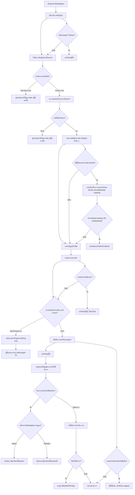
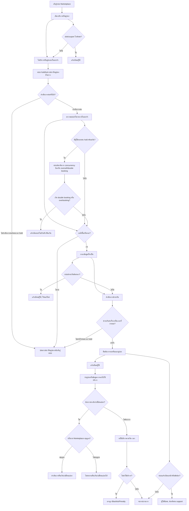

# Flow การ hold/lock คูปองและการจองเข้ารับบริการใน Marketplace

ไฟล์นี้อธิบาย Flow การจองคูปอง/บริการใน Marketplace ทั้งกรณี hold/lock ตอนเริ่ม checkout และกรณี hold/lock ทันทีหลังหยิบใส่ตะกร้า พร้อม Mermaid flowchart และคำอธิบายเหตุผล

---

## เหตุผลในการเลือกจุด hold/lock

- **Hold/lock ตอนเริ่ม checkout:**  
  ลดปัญหา slot/coupon ค้างในตะกร้าโดยไม่ถูกซื้อจริง เพิ่มโอกาสให้ลูกค้าคนอื่นจองได้ และป้องกัน overbooking/oversell ได้ดี
- **Hold/lock หลังหยิบใส่ตะกร้า:**  
  ผู้ใช้มั่นใจว่าสินค้าหรือบริการที่เลือกจะยังคงอยู่ในตะกร้าของตนเองในช่วงเวลาหนึ่ง (เช่น 5-10 นาที) โดยไม่ถูกผู้อื่นแย่งจองระหว่างที่กำลังตัดสินใจหรือกรอกข้อมูล  
  ข้อเสียคืออาจทำให้ slot/coupon ถูก hold ค้างในระบบ หากผู้ใช้ไม่ดำเนินการต่อ

---

## 1. Flow หลัก (Hold/lock ตอนเริ่ม checkout)

---

## 2. Flow กรณี hold/lock หลังหยิบใส่ตะกร้า

