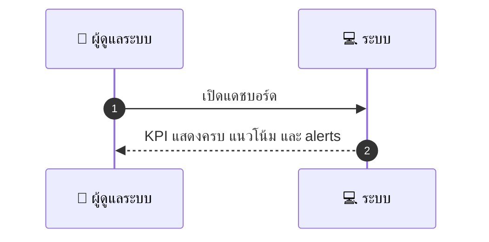
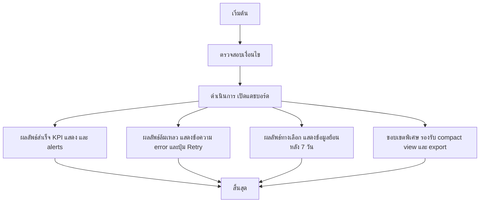

# ASYS005 - ดูแดชบอร์ดภาพรวม Admin Dashboard

## 👤 บทบาท
- ผู้ดูแลระบบ

## 🎯 เป้าหมายของเคส
- ในฐานะ Admin
- ต้องการ เห็นภาพรวม KPI ของแพลตฟอร์ม
- เพื่อ เพื่อติดตามสถานะการดำเนินงาน GMV, bookings, disputes

## ⚙️ เงื่อนไขก่อนเริ่ม (Precondition)
- มีข้อมูลธุรกรรมและกิจกรรมในระบบ

## 🧭 ผลลัพธ์และสถานการณ์
- ✅ ผลลัพธ์ที่คาดหวัง (Success Flow): ระบบแสดง KPIs, trends และ alerts
- ❌ ผลลัพธ์ที่ Failure:
  - ไม่สามารถดึงข้อมูล KPI จากแหล่งข้อมูลหลักได้ ทำให้แดชบอร์ดไม่แสดง KPI
  - การโหลดแดชบอร์ดล้มเหลวทั้งหมด แสดงข้อความ error และปุ่ม Retry
  - ข้อมูล KPI ไม่สอดคล้องกับช่วงเวลาที่เลือก misalignment ส่งค่าผลลัพธ์ไม่ถูกต้องหรือเป็น NaN
  - สิทธิ์เข้าถึงแดชบอร์ดถูกจำกัด ส่งข้อความ Permission denied
- 🔄 ผลลัพธ์ทางเลือก:
  - หากช่วงวันที่เลือกไม่มีข้อมูล แดชบอร์ดแสดงข้อมูลย้อนหลัง 7 วันที่ผ่านมา พร้อมแจ้งเหตุผล
  - โหมดสรุป compact view แสดง KPI หลักและแนวโน้มสำคัญเท่านั้น
  - สามารถส่งออกข้อมูล KPI เป็น CSV หรือ Excel เพื่อใช้งานภายนอก
  - มีตัวเลือก quick date ranges Today, 7D, 30D โดยอัปเดตข้อมูลทันที
- ⚠️ ผลลัพธ์ขอบเขตพิเศษ:
  - หากช่วงวันที่เลือกไม่มีข้อมูล แดชบอร์ดแสดงข้อมูลย้อนหลัง 7 วันที่ผ่านมา พร้อมแจ้งเหตุผล
  - โหมดสรุป compact view แสดง KPI หลักและแนวโน้มสำคัญเท่านั้น
  - สามารถส่งออกข้อมูล KPI เป็น CSV หรือ Excel เพื่อใช้งานภายนอก
  - มีตัวเลือก quick date ranges Today 7D 30D โดยอัปเดตข้อมูลทันที

## ✅ เกณฑ์การยอมรับ (Acceptance Criteria)
- KPIs: DAU, GMV, bookings/day, dispute rate
- filters by date
- data refresh under 60s

## ⏱ ลำดับความสำคัญ / SLA
- Priority: P0
- SLA: refresh 60s

---

## 🔁 Sequence Diagram  
> แสดงลำดับเหตุการณ์ระหว่าง "ผู้ดูแลระบบ" กับ "ระบบ"

---

## 🧭 Flowchart Diagram
> แสดงขั้นตอนการทำงานของระบบอย่างเข้าใจง่าย

