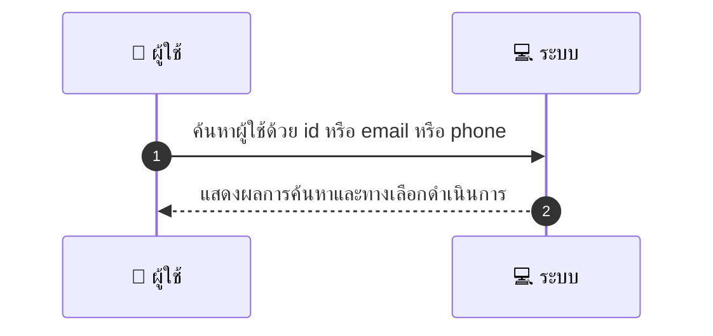
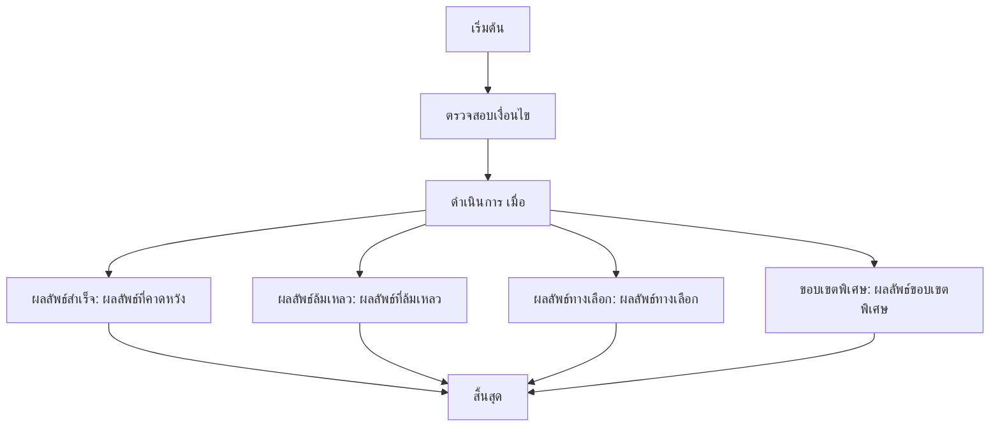

# ASYS006 - จัดการบัญชีผู้ใช้ User Management

## 👤 บทบาท
- ผู้ดูแลระบบ

## 🎯 เป้าหมายของเคส
- ในฐานะ Admin
- ต้องการ ค้นหา/ดู/แก้ไข/ระงับผู้ใช้หรือ provider
- เพื่อ เพื่อแก้ไขปัญหา/ยับยั้งการใช้บริการที่ผิดปกติ

## ⚙️ เงื่อนไขก่อนเริ่ม (Precondition)
- มีรายชื่อผู้ใช้ใน DB

## 🧭 ผลลัพธ์และสถานการณ์
- ✅ ผลลัพธ์ที่คาดหวัง (Success Flow): ระบบอนุญาตแก้ไข fields ที่เหมาะสมและบันทึก audit log
- ❌ ผลลัพธ์ที่ Failure:  
  - ไม่พบผู้ใช้ตามเงื่อนไขการค้นหา
  - สิทธิ์ในการแก้ไขไม่เพียงพอตามบทบาท
  - บันทึก Audit log ล้มเหลว
  - การเชื่อมต่อฐานข้อมูลล้มเหลว
- 🔄 ผลลัพธ์ทางเลือก:  
  - ค้นหาผู้ใช้สำเร็จแต่ไม่มีการเปลี่ยนแปลงใดๆ
  - พบผู้ใช้หลายรายการที่ตรงเงื่อนไขและต้องเลือกดำเนินการทีละรายการ
  - มีการระงับผู้ใช้เรียบร้อยแล้ว แต่มีการแจ้งเตือนให้ตรวจสอบภายหลัง
- ⚠️ ผลลัพธ์ขอบเขตพิเศษ:  
  - ค้นหาผู้ใช้สำเร็จแต่ไม่มีการเปลี่ยนแปลงใดๆ
  - พบผู้ใช้หลายรายการที่ตรงเงื่อนไขและต้องเลือกดำเนินการทีละรายการ
  - มีการระงับผู้ใช้เรียบร้อยแล้ว แต่มีการแจ้งเตือนให้ตรวจสอบภายหลัง

## ✅ เกณฑ์การยอมรับ (Acceptance Criteria)
- Search by id/email/phone
- edit fields per role
- action logged

## ⏱ ลำดับความสำคัญ / SLA
- Priority: P0
- SLA: actions logged immediate

---

## 🔁 Sequence Diagram  
> แสดงลำดับเหตุการณ์ระหว่าง "ผู้ใช้" กับ "ระบบ"

---

## 🧭 Flowchart Diagram
> แสดงขั้นตอนการทำงานของระบบอย่างเข้าใจง่าย

