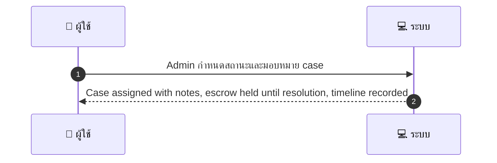
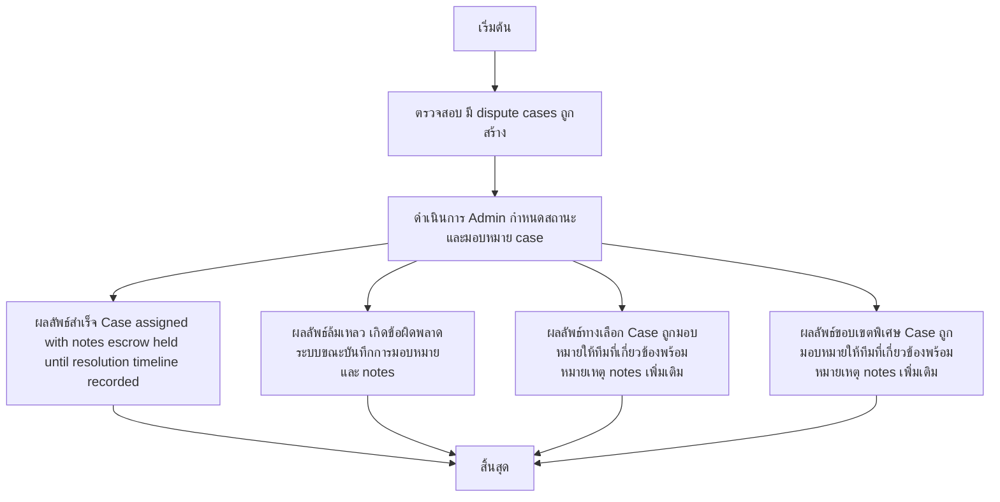

# ASYS008 - จัดการ dispute queue Dispute Triage

## 👤 บทบาท
- Admin

## 🎯 เป้าหมายของเคส
- ในฐานะ Admin
- ต้องการ ดูรายการ dispute ตั้ง priority และมอบหมายให้ทีม
- เพื่อ แก้ไขข้อพิพาทระหว่างลูกค้า/ผู้ให้บริการ

## ⚙️ เงื่อนไขก่อนเริ่ม (Precondition)
- มี dispute cases ถูกสร้าง

## 🧭 ผลลัพธ์และสถานการณ์
- ✅ ผลลัพธ์ที่คาดหวัง (Success Flow): Case assigned with notes, escrow held until resolution, timeline recorded
- ❌ ผลลัพธ์ที่ Failure:
  - เกิดข้อผิดพลาดระบบขณะบันทึกการมอบหมายและ notes
  - ไม่พบ dispute ที่ยังไม่ถูกมอบหมายในคิว
  - ข้อมูล dispute ขาดหายหรือไม่สมบูรณ์ ทำให้มอบหมายไม่ได้
  - ไม่สามารถแจ้งเตือนฝ่ายที่เกี่ยวข้องได้ภายใน SLA
  - เกิดข้อผิดพลาดในการบันทึก Audit log และ/หรือติดตาม SLA
- 🔄 ผลลัพธ์ทางเลือก:
  - Case ถูกมอบหมายให้ทีมที่เกี่ยวข้องพร้อมหมายเหตุ notes เพิ่มเติม
  - Case ถูกมอบหมายด้วย Priority ที่ต่างจากที่คาด แต่ยังอยู่ในกรอบ SLA
  - ระบบบันทึก Audit log สำเร็จและ Timeline ถูกสร้าง แต่ escrow ถูกถือไว้จนการยุติข้อพิพาท
  - มีการแจ้งเตือนผู้เกี่ยวข้องเรียบร้อยแล้ว แต่ลูกค้า/ผู้ให้บริการยังตอบกลับ
- ⚠️ ผลลัพธ์ขอบเขตพิเศษ:
  - Case ถูกมอบหมายให้ทีมที่เกี่ยวข้องพร้อมหมายเหตุ notes เพิ่มเติม
  - Case ถูกมอบหมายด้วย Priority ที่ต่างจากที่คาด แต่ยังอยู่ในกรอบ SLA
  - ระบบบันทึก Audit log สำเร็จและ Timeline ถูกสร้าง แต่ escrow ถูกถือไว้จนการยุติข้อพิพาท
  - มีการแจ้งเตือนผู้เกี่ยวข้องเรียบร้อยแล้ว แต่ลูกค้า/ผู้ให้บริการยังตอบกลับ

## ✅ เกณฑ์การยอมรับ (Acceptance Criteria)
- Assignment, audit log, notify parties, SLA targets for response

## ⏱ ลำดับความสำคัญ / SLA
- Priority: P0
- SLA: 
  - acknowledge =24h
  - resolution =30d

---

## 🔁 Sequence Diagram  
> แสดงลำดับเหตุการณ์ระหว่าง "ผู้ใช้" กับ "ระบบ"

---

## 🧭 Flowchart Diagram
> แสดงขั้นตอนการทำงานของระบบอย่างเข้าใจง่าย

