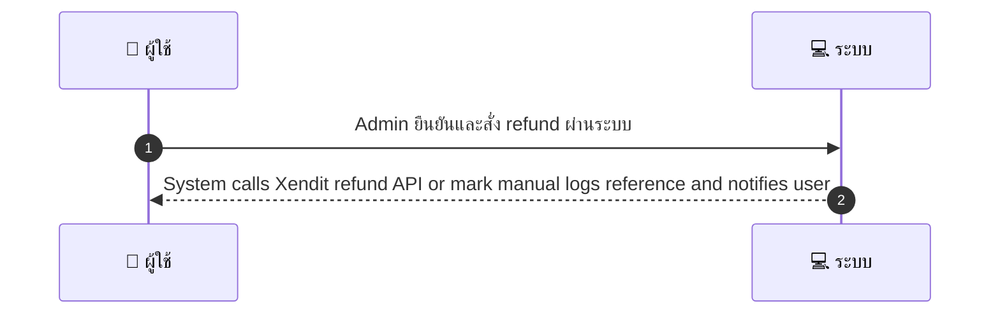
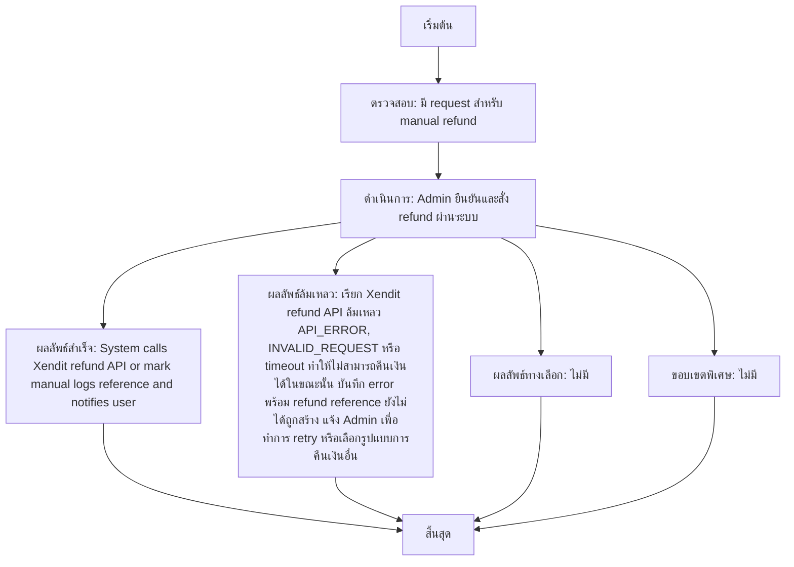

# ASYS009 - ทำ manual refund/adjustment

## 👤 บทบาท
- ผู้ดูแลระบบ

## 🎯 เป้าหมายของเคส
- ในฐานะ: Admin
- ต้องการ: ดำเนินการคืนเงิน/ปรับยอดด้วยตนเอง
- เพื่อ: เพื่อแก้ไขกรณีพิเศษหรือ dispute

## ⚙️ เงื่อนไขก่อนเริ่ม (Precondition)
- มี request สำหรับ manual refund

## 🧭 ผลลัพธ์และสถานการณ์
- ✅ ผลลัพธ์ที่คาดหวัง (Success Flow): System calls Xendit refund API or mark manual, logs reference and notifies user
- ❌ ผลลัพธ์ที่ Failure:
  - เรียก Xendit refund API แล้วล้มเหลว API_ERROR, INVALID_REQUEST หรือ timeout ทำให้ไม่สามารถคืนเงินได้ในขณะนั้น บันทึก error พร้อม refund reference ยังไม่ได้ถูกสร้าง แจ้ง Admin เพื่อทำการ retry หรือเลือกรูปแบบการคืนเงินอื่น
  - สิทธิ์ไม่เพียงพอหรือ 2FA ไม่ผ่าน ระบบปฏิเสธคำขอ และไม่ดำเนินการใดๆ ผู้ใช้งานได้รับแจ้งเหตุผลและให้ Admin ตรวจสอบสิทธิ์/2FA ใหม่
  - ข้อมูลคำขอไม่ครบถ้วนหรือไม่ถูกต้อง รหัสคำสั่ง/หมายเลขอ้างอิง, จำนวนเงิน, ช่องทางรับเงิน ปฏิเสธคำขอและขอข้อมูลเพิ่มเติม
- 🔄 ผลลัพธ์ทางเลือก: ไม่มี
- ⚠️ ผลลัพธ์ขอบเขตพิเศษ: ไม่มี

## ✅ เกณฑ์การยอมรับ (Acceptance Criteria)
- Requires permission
- 2FA for action
- audit trail
- refund reference stored

## ⏱ ลำดับความสำคัญ / SLA
- Priority: P0
- SLA: action queued =3 business days

---

## 🔁 Sequence Diagram  
> แสดงลำดับเหตุการณ์ระหว่าง "ผู้ใช้" กับ "ระบบ"

---

## 🧭 Flowchart Diagram
> แสดงขั้นตอนการทำงานของระบบอย่างเข้าใจง่าย

