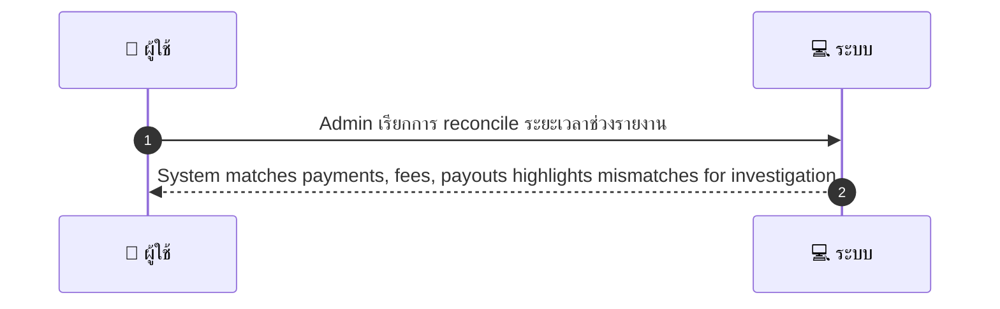
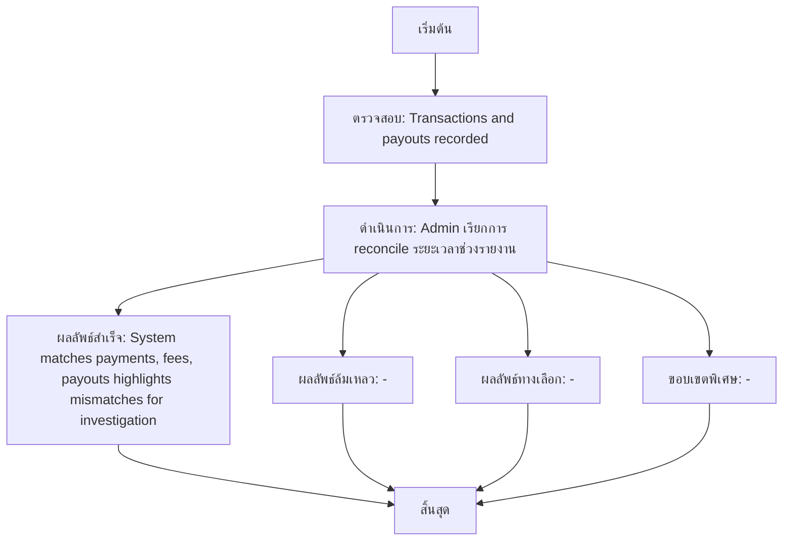

# ASYS010 - รัน settlement / payout reconciliation

## 👤 บทบาท
- ผู้ดูแลระบบ

## 🎯 เป้าหมายของเคส
- ในฐานะ
- Admin/Finance
- เพื่อ
- เพื่อให้ยอดบัญชีตรงกับการจ่ายจริง

## ⚙️ เงื่อนไขก่อนเริ่ม (Precondition)
- Transactions and payouts recorded

## 🧭 ผลลัพธ์และสถานการณ์
- ✅ ผลลัพธ์ที่คาดหวัง (Success Flow): System matches payments, fees, payouts highlights mismatches for investigation
- ❌ ผลลัพธ์ที่ Failure:
  - -
- 🔄 ผลลัพธ์ทางเลือก:
  - -
- ⚠️ ผลลัพธ์ขอบเขตพิเศษ:
  - -

## ✅ เกณฑ์การยอมรับ (Acceptance Criteria)
- Export CSV, discrepancy list with delta and suggested actions

## ⏱ ลำดับความสำคัญ / SLA
- Priority: P0
- SLA: reconcile job 5m typical
- SLA: alerts immediate

---

## 🔁 Sequence Diagram  
> แสดงลำดับเหตุการณ์ระหว่าง "ผู้ใช้" กับ "ระบบ"

---

## 🧭 Flowchart Diagram
> แสดงขั้นตอนการทำงานของระบบอย่างเข้าใจง่าย

