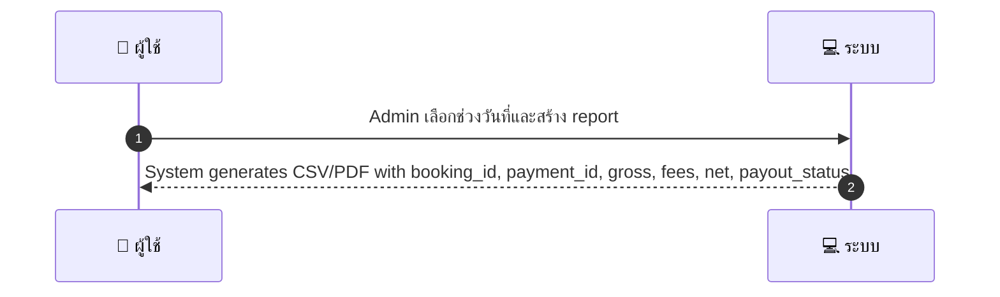
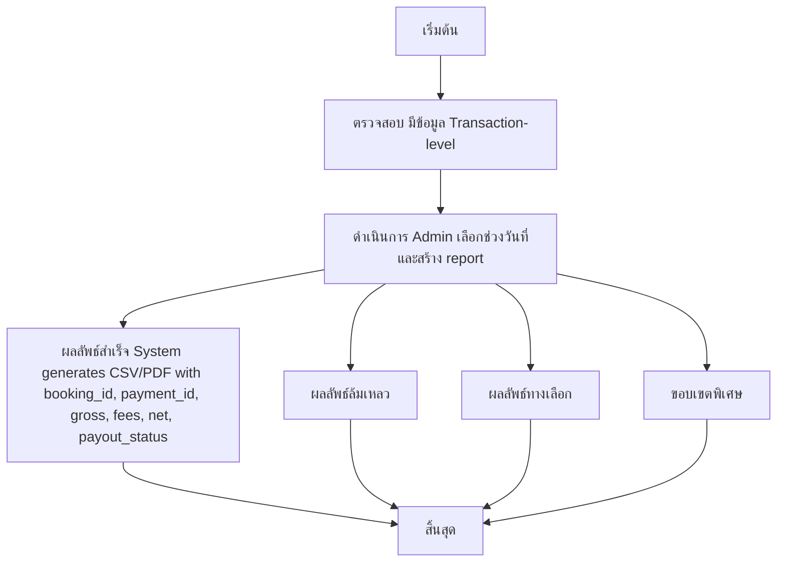

# ASYS011 - ดู/ดาวน์โหลดรายงานการเงิน Financial Reports

## 👤 บทบาท
- ผู้ดูแลระบบ

## 🎯 เป้าหมายของเคส
- ในฐานะ
- Admin/Finance
- ต้องการ
- สร้างรายงาน GMV, fees, refunds และ payouts ในช่วงวันที่ต้องการ
- เพื่อ
- เพื่อใช้ในการบัญชีและภาษี

## ⚙️ เงื่อนไขก่อนเริ่ม (Precondition)
- มีข้อมูล Transaction-level

## 🧭 ผลลัพธ์และสถานการณ์
- ✅ ผลลัพธ์ที่คาดหวัง (Success Flow): System generates CSV/PDF with booking_id, payment_id, gross, fees, net, payout_status  
- ❌ ผลลัพธ์ที่ Failure:  
  - ไม่พบข้อมูลระดับธุรกรรม transaction-level ในช่วงวันที่ที่เลือก
  - เกิดข้อผิดพลาดในการสร้างไฟล์ CSV/PDF IO/Error ในการแปลงข้อมูล
  - สิทธิ์ของผู้ใช้ไม่เพียงพอสำหรับการส่งออก/ดาวน์โหลดรายงาน
- 🔄 ผลลัพธ์ทางเลือก:  
  - แสดงตัวอย่างรายงานบนหน้าจอเพื่อการตรวจสอบก่อนดาวน์โหลด
  - ส่งออกไปยังอีเมลของผู้ใช้งานหรือที่เก็บเอกสารในระบบแทนการดาวน์โหลด
  - รองรับการตั้งเวลารันอัตโนมัติ schedule พร้อมการแจ้งเตือนเมื่อเสร็จสมบูรณ์
- ⚠️ ผลลัพธ์ขอบเขตพิเศษ:  
  - แสดงตัวอย่างรายงานบนหน้าจอเพื่อการตรวจสอบก่อนดาวน์โหลด
  - ส่งออกไปยังอีเมลของผู้ใช้งานหรือที่เก็บเอกสารในระบบแทนการดาวน์โหลด
  - รองรับการตั้งเวลารันอัตโนมัติ schedule พร้อมการแจ้งเตือนเมื่อเสร็จสมบูรณ์

## ✅ เกณฑ์การยอมรับ (Acceptance Criteria)
- Reports include filters, export, and schedule options

## ⏱ ลำดับความสำคัญ / SLA
- Priority: P0
- SLA: generate <60s typical

---

## 🔁 Sequence Diagram  
> แสดงลำดับเหตุการณ์ระหว่าง "ผู้ใช้" กับ "ระบบ"

---

## 🧭 Flowchart Diagram
> แสดงขั้นตอนการทำงานของระบบอย่างเข้าใจง่าย

