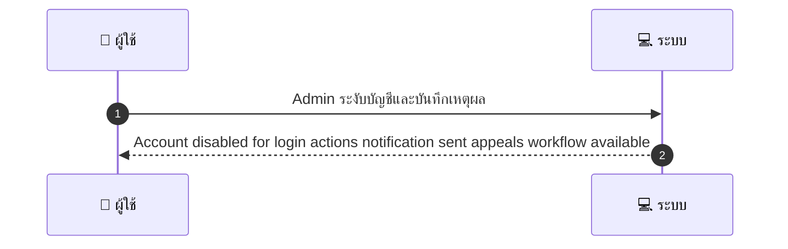
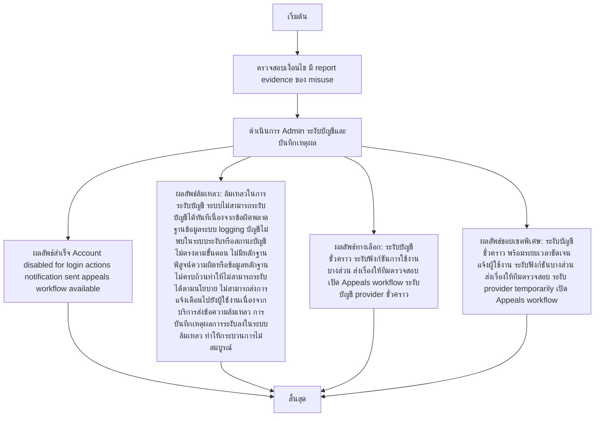

# ASYS020 - จัดการ blacklist / suspended accounts

## 👤 บทบาท
- ผู้ดูแลระบบ

## 🎯 เป้าหมายของเคส
- ในฐานะ
- ต้องการ
- เพื่อ

## 🎯 เป้าหมายของเคส
- ในฐานะ: Admin
- ต้องการ: ระงับหรือแบนบัญชีผู้ใช้หรือ provider ที่ทุจริต/ละเมิด
- เพื่อ: เพื่อปกป้องชุมชน

## ⚙️ เงื่อนไขก่อนเริ่ม (Precondition)
- มี report evidence ของ misuse

## 🧭 ผลลัพธ์และสถานการณ์
- ✅ ผลลัพธ์ที่คาดหวัง (Success Flow): Account disabled for login actions notification sent appeals workflow available
- ❌ ผลลัพธ์ที่ Failure:
  - ล้มเหลวในการระงับบัญชี: ระบบไม่สามารถระงับบัญชีได้ทันทีเนื่องจากข้อผิดพลาดฐานข้อมูล/ระบบ logging
  - บัญชีไม่พบในระบบขณะดำเนินการระงับหรือสถานะบัญชีไม่ตรงตามขั้นตอน
  - ไม่มีหลักฐานพิสูจน์ความผิดหรือข้อมูลหลักฐานไม่ครบถ้วนทำให้ไม่สามารถระงับได้ตามนโยบาย
  - ไม่สามารถส่งการแจ้งเตือนไปยังผู้ใช้งานเนื่องจากบริการส่งข้อความล้มเหลว
  - การบันทึกเหตุผลการระงับลงในระบบล้มเหลว ทำให้กระบวนการไม่สมบูรณ์
- 🔄 ผลลัพธ์ทางเลือก:
  - ระงับบัญชีชั่วคราว พร้อมกำหนดระยะเวลาชัดเจนและแจ้งผู้ใช้งาน
  - ระงับฟังก์ชันการใช้งานบางส่วน (เช่น login ไม่ได้ แต่ดูข้อมูลพื้นฐานได้) เพื่อความปลอดภัย
  - ส่งเรื่องให้ทีมตรวจสอบความผิดปกติ (investigation) ก่อนตัดสินใจระงับถาวรมากขึ้น
  - ระงับบัญชีของผู้ให้บริการ (provider) ในระดับชั้นงานชั่วคราว พร้อมบันทึกเหตุผล
  - เปิด Appeals workflow ให้ผู้ใช้งานยื่นอุทธรณ์พร้อมเอกสารสนับสนุนและรอผลตรวจสอบ
- ⚠️ ผลลัพธ์ขอบเขตพิเศษ:
  - ระงับบัญชีชั่วคราว พร้อมกำหนดระยะเวลาชัดเจนและแจ้งผู้ใช้งาน
  - ระงับฟังก์ชันการใช้งานบางส่วน (เช่น login ไม่ได้ แต่ดูข้อมูลพื้นฐานได้) เพื่อความปลอดภัย
  - ส่งเรื่องให้ทีมตรวจสอบความผิดปกติ (investigation) ก่อนตัดสินใจระงับถาวรมากขึ้น
  - ระงับบัญชีของผู้ให้บริการ (provider) ในระดับชั้นงานชั่วคราว พร้อมบันทึกเหตุผล
  - เปิด Appeals workflow ให้ผู้ใช้งานยื่นอุทธรณ์พร้อมเอกสารสนับสนุนและรอผลตรวจสอบ

## ✅ เกณฑ์การยอมรับ (Acceptance Criteria)
- Suspension reasons logged
- appeals tracked
- escrow/payout rules applied

## ⏱ ลำดับความสำคัญ / SLA
- Priority: P0
- SLA: suspend immediate

---

## 🔁 Sequence Diagram  
> แสดงลำดับเหตุการณ์ระหว่าง "ผู้ใช้" กับ "ระบบ"

---

## 🧭 Flowchart Diagram
> แสดงขั้นตอนการทำงานของระบบอย่างเข้าใจง่าย

