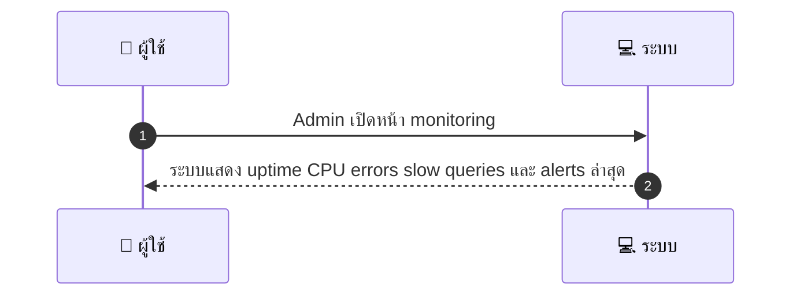
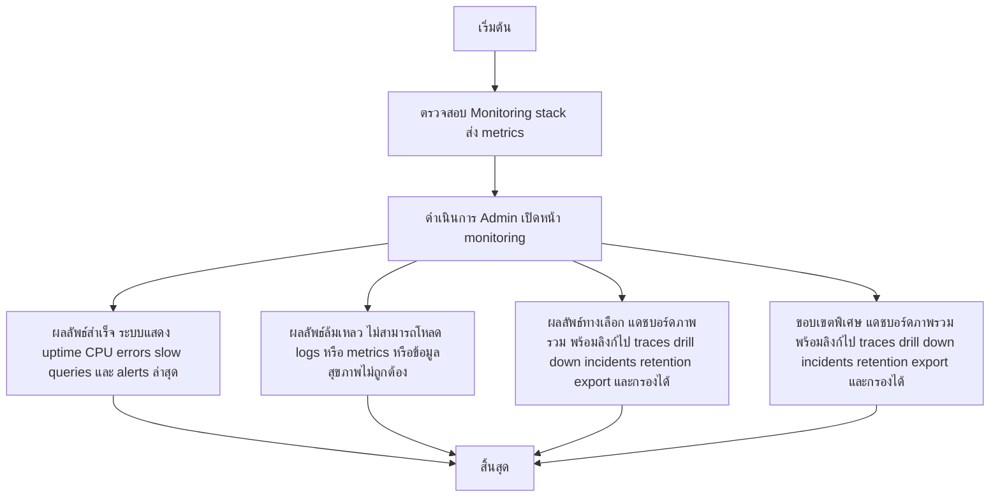

# ASYS023 - ดู logs ระบบและสถิติ performance System Monitoring

## 👤 บทบาท
- ผู้ดูแลระบบ

## 🎯 เป้าหมายของเคส
- Admin/DevOps
- เข้าถึง logs metrics และ alert history ของระบบ
- เพื่อตรวจสอบสุขภาพของระบบ

## ⚙️ เงื่อนไขก่อนเริ่ม (Precondition)
- Monitoring stack ส่ง metrics

## 🧭 ผลลัพธ์และสถานการณ์
- ✅ ผลลัพธ์ที่คาดหวัง (Success Flow): ระบบแสดง uptime CPU errors slow queries และ alerts ล่าสุด
- ❌ ผลลัพธ์ที่ Failure:  
  - ไม่สามารถโหลด logs หรือ metrics ได้เนื่องจากปัญหาการเชื่อมต่อกับ monitoring stack
  - ข้อมูลสุขภาพระบบไม่ถูกต้อง เช่น uptime หรือ CPU แสดงค่าผิดพลาด
  - ไม่พบประวัติ Alert ล่าสุด หรือข้อมูลซ้ำซ้อนทำให้วิเคราะห์ไม่ได้
  - การแจ้งเตือนล้มเหลว หรือ SLA breach เพราะ latency ของ alerts เกิน 1 นาที
  - หน้า monitoring ล่มไม่สามารถแสดงกราฟ/รายการได้
- 🔄 ผลลัพธ์ทางเลือก:  
  - แดชบอร์ดแสดงภาพรวมสถานะระบบ พร้อมลิงก์ไปยัง traces
  - สามารถ drill down เข้า incidents ผ่านรายการ Alerts ได้
  - แสดง retention policy ของ logs และระยะเวลาการเก็บข้อมูล
  - สามารถส่งออก logs/metrics เป็น CSV หรือ JSON
  - สามารถกรองข้อมูลตาม service, namespace หรือเวิร์กโหลด
- ⚠️ ผลลัพธ์ขอบเขตพิเศษ:  
  - แดชบอร์ดแสดงภาพรวมสถานะระบบ พร้อมลิงก์ไปยัง traces
  - สามารถ drill down เข้า incidents ผ่านรายการ Alerts ได้
  - แสดง retention policy ของ logs และระยะเวลาการเก็บข้อมูล
  - สามารถส่งออก logs/metrics เป็น CSV หรือ JSON
  - สามารถกรองข้อมูลตาม service, namespace หรือเวิร์กโหลด

## ✅ เกณฑ์การยอมรับ (Acceptance Criteria)
- ลิงก์ไปยัง traces
- ความสามารถในการ drill into incidents
- retention policy สำหรับ logs

## ⏱ ลำดับความสำคัญ / SLA
- Priority: P0
- SLA: alerts <1m

---

## 🔁 Sequence Diagram  
> แสดงลำดับเหตุการณ์ระหว่าง "ผู้ใช้" กับ "ระบบ"

---

## 🧭 Flowchart Diagram
> แสดงขั้นตอนการทำงานของระบบอย่างเข้าใจง่าย

