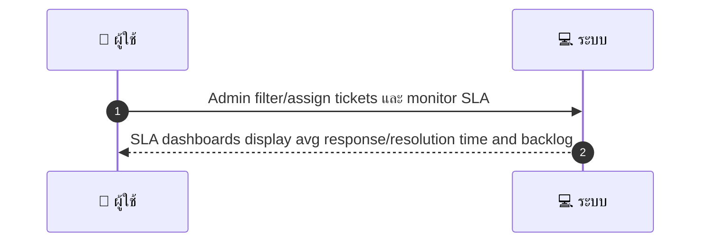
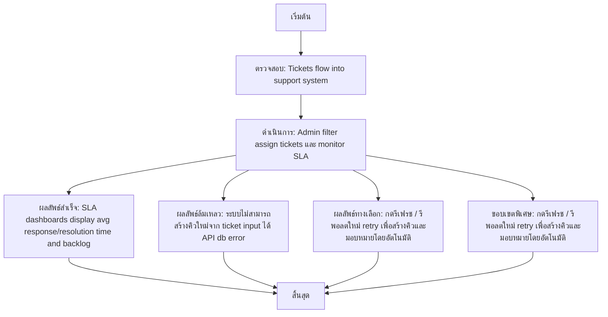

# ASYS028 - จัดการ support queues และ SLA

## 👤 บทบาท
- ผู้ดูแลระบบ

## 📝 อธิบายเคส
- ผู้ดูแลระบบมีหน้าที่ดูคิว ticket มอบหมาย และติดตาม SLA เพื่อยกระดับการตอบสนองลูกค้า
- โดยมองเห็นภาพรวมคิวที่อยู่ในระบบ ตั้งค่าการมอบหมาย และแจ้งเตือน SLA เพื่อปรับปรุงประสิทธิภาพทีม
- ระบบจะรวบรวมข้อมูล SLA และ timestamps แสดงในแดชบอร์ด เพื่อให้ทีมสามารถวิเคราะห์แนวโน้มและ backlogs ได้

## 🎯 เป้าหมายของเคส
- ในฐานะ Support Manager
- ต้องการ ดูคิว ticket,มอบหมาย,ติดตาม SLA และประสิทธิภาพทีม
- เพื่อ ยกระดับการตอบสนองลูกค้า

## ⚙️ เงื่อนไขก่อนเริ่ม (Precondition)
- Tickets flow into support system

## 🧭 ผลลัพธ์และสถานการณ์
- ✅ ผลลัพธ์ที่คาดหวัง (Success Flow): SLA dashboards display avg response/resolution time and backlog
- ❌ ผลลัพธ์ที่ Failure:
  - ระบบไม่สามารถสร้างคิวใหม่จาก ticket input ได้ API db error
  - การมอบหมาย ticket ล้มเหลวหลังจากเลือกผู้รับผิดชอบ เนื่องจาก agent ไม่มีสถานะใช้งาน ถูกระงับ
  - ไม่สามารถคำนวณหรือแสดง SLA บนแดชบอร์ดได้ เนื่องจากข้อมูล SLA หรือ timestamps ไม่พร้อมใช้งาน
- 🔄 ผลลัพธ์ทางเลือก:
  - กดรีเฟรช / รีพอลตใหม่ retry เพื่อสร้างคิวและมอบหมายโดยอัตโนมัติ
  - ผู้ดูแลระบบทำ manual override และเปลี่ยนลำดับความสำคัญของคิวที่มี SLA breach
  - ส่งออก metrics เป็น CSV/Excel เพื่อวิเคราะห์แนวโน้มและประสิทธิภาพทีม
- ⚠️ ผลลัพธ์ขอบเขตพิเศษ:
  - กดรีเฟรช / รีพอลตใหม่ retry เพื่อสร้างคิวและมอบหมายโดยอัตโนมัติ
  - ผู้ดูแลระบบทำ manual override และเปลี่ยนลำดับความสำคัญของคิวที่มี SLA breach
  - ส่งออก metrics เป็น CSV/Excel เพื่อวิเคราะห์แนวโน้มและประสิทธิภาพทีม

## ✅ เกณฑ์การยอมรับ (Acceptance Criteria)
- Auto-escalation rules
- SLA alerts
- exportable metrics

## ⏱ ลำดับความสำคัญ / SLA
- Priority: P0
- SLA:
  - ack 24h
  - resolution targets configured

---

## 🔁 Sequence Diagram  
> แสดงลำดับเหตุการณ์ระหว่าง "ผู้ใช้" กับ "ระบบ"

---

## 🧭 Flowchart Diagram
> แสดงขั้นตอนการทำงานของระบบอย่างเข้าใจง่าย

