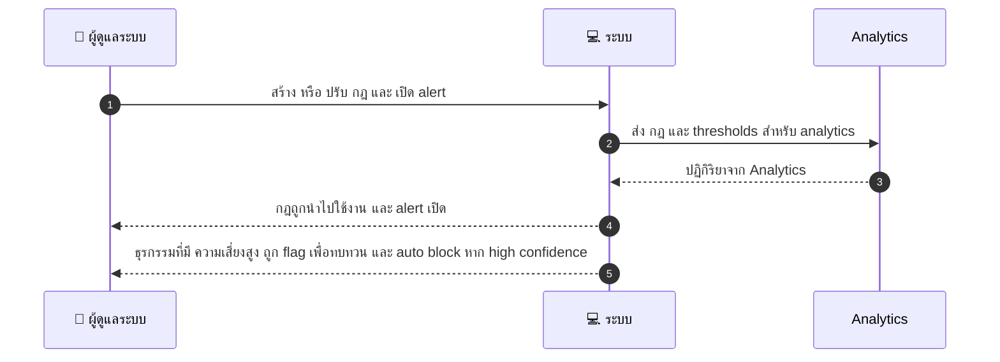
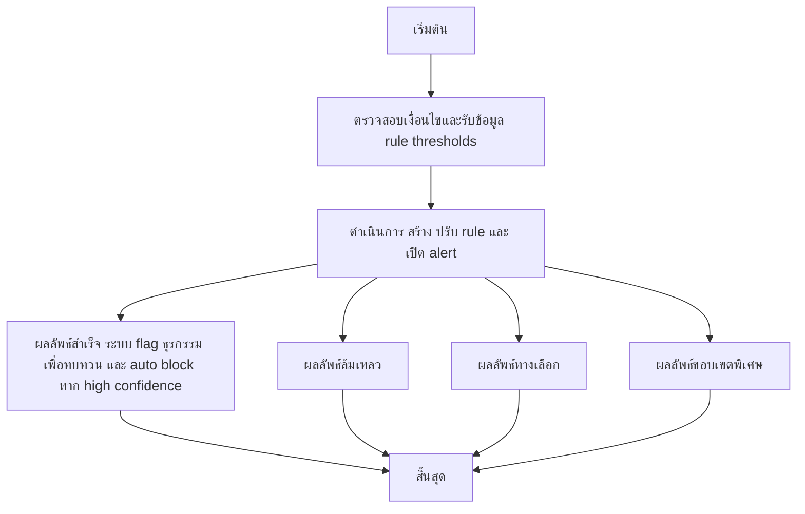

# ASYS031 - จัดการ fraud detection rules & alerts

## 👤 บทบาท
- ผู้ดูแลระบบ

## 🎯 เป้าหมายของเคส
- ในฐานะ Admin Risk
- ต้องการ ตั้งกฎและ thresholds สำหรับการตรวจจับพฤติกรรมทุจริต
- เพื่อ ลดความเสี่ยงการฉ้อโกง

## ⚙️ เงื่อนไขก่อนเริ่ม (Precondition)
- Events flow into analytics

## 🧭 ผลลัพธ์และสถานการณ์
- ✅ ผลลัพธ์ที่คาดหวัง (Success Flow): ระบบทำเครื่องหมายรายการธุรกรรมเพื่อการตรวจสอบ และหากมีความเสี่ยงสูงจะบล็อคอัตโนมัติ
- ❌ ผลลัพธ์ที่ Failure:
  - ระบบประมวลผลกฎ alerts ล้มเหลวจาก Analytics ล่ม ส่งผลให้ไม่มีการ flag รายการใด ๆ
  - การบันทึก ปรับ rule ล้มเหลว due to validation error หรือสิทธิ์ไม่เพียงพอ admin rule ไม่ถูกบันทึก
  - ส่งแจ้งเตือนไปยัง UI หรือระบบ downstream ล้มเหลว เกิดข้อผิดพลาดการสื่อสาร SLA 5 นาทีไม่ถูก met
  - ข้อมูล transaction ไม่มี context เพียงพอในการคำนวณคะแนนความเสี่ยง ทำให้ไม่สามารถสร้าง alert ได้
- 🔄 ผลลัพธ์ทางเลือก:
  - โหมดทดสอบ Rule Sim Testing ระบบสร้าง logs และสัญญาณในระบบ แต่ไม่มีการ block จริง เพื่อ validation โดย QA
  - Threshold ถูกตั้งสูง โอกาสเกิด flags แต่จะไม่ auto block ใหม่รอการ review
  - Alerts ถูกกรองซ้ำหรือถูก suppress ตาม suppress rules system flags transactions 1 ครั้งต่อขั้นตอน เพื่อป้องกัน alert fatigue
  - ข้อมูล latency ทำให้สรุป score ช้ากว่า SLA alert ถูกส่งแบบ batched ในรอบถัดไป
- ⚠️ ผลลัพธ์ขอบเขตพิเศษ:
  - โหมดทดสอบ Rule Sim Testing ระบบสร้าง logs และสัญญาณในระบบ แต่ไม่มีการ block จริง เพื่อ validation โดย QA
  - Threshold ถูกตั้งสูง โอกาสเกิด flags แต่จะไม่ auto block ใหม่รอการ review
  - Alerts ถูกกรองซ้ำหรือถูก suppress ตาม suppress rules system flags transactions 1 ครั้งต่อขั้นตอน เพื่อป้องกัน alert fatigue
  - ข้อมูล latency ทำให้สรุป score ช้ากว่า SLA alert ถูกส่งแบบ batched ในรอบถัดไป

## ✅ เกณฑ์การยอมรับ (Acceptance Criteria)
- Rule sim testing mode
- alert thresholds
- review UI

## ⏱ ลำดับความสำคัญ / SLA
- Priority: P0
- SLA: alerts under 5 minutes

---

## 🔁 Sequence Diagram  
> แสดงลำดับเหตุการณ์ระหว่าง "ผู้ดูแลระบบ" กับ "ระบบ"

---

## 🧭 Flowchart Diagram
> แสดงขั้นตอนการทำงานของระบบอย่างเข้าใจง่าย

