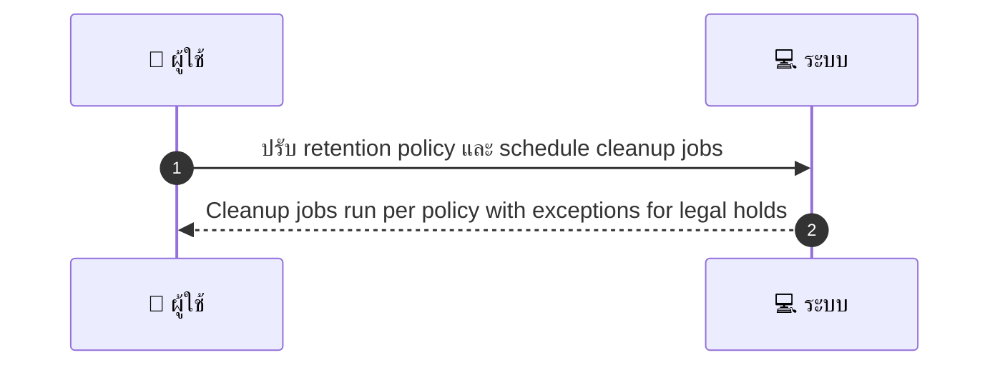
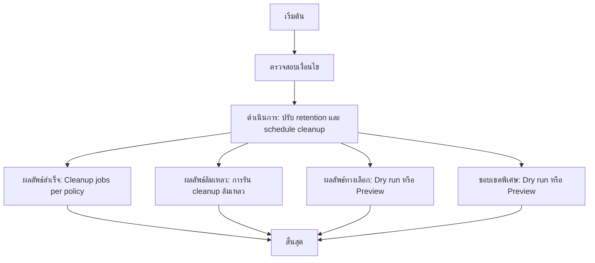

# ASYS034 - ตั้งค่าการเก็บรักษาข้อมูล Data Retention Policy

## 👤 บทบาท
- ผู้ดูแลระบบ

## 🎯 เป้าหมายของเคส
- ในฐานะ Admin/Privacy
- ต้องการ กำหนด retention periods สำหรับ logs, payments, user data
- เพื่อ เพื่อปฏิบัติตาม PDPA และลดความเสี่ยง

## ⚙️ เงื่อนไขก่อนเริ่ม (Precondition)
- Default retention policy defined

## 🧭 ผลลัพธ์และสถานการณ์
- ✅ ผลลัพธ์ที่คาดหวัง (Success Flow): Cleanup jobs run per policy with exceptions for legal holds
- ❌ ผลลัพธ์ที่ Failure:
  - การรัน cleanup ล้มเหลเกิดข้อผิดพลาดฐานข้อมูลระหว่างลบข้อมูลตาม retention policy
  - ไม่สามารถบันทึก deletion logs ระบบไม่สามารถเขียนลง audit log ได้หลังการลบ
  - ไม่มีสิทธิ์ของ Admin ในการปรับ retention หรือรัน cleanup
  - Policy version ที่เลือกไม่พบหรือมีรูปแบบผิดพลาด ทำให้ไม่สามารถใช้งานได้
- 🔄 ผลลัพธ์ทางเลือก:
  - Dry run ทดสอบก่อนใช้งานจริง ระบบแสดงรายการข้อมูลที่จะถูกลบโดยไม่ลบจริง
  - Preview/Approval step ผู้ดูแลระบบยืนยันการเปลี่ยนแปลง retention ก่อนรันจริง และบันทึกใน audit
  - ปรับใช้นโยบายแบบแยกส่วนสำหรับข้อมูลประเภทต่างๆ logs payments user data แล้วรัน cleanup ใน scheduled ที่ถัดไป
- ⚠️ ผลลัพธ์ขอบเขตพิเศษ:
  - Dry run ทดสอบก่อนใช้งานจริง ระบบแสดงรายการข้อมูลที่จะถูกลบโดยไม่ลบจริง
  - Preview/Approval step ผู้ดูแลระบบยืนยันการเปลี่ยนแปลง retention ก่อนรันจริง และบันทึกใน audit
  - ปรับใช้นโยบายแบบแยกส่วนสำหรับข้อมูลประเภทต่างๆ logs payments user data แล้วรัน cleanup ใน scheduled ที่ถัดไป

## ✅ เกณฑ์การยอมรับ (Acceptance Criteria)
- Policy versions tracked
- deletion logs stored

## ⏱ ลำดับความสำคัญ / SLA
- Priority: P0
- SLA:
  - policy change immediate
  - cleanup per schedule

---

## 🔁 Sequence Diagram  
> แสดงลำดับเหตุการณ์ระหว่าง ผู้ใช้งาน กับ ระบบ

---

## 🧭 Flowchart Diagram
> แสดงขั้นตอนการทำงานของระบบอย่างเข้าใจง่าย

