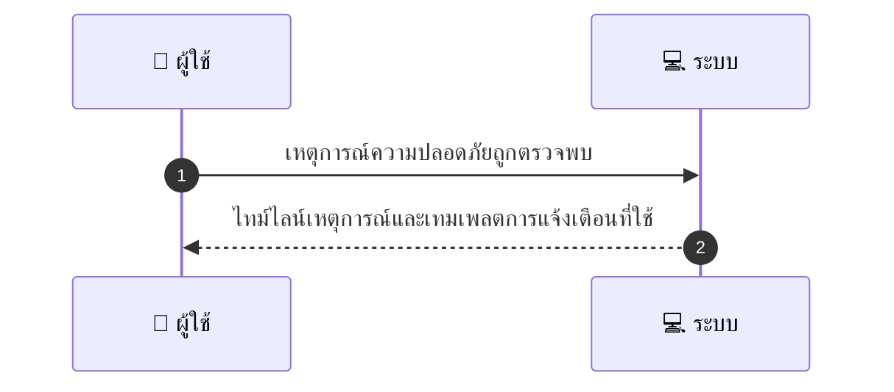
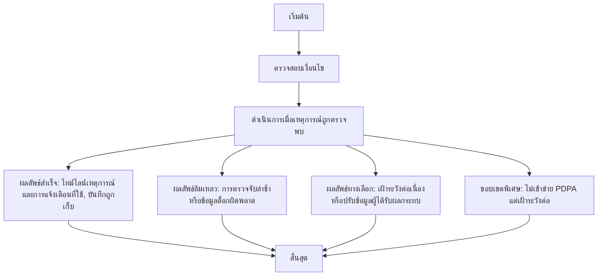

# ASYS049 - จัดการ security incidents และ user breach notifications

## 👤 บทบาท
- ผู้ดูแลระบบ

## 🎯 เป้าหมายของเคส
- ในฐานะ Security Officer
- ต้องการ รับรายงานเหตุการณ์ความปลอดภัยและแจ้งผู้ได้รับผลกระทบตาม PDPA
- เพื่อ ปฏิบัติตามข้อกฎหมายและลดความเสียหาย

## ⚙️ เงื่อนไขก่อนเริ่ม (Precondition)
- Security event detected

## 🧭 ผลลัพธ์และสถานการณ์
- ✅ ผลลัพธ์ที่คาดหวัง: ไทม์ไลน์เหตุการณ์ ขั้นตอนการแก้ไข และเทมเพลตการแจ้งเตือนที่ใช้ บันทึกถูกเก็บรักษา
- ❌ ผลลัพธ์ที่ Failure:
  - การตรวจจับเหตุการณ์ล่าช้าเกินกำหนด ทำให้ containment ไม่สำเร็จภายใน SLA initial containment 24 ชั่วโมงหรือน้อยกว่า
  - ไม่สามารถบันทึก incident timeline หรือ remediation steps ได้ เนื่องจากระบบล็อกข้อมูลเกิดความผิดพลาด
  - ไม่สามารถแจ้งเตือนผู้ได้รับผลกระทบหรือหน่วยงานที่เกี่ยวข้องภายในระยะเวลาที่กฎหมายกำหนด เนื่องจากช่องทางสื่อสารล้มเหลวหรือข้อมูลติดต่อผิด
- 🔄 ผลลัพธ์ทางเลือก:
  - เหตุการณ์ถูกตัดสินว่าไม่เข้าข่าย PDPA หรือไม่จำเป็นแจ้งผู้ได้รับผลกระทบ แต่ยังต้องดำเนินการเฝ้าระวังต่อเนื่อง
  - ผู้ได้รับผลกระทบยืนยันข้อมูลการติดต่อผิด ทำให้ต้องปรับข้อมูลและส่งแจ้งเตือนไหม่
  - แจ้งเตือนเรียบร้อยและได้รับการอนุมัติจากฝ่ายกฎหมาย แต่ต้องปรับข้อความแจ้งให้สอดคล้องกับ FAQ และสื่อสารผ่านช่องทางที่ปลอดภัย
- ⚠️ ผลลัพธ์ขอบเขตพิเศษ:
  - เหตุการณ์ถูกตัดสินว่าไม่เข้าข่าย PDPA หรือไม่จำเป็นแจ้งผู้ได้รับผลกระทบ แต่ยังต้องดำเนินการเฝ้าระวังต่อเนื่อง
  - ผู้ได้รับผลกระทบยืนยันข้อมูลการติดต่อผิด ทำให้ต้องปรับข้อมูลและส่งแจ้งเตือนไหม่
  - แจ้งเตือนเรียบร้อยและได้รับการอนุมัติจากฝ่ายกฎหมาย แต่ต้องปรับข้อความแจ้งให้สอดคล้องกับ FAQ และสื่อสารผ่านช่องทางที่ปลอดภัย
- ✅ เกณฑ์การยอมรับ (Acceptance Criteria)
  - Notification within legal timeframe
  - incident record kept
- ⏱ ลำดับความสำคัญ / SLA
  - Priority: P0
  - SLA:
    - initial containment 24 ชั่วโมงหรือน้อยกว่า
    - การแจ้งเตือนไตามกฎหมาย

---

## 🔁 Sequence Diagram  
> แสดงลำดับเหตุการณ์ระหว่าง "ผู้ใช้" กับ "ระบบ"

---

## 🧭 Flowchart Diagram
> แสดงขั้นตอนการทำงานของระบบอย่างเข้าใจง่าย

