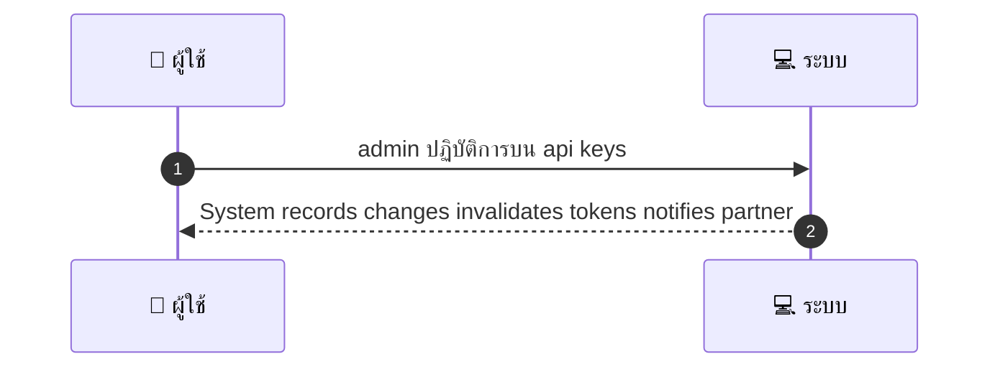
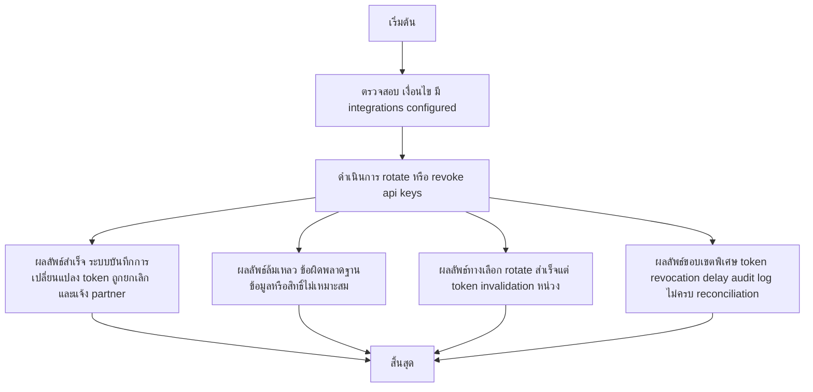

# ASYS013 - ตรวจสอบและจัดการ API keys / Integrations

## 👤 บทบาท
- ผู้ดูแลระบบ

## 🎯 เป้าหมายของเคส
- ในฐานะ Admin
- ต้องการ ดู/หมุน/เพิกถอน API keys ของ partner/integrations
- เพื่อ เพื่อความปลอดภัยการเชื่อมต่อภายนอก

## ⚙️ เงื่อนไขก่อนเริ่ม (Precondition)
- มี integrations configured

## 🧭 ผลลัพธ์และสถานการณ์
- ✅ ผลลัพธ์ที่คาดหวัง (Success Flow): System records changes, invalidates tokens, notifies partner
- ❌ ผลลัพธ์ที่ Failure:  
  - ล้มเหลวในการ rotate หรือเพิกถอน API key เนื่องจากข้อผิดพลาดฐานข้อมูลขณะบันทึกการเปลี่ยนแปลง
  - ไม่สามารถ invalidate tokens ได้ในบริการ token revocation ทำให้ tokens ยังคงใช้งานชั่วคราว
  - สิทธิ์ของผู้ดูแลระบบไม่ถูกต้องหรือ Role ไม่ตรงกับ Admin ในระบบ ทำให้ไม่สามารถดำเนินการได้
  - การแจ้งเตือนไปยัง partner ล้มเหลวระหว่างกระบวนการ rotation/เพิกถอน ทำให้ข้อมูลไม่สอดคล้องกับสถานะจริง
- 🔄 ผลลัพธ์ทางเลือก:  
  - Rotation สำเร็จ แต่การ invalidation tokens ในบางระบบล่าช้า ทำให้ช่วงเวลาที่ token อาจยังใช้งานได้
  - Rotation พบความขัดแย้งระหว่าง keys เดิมกับคีย์ใหม่ ทำให้ระบบเข้าถึงบางส่วนช้า; สามารถใช้ key สำรองชั่วคราว
  - ไม่สามารถ notify partner ในรอบแรก แต่จะทำซ้ำในรอบถัดไปโดยอัตโนมัติ
  - การ rotate สำเร็จแต่ audit log ไม่ครบถ้วน ต้องทำ reconciliation ทีหลัง
- ⚠️ ผลลัพธ์ขอบเขตพิเศษ:  
  - Rotation สำเร็จ แต่การ invalidation tokens ในบางระบบล่าช้า ทำให้ช่วงเวลาที่ token อาจยังใช้งานได้
  - Rotation พบความขัดแย้งระหว่าง keys เดิมกับคีย์ใหม่ ทำให้ระบบเข้าถึงบางส่วนช้า สามารถใช้ key สำรองชั่วคราว
  - ไม่สามารถ notify partner ในรอบแรก แต่จะทำซ้ำในรอบถัดไปโดยอัตโนมัติ
  - การ rotate สำเร็จแต่ audit log ไม่ครบถ้วน ต้องทำ reconciliation ทีหลัง

- ✅ เกณฑ์การยอมรับ (Acceptance Criteria)
  - Key rotation audit, immediate revocation capability, notification to integrator

- ⏱ ลำดับความสำคัญ / SLA
  - Priority: P1
  - SLA: revoke immediate

---

## 🔁 Sequence Diagram  
> แสดงลำดับเหตุการณ์ระหว่าง "ผู้ใช้" กับ "ระบบ"

---

## 🧭 Flowchart Diagram
> แสดงขั้นตอนการทำงานของระบบอย่างเข้าใจง่าย

