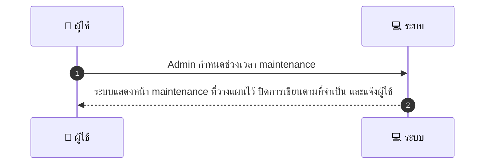
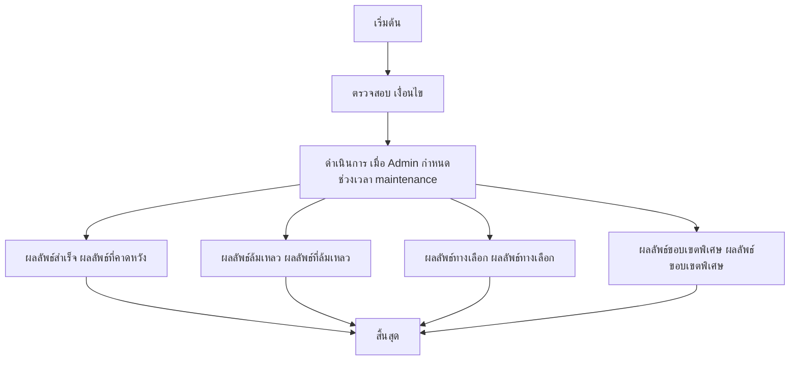

# ASYS017 - จัดการ blackout / maintenance windows

## 👤 บทบาท
- ผู้ดูแลระบบ

## 🎯 เป้าหมายของเคส
- ในฐานะ Admin/DevOps
- ต้องการ ตั้งเวลา maintenance และแสดงหน้า maintenance ให้ผู้ใช้
- เพื่อ ป้องกันการทำงานระหว่าง downtime

## ⚙️ เงื่อนไขก่อนเริ่ม (Precondition)
- ต้องมีการอัปเดตระบบ deploy

## 🧭 ผลลัพธ์และสถานการณ์
- ✅ ผลลัพธ์ที่คาดหวัง: ระบบแสดงหน้า maintenance ที่วางแผนไว้ ปิดการเขียนในที่จำเป็น และแจ้งผู้ใช้
- ❌ ผลลัพธ์ที่ Failure:
  - หน้า maintenance ไม่แสดงเมื่อเปิดโหมด maintenance
  - ไม่สามารถปิดการเขียนในส่วนที่กำหนดได้
  - ไม่สามารถส่งการแจ้งเตือนไปยังผู้ใช้ตามเวลาที่กำหนด
  - การบันทึกกำหนดการ maintenance ล้มเหลว
  - การ deploy อัปเดตระบบระหว่าง maintenance ล้มเหลว
- 🔄 ผลลัพธ์ทางเลือก:
  - abort หรือ reschedule สำเร็จ พร้อมแสดงสถานะใหม่ในแดชบอร์ด
  - การแจ้งเตือนถูกตั้งเวลาและส่งถึงผู้ใช้ตามกลุ่มได้ครบถ้วนแต่บางกลุ่มอาจมีความล่าช้าเล็กน้อย
  - maintenance page แสดงข้อความที่ปรับแต่งตามบริการที่ outage
  - ระบบเลือกปรับข้อความรายละเอียดหน้า maintenance ตามพื้นที่บริการ
  - เหตุการณ์ถูกบันทึกใน Logs และ Audit trail อย่างครบถ้วน
- ⚠️ ผลลัพธ์ขอบเขตพิเศษ:
  - abort หรือ reschedule สำเร็จ พร้อมแสดงสถานะใหม่ในแดชบอร์ด
  - การแจ้งเตือนถูกตั้งเวลาและส่งถึงผู้ใช้ตามกลุ่มได้ครบถ้วนแต่บางกลุ่มอาจมีความล่าช้าเล็กน้อย
  - maintenance page แสดงข้อความที่ปรับแต่งตามบริการที่ outage
  - ระบบเลือกปรับข้อความรายละเอียดหน้า maintenance ตามพื้นที่บริการ
  - เหตุการณ์ถูกบันทึกใน Logs และ Audit trail อย่างครบถ้วน

## ✅ เกณฑ์การยอมรับ (Acceptance Criteria)
- Maintenance notifications scheduled
- able to abort or reschedule
- logs kept

## ⏱ ลำดับความสำคัญ / SLA
- Priority: P1
- SLA: notify users at least 24h prior

---

## 🔁 Sequence Diagram  
> แสดงลำดับเหตุการณ์ระหว่าง "ผู้ใช้" กับ "ระบบ"

---

## 🧭 Flowchart Diagram
> แสดงขั้นตอนการทำงานของระบบอย่างเข้าใจง่าย

