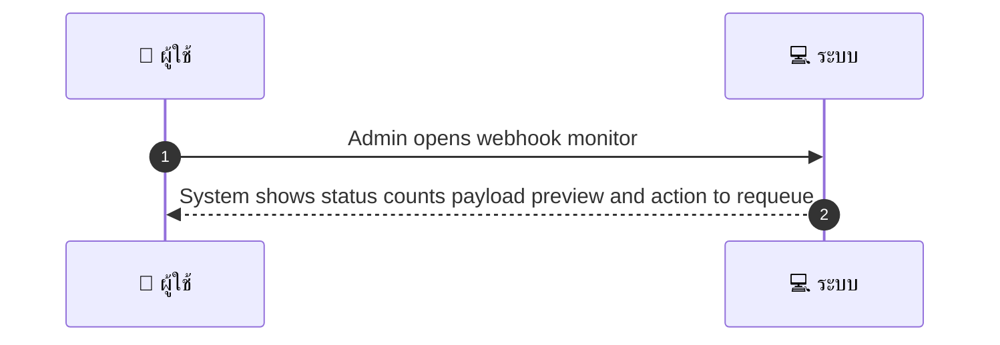
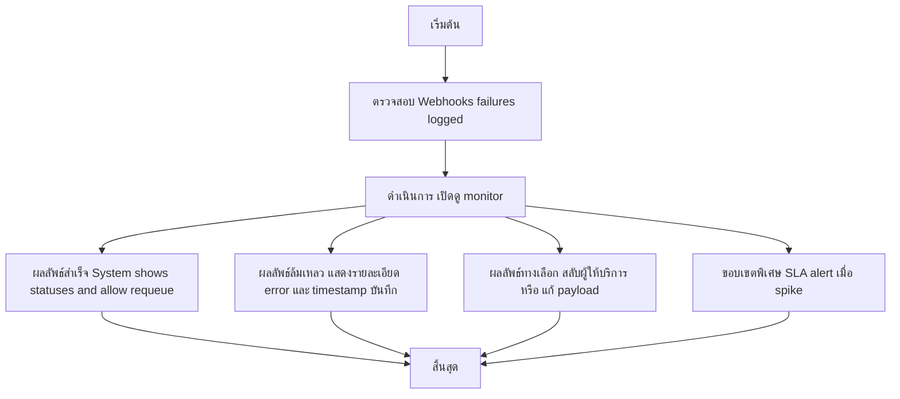

# ASYS018 - monitor webhook health & retry queue

## 👤 บทบาท
- ผู้ดูแลระบบ

## 🎯 เป้าหมายของเคส
- ในฐานะ Admin/DevOps
- ต้องการ ดูสถานะ webhook delivery Xendit/Google และจัดการ retry/failures
- เพื่อ เพื่อตรวจสอบและแก้ไขปัญหา integration

## ⚙️ เงื่อนไขก่อนเริ่ม (Precondition)
- Webhooks failures logged

## 🧭 ผลลัพธ์และสถานการณ์
- ✅ ผลลัพธ์ที่คาดหวัง (Success Flow): System shows success/fail counts, payload preview, and action to requeue
- ❌ ผลลัพธ์ที่ Failure:  
  - Webhooks delivery ล้มเหลวหลังจากการ retry ครบทุกรอบ และสถานะใน monitor ถูกบันทึกเป็น Failed พร้อมแสดง HTTP status, error message และ payload preview
- 🔄 ผลลัพธ์ทางเลือก:  
  - Admin กด Requeue ใบสั่งงานจากหน้า webhook monitor แล้วการส่งใหม่ประสบความสำเร็จ
  - เลือกใช้งาน webhook provider อื่น ในรอบ retry แล้วพัสดุส่งสำเร็จ
  - Admin ปรับ payload หรือ header ก่อน requeue เพื่อให้ผ่าน validation และ delivery ประสบความสำเร็จ
- ⚠️ ผลลัพธ์ขอบเขตพิเศษ:  
  - Admin ปรับ payload หรือ header ก่อน requeue เพื่อให้ผ่าน validation และ delivery ประสบความสำเร็จ

## ✅ เกณฑ์การยอมรับ (Acceptance Criteria)
- Ability to replay webhooks, view signatures, and error details

## ⏱ ลำดับความสำคัญ / SLA
- Priority: P1
- SLA: alert on failure spike 5m

---

## 🔁 Sequence Diagram  
> แสดงลำดับเหตุการณ์ระหว่าง "ผู้ใช้งาน" กับ "ระบบ"

---

## 🧭 Flowchart Diagram
> แสดงขั้นตอนการทำงานของระบบอย่างเข้าใจง่าย

