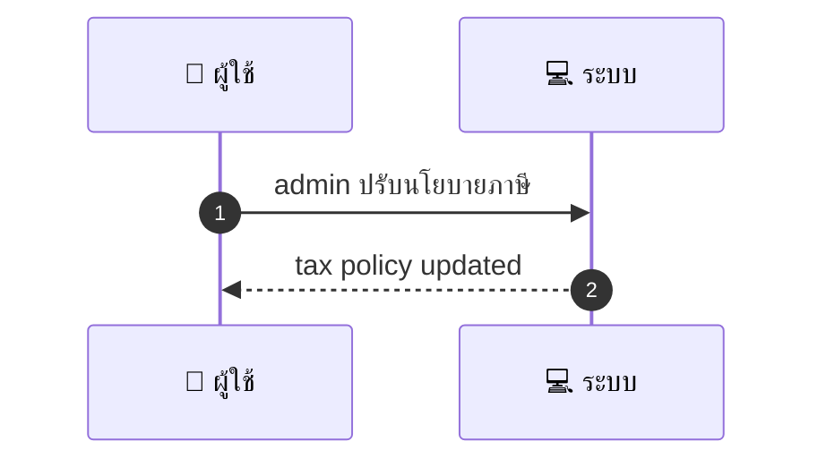
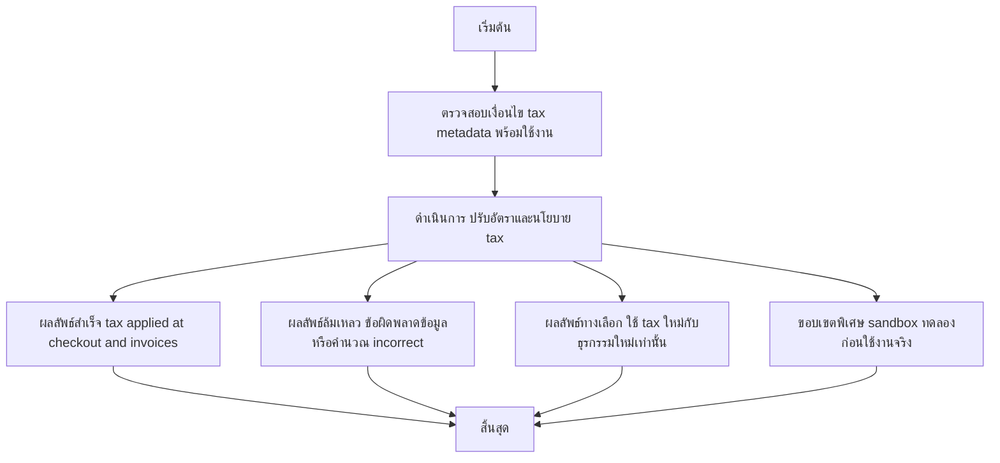

# ASYS022 - จัดการ tax settings & compliance

## 👤 บทบาท
- ผู้ดูแลระบบ

## 🎯 เป้าหมายของเคส
- ในฐานะ Admin/Finance
- ต้องการ ตั้งค่า VAT tax rules global และ per country per provider
- เพื่อ ใบเสร็จและรายงานสอดคล้องกับกฎหมายภาษี

## ⚙️ เงื่อนไขก่อนเริ่ม (Precondition)
- Providers have tax metadata

## 🧭 ผลลัพธ์และสถานการณ์
- ✅ ผลลัพธ์ที่คาดหวัง (Success Flow): Tax applied at checkout and invoice reports reflect tax changes
- ❌ ผลลัพธ์ที่ Failure:
  - บันทึกการตั้งค่าภาษีล้มเหลว เนื่องจากข้อมูล tax metadata ไม่ครบถ้วนหรือมีความขัดแย้ง
  - การคำนวณภาษีใน checkout/invoice แสดงจำนวนภาษีผิดพลาดหรือไม่ตรงกับกฎหมาย
  - ไม่สามารถส่งออกหรือรีเฟรชรายงานภาษีที่อัปเดต
  - การบังคับใช้ Effective Date เกิดความล่าช้า ทำให้ใบเสร็จอัปเดตภาษีล่าช้า
- 🔄 ผลลัพธ์ทางเลือก:
  - Tax changes ถูกนำไปใช้กับธุรกรรมใหม่เท่านั้น ในขณะที่ธุรกรรมที่มีอยู่ยังใช้ tax เดิม
  - การเปลี่ยนแปลงลงทะเบียนเป็นเวิร์คโฟลว์แบบทดลองใน sandbox ก่อนใช้งานจริง
  - ระบบอนุญาตให้บันทึกการตั้งค่าเป็น Draft หรือ Pending approval ก่อนปล่อยใช้งาน
  - ใบเสร็จ/รายงานยังสามารถอัปเดตได้ตามช่วงเวลาที่ระบุ หากผู้ใช้งานเลือก Activated later
- ⚠️ ผลลัพธ์ขอบเขตพิเศษ:
  - Tax changes ถูกนำไปใช้กับธุรกรรมใหม่เท่านั้น ในขณะที่ธุรกรรมที่มีอยู่ยังใช้ tax เดิม
  - การเปลี่ยนแปลงลงทะเบียนเป็นเวิร์คโฟลว์แบบทดลองใน sandbox ก่อนใช้งานจริง
  - ระบบอนุญาตให้บันทึกการตั้งค่าเป็น Draft หรือ Pending approval ก่อนปล่อยใช้งาน
  - ใบเสร็จ/รายงานยังสามารถอัปเดตได้ตามช่วงเวลาที่ระบุ หากผู้ใช้งานเลือก Activated later

## ✅ เกณฑ์การยอมรับ (Acceptance Criteria)
- Effective date for changes
- audit trail and exportable tax reports

## ⏱ ลำดับความสำคัญ / SLA
- Priority: P1
- SLA: change effective per schedule

---

## 🔁 Sequence Diagram  
> แสดงลำดับเหตุการณ์ระหว่าง ผู้ใช้ กับ ระบบ

---

## 🧭 Flowchart Diagram
> แสดงขั้นตอนการทำงานของระบบอย่างเข้าใจง่าย

