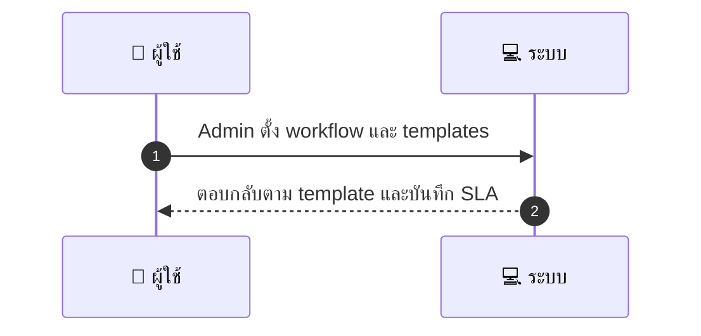
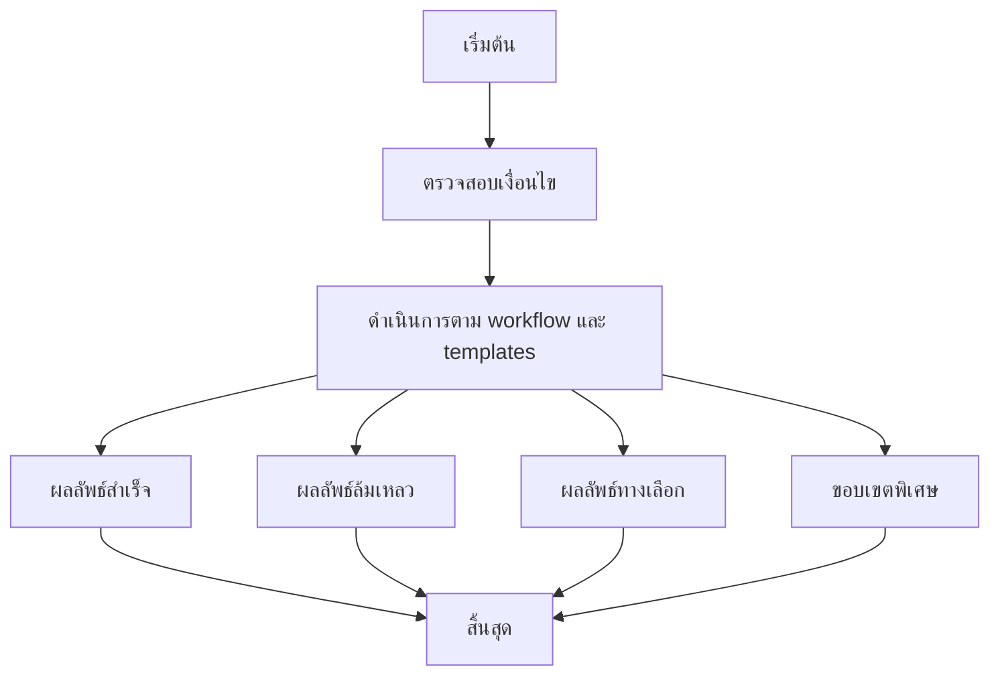

# ASYS038 - จัดการ complaint handling process & templates

## 👤 บทบาท
- ผู้ดูแลระบบ

## 🎯 เป้าหมายของเคส
- ในฐานะ Admin/Support
- ต้องการ กำหนดขั้นตอนและ template สำหรับตอบ complaint ลูกค้า
- เพื่อ เพื่อให้การตอบเป็นมาตรฐานและรวดเร็ว

## ⚙️ เงื่อนไขก่อนเริ่ม (Precondition)
- Complaints come in via tickets

## 🧭 ผลลัพธ์และสถานการณ์
- ✅ ผลลัพธ์ที่คาดหวัง (Success Flow): Agents follow templates; responses logged; SLA enforced
- ❌ ผลลัพธ์ที่ Failure:  
  - ไม่พบ template หรือเวอร์ชันที่สอดคล้องกับ locale ที่ระบุ ทำให้ไม่สามารถส่งข้อความตามมาตรฐานได้
  - ระบบ logging หรือบันทึกการตอบกลับล้มเหลว ทำให้ไม่มีบันทึกการสื่อสารและสายงาน SLA
  - ข้อความตอบกลับไม่สอดคล้องกับมาตรฐาน QA หรือ guidelines ภายในองค์กร
  - ACK/ยืนยัน Receipt ไม่ถูกส่งภายใน SLA initial ack 24h
  - เกิดข้อผิดพลาดในการ merge fields หรือการสร้างข้อความ ทำให้เนื้อหาข้อความไม่ครบถ้วน
- 🔄 ผลลัพธ์ทางเลือก:  
  - ใช้ template ภาษาอังกฤษเป็น fallback และ localization ตาม locale พร้อมแจ้งผู้ใช้งาน
  - ใช้งานเวอร์ชัน template แบบ A/B test เพื่อหาความเหมาะสม และให้ QA ตรวจสอบก่อนใช้งานจริง
  - หาก locale ไม่รองรับ ให้ตอบด้วยข้อความกลาง neutral และตามด้วยลิงก์ self-service
  - ใช้ dynamic fields ที่ปรับตามข้อมูลที่ลูกค้าสมบูรณ์เพื่อให้ข้อความสอดคล้อง
  - ให้ agent ปรับแต่งข้อความตามสถานการณ์หลังจากเลือก template แล้วบันทึกเวอร์ชันที่ใช้งาน
- ⚠️ ผลลัพธ์ขอบเขตพิเศษ:  
  - ใช้ template ภาษาอังกฤษเป็น fallback และ localization ตาม locale พร้อมแจ้งผู้ใช้งาน
  - ใช้งานเวอร์ชัน template แบบ A/B test เพื่อหาความเหมาะสม และให้ QA ตรวจสอบก่อนใช้งานจริง
  - หาก locale ไม่รองรับ ให้ตอบด้วยข้อความกลาง neutral และตามด้วยลิงก์ self-service
  - ใช้ dynamic fields ที่ปรับตามข้อมูลที่ลูกค้าสมบูรณ์เพื่อให้ข้อความสอดคล้อง
  - ให้ agent ปรับแต่งข้อความตามสถานการณ์หลังจากเลือก template แล้วบันทึกเวอร์ชันที่ใช้งาน

## ✅ เกณฑ์การยอมรับ (Acceptance Criteria)
- Templates localized
- versioning and A/B testing possible

## ⏱ ลำดับความสำคัญ / SLA
- Priority: P1
- SLA: initial ack 24h

---

## 🔁 Sequence Diagram  
> แสดงลำดับเหตุการณ์ระหว่าง "ผู้ใช้" กับ "ระบบ"

---

## 🧭 Flowchart Diagram
> แสดงขั้นตอนการทำงานของระบบอย่างเข้าใจง่าย

