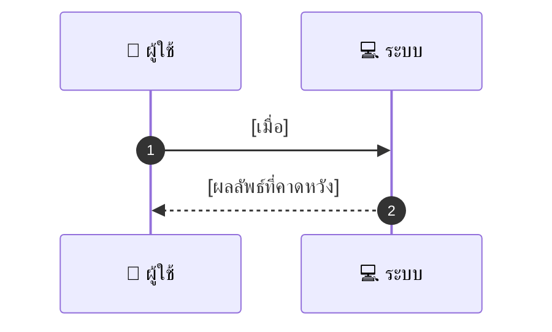

# ASYS045 - จัดการ legal & tax document storage

## 👤 บทบาท
- ผู้ดูแลระบบ

## 🎯 เป้าหมายของเคส
- ในฐานะ Admin/Finance
- ต้องการ เก็บเอกสารทางกฎหมายและภาษีของ providers และ platform
- เพื่อ รองรับ audit และ compliance

## ⚙️ เงื่อนไขก่อนเริ่ม (Precondition)
- Providers upload documents

## 🧭 ผลลัพธ์และสถานการณ์
- ✅ ผลลัพธ์ที่คาดหวัง (Success Flow): Documents indexed, access controlled, and versioned
- ❌ ผลลัพธ์ที่ Failure:
  - เอกสารถูกอัปโหลดแล้ว แต่ไม่ถูก index ในระบบค้นหา ทำให้ไม่สามารถค้นหาพบได้
  - ผู้ใช้ไม่มีสิทธิ์เข้าถึงเอกสารที่ดาวน์โหลด
  - ไฟล์เสียหายหรือตรวจสอบความถูกต้องล้มเหลว
  - Encryption at rest ล้มเหลวหรือคีย์หาย ทำให้ไม่สามารถอ่านข้อมูลได้
  - Retention logs ไม่ถูกสร้างหรือหาย
- 🔄 ผลลัพธ์ทางเลือก:
  - ค้นหาได้และดาวน์โหลดสำเร็จ แต่เวอร์ชันของเอกสารไม่ใช่เวอร์ชันล่าสุด ระบบเสนอให้เลือกเวอร์ชันที่ถูกต้อง
  - เอกสารถูกค้นหาและดาวน์โหลดได้ แต่ metadata บางรายการไม่ครบ ระบบแจ้งและขอปรับ metadata ก่อนปล่อยเวอร์ชัน
  - การอัป_UPLOAD สำเร็จแต่ metadata ไม่ครบ ผู้ดูแลระบบสามารถกรอก metadata ที่จำเป็นและบันทึกใหม่
- ⚠️ ผลลัพธ์ขอบเขตพิเศษ:
  - ค้นหาได้และดาวน์โหลดสำเร็จ แต่เวอร์ชันของเอกสารไม่ใช่เวอร์ชันล่าสุด ระบบเสนอให้เลือกเวอร์ชันที่ถูกต้อง
  - เอกสารถูกค้นหาและดาวน์โหลดได้ แต่ metadata บางรายการไม่ครบ ระบบแจ้งและขอปรับ metadata ก่อนปล่อยเวอร์ชัน
  - การอัป_UPLOAD สำเร็จแต่ metadata ไม่ครบ ผู้ดูแลระบบสามารถกรอก metadata ที่จำเป็นและบันทึกใหม่

## ✅ เกณฑ์การยอมรับ (Acceptance Criteria)
- Retention and access logs maintained
- encryption at rest

## ⏱ ลำดับความสำคัญ / SLA
- Priority: P1
- SLA: search 10s

---

## 🔁 Sequence Diagram  
> แสดงลำดับเหตุการณ์ระหว่าง "ผู้ใช้" กับ "ระบบ"



---

## 🧭 Flowchart Diagram
> แสดงขั้นตอนการทำงานของระบบอย่างเข้าใจง่าย

```mermaid
flowchart TD
  A[เริ่มต้น] --> B[ตรวจสอบ: [เงื่อนไข]]
  B --> C[ดำเนินการ: [เมื่อ]]
  C --> D[ผลลัพธ์สำเร็จ: [ผลลัพธ์ที่คาดหวัง]]
  C --> E[ผลลัพธ์ล้มเหลว: [ผลลัพธ์ที่Failure]]
  C --> F[ผลลัพธ์ทางเลือก: [ผลลัพธ์ทางเลือก]]
  C --> G[ขอบเขตพิเศษ: [ผลลัพธ์ขอบเขตพิเศษ]]
  D --> H[สิ้นสุด]
  E --> H
  F --> H
  G --> H
```

