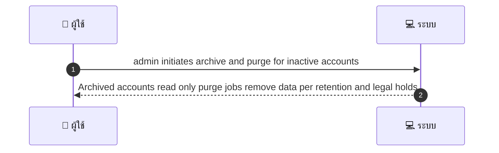
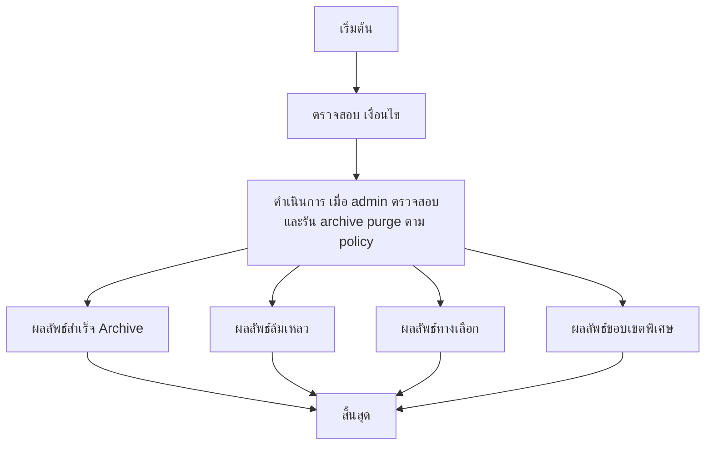

# ASYS047 - จัดการ archived accounts และ data purge workflows

## 🧭 ส่วนอธิบาย Use Case
ผู้ดูแลระบบจะค้นหาบัญชีที่ inactive ตาม threshold แล้วย้ายไป archive เพื่อให้บัญชีเป็น read only และรัน purge ตาม retention policy โดยคำนึงถึง legal holds ทั้งนี้ หากเกิดสถานการณ์ต่างๆ เช่น ไม่มีบัญชีที่ตรงเงื่อนไข holds หรือการเชื่อมต่อถูกสะดุด จะมีทางเลือกในการดำเนินการและการแจ้งเตือน พร้อมบันทึกเหตุการณ์เพื่อการตรวจสอบทางกฎหมาย

## 👤 บทบาท
- ผู้ดูแลระบบ

## 🎯 เป้าหมายของเคส
- ในฐานะ Admin/Privacy
- ต้องการ ย้ายบัญชีที่ inactive ไป archive และ purge ตาม policy
- เพื่อ ลด footprint ของข้อมูลและปฏิบัติตาม retention

## ⚙️ เงื่อนไขก่อนเริ่ม (Precondition)
- Users inactive beyond threshold

## 🧭 ผลลัพธ์และสถานการณ์
- ✅ ผลลัพธ์ที่คาดหวัง: Archived accounts read only purge jobs remove data per retention and legal holds
- ❌ ผลลัพธ์ที่ Failure:
  - ไม่พบบัญชีที่ inactive ตาม threshold ในระบบ ทำให้ไม่สามารถ archive ได้
  - ข้อมูลถูก legal hold หรือถูกถ่วงการลบ ทำให้ purge ไม่สำเร็จ
  - ข้อผิดพลาดระบบ เช่น DBConnectionError ระหว่างรันงาน archive purge ทำให้กระบวนการล้มเหลว
  - สิทธิ์ผู้ดูแลไม่เพียงพอ ปิดกั้นการ archive หรือ purge
  - การย้ายไป archive ล้มเหลว เนื่องจากปัญหาการเชื่อมต่อ data store
- 🔄 ผลลัพธ์ทางเลือก:
  - Archive สำเร็จ แต่ purge ล้มเหลวหรือถูกเลื่อนออกไปตาม SLA
  - Archive สำเร็จพร้อม data ที่ถูกเก็บในโฟลเดอร์ archive และ purge งานถูกกำหนดให้รันในรอบถัดไป
  - Archive ทำได้สำเร็จแต่ข้อมูลบางส่วนถูกเก็บไว้เพื่อ forensic legal review และ purge ทำต่อเมื่อ Holds ปลด
  - Restore option พร้อมใช้งานและมีเอกสารขั้นตอน restore
  - Deferral maintenance window ทำให้รัน purge archive ถูกเลื่อน
- ⚠️ ผลลัพธ์ขอบเขตพิเศษ:
  - Archive สำเร็จ แต่ purge ล้มเหลวหรือถูกเลื่อนออกไปตาม SLA
  - Archive สำเร็จพร้อม data ที่ถูกเก็บในโฟลเดอร์ archive และ purge งานถูกกำหนดให้รันในรอบถัดไป
  - Archive ทำได้สำเร็จแต่ข้อมูลบางส่วนถูกเก็บไว้เพื่อ forensic legal review และ purge ทำต่อเมื่อ Holds ปลด
  - Restore option พร้อมใช้งานและมีเอกสารขั้นตอน restore
  - Deferral maintenance window ทำให้รัน purge archive ถูกเลื่อน
- เกณฑ์การยอมรับ:
  - Archive restore process documented
  - purge logs kept

## ✅ เกณฑ์การยอมรับ (Acceptance Criteria)
- Archive restore process documented
- purge logs kept

## ⏱ ลำดับความสำคัญ / SLA
- Priority: P1
- SLA:
  - archive job weekly
  - purge per retention

---

## 🔁 Sequence Diagram  
> แสดงลำดับเหตุการณ์ระหว่าง ผู้ใช้ กับ ระบบ

---

## 🧭 Flowchart Diagram
> แสดงขั้นตอนการทำงานของระบบอย่างเข้าใจง่าย

