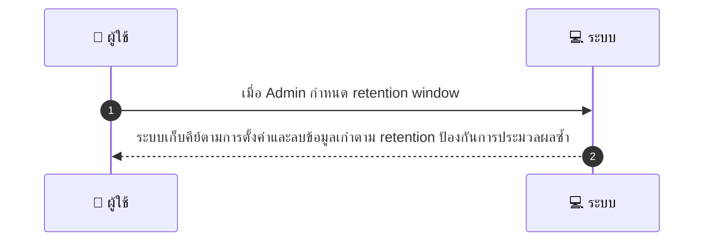
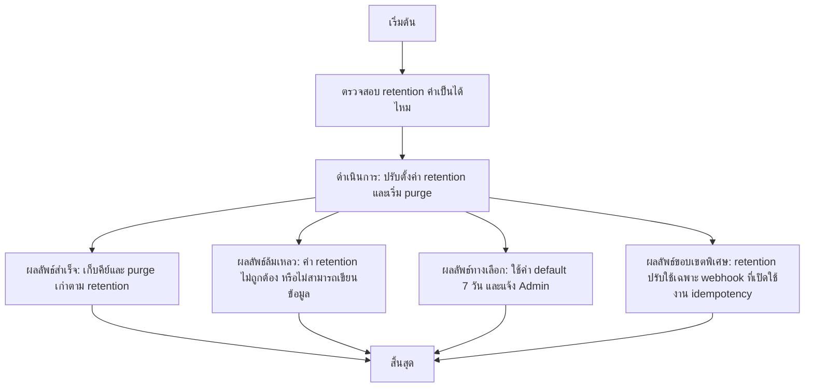

# ASYS052 - ตั้งค่า retention ของ idempotency keys และ webhook cache

## 👤 บทบาท
- ผู้ดูแลระบบ

## 🎯 เป้าหมายของเคส
- ในฐานะ Admin/DevOps
- ต้องการ จัดการค่าการเก็บ idempotency keys เพื่อป้องกัน replay และเก็บทรัพยากร
- เพื่อ balance ระหว่างความปลอดภัยและ storage

## ⚙️ เงื่อนไขก่อนเริ่ม (Precondition)
- Webhooks idempotency implemented

## 🧭 ผลลัพธ์และสถานการณ์
- ✅ ผลลัพธ์ที่คาดหวัง (Success Flow): ระบบเก็บคีย์ตามการตั้งค่าและลบข้อมูลเก่าตาม retention ป้องกันการประมวลผลซ้ำ  
- ❌ ผลลัพธ์ที่ Failure:  
  - ค่า retention ที่ป้อนอยู่นอกช่วงที่อนุญาต น้อยกว่า 1 วัน หรือ มากกว่า 365 วัน ทำให้การบันทึกการตั้งค่าล้มเหลว  
  - ไม่สามารถเขียนค่าการตั้งค่าไปยังฐานข้อมูล/ Redis cache เนื่องจากการเชื่อมต่อขัดข้อง  
  - เกิดข้อผิดพลาดระหว่างกระบวนการ purge ข้อมูลเก่าที่เกิน retention ทำให้ไม่สามารถล้างข้อมูลได้ทั้งหมด  
  - สิทธิ์ของผู้ใช้งานไม่เพียงพอในการเปลี่ยน retention  
- 🔄 ผลลัพธ์ทางเลือก:  
  - ระบบใช้ค่า default 7 วันและแจ้งเตือน Admin เมื่อค่า retention ที่ป้อนไม่ถูกต้อง  
  - ผลลัพธ์บางส่วนสำเร็จ ตั้ง retention ได้สำหรับชุด keys บางส่วน ในขณะที่ข้อมูลเก่าบางส่วนยังรอ purge ในรอบถัดไป  
  - Retention ปรับใช้เฉพาะ Webhook ที่เปิดใช้งาน idempotency หาก path อื่นยังคงใช้งานค่าเดิม  
- ⚠️ ผลลัพธ์ขอบเขตพิเศษ:  
  - ระบบใช้ค่า default 7 วันและแจ้งเตือน Admin เมื่อค่า retention ที่ป้อนไม่ถูกต้อง  
  - ผลลัพธ์บางส่วนสำเร็จ ตั้ง retention ได้สำหรับชุด keys บางส่วน ในขณะที่ข้อมูลเก่าบางส่วนยังรอ purge ในรอบถัดไป  
  - Retention ปรับใช้เฉพาะ Webhook ที่เปิดใช้งาน idempotency หาก path อื่นยังคงใช้งานค่าเดิม

## ✅ เกณฑ์การยอมรับ (Acceptance Criteria)
- ความสามารถในการกำหนดค่า retention
- ค่าเริ่มต้น 7 วัน
- เมตริกส์การนับ dedup hits

## ⏱ ลำดับความสำคัญ / SLA
- Priority: P1
- SLA: change effective immediate

---

## 🔁 Sequence Diagram  
> แสดงลำดับเหตุการณ์ระหว่าง "ผู้ใช้" กับ "ระบบ"

---

## 🧭 Flowchart Diagram
> แสดงขั้นตอนการทำงานของระบบอย่างเข้าใจง่าย

