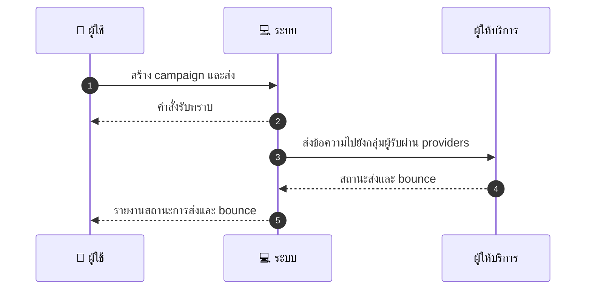
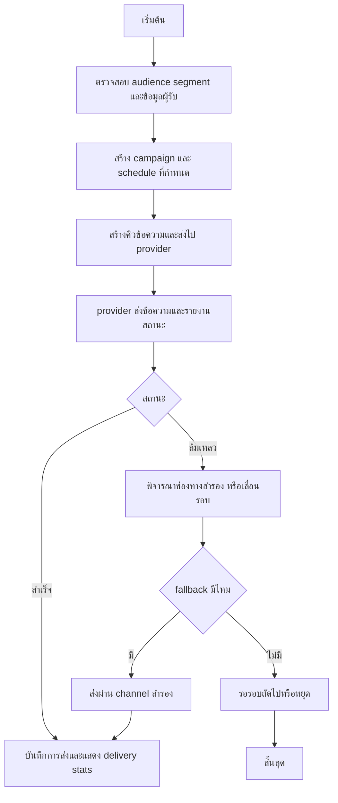

# ASYS026 - จัดการ mass messaging / announcements

## 👤 บทบาท
- ผู้ดูแลระบบ

## 🎯 เป้าหมายของเคส
- ในฐานะ Admin/Marketing
- ต้องการ ส่งข้อความแบบเป็นกลุ่ม email push SMS ต่อกลุ่มผู้ใช้ที่เลือก
- เพื่อ ประกาศข่าวสารหรือโปรโมชั่น

## ⚙️ เงื่อนไขก่อนเริ่ม (Precondition)
- มี audience segment ที่ระบุ

## 🧭 ผลลัพธ์และสถานการณ์
- ✅ ผลลัพธ์ที่คาดหวัง (Success Flow): System queues messages via providers, shows delivery stats and bounces
- ❌ ผลลัพธ์ที่ Failure:  
  - ข้อความไม่ถูกส่งตามกำหนดเนื่องจากผู้ให้บริการ ล้มเหลวชั่วคราว
  - คิวส่งไม่ถูกสร้างหรือข้อมูลกลุ่มผู้รับผิดพลาด ทำให้กระบวนการล้มเหลว
  - ข้อมูลผู้รับไม่สมบูรณ์ เช่น อีเมล/เบอร์โทรศัพท์ไม่ถูกต้อง
  - ขีดจำกัดการส่ง/ rate limit ถูกตีเร็วเกินไป ทำให้การส่งล้มเหลวบางช่วง
  - การบันทึกสถานะหรือจองข้อความลงในคิวล้มเหลว
  - timeout/API error ระหว่างการเรียก provider
- 🔄 ผลลัพธ์ทางเลือก:  
  - ข้อความถูกส่งสำเร็จบางส่วน มีกลุ่มผู้รับที่ได้รับข้อความ ส่วนที่เหลืออยู่ในคิว
  - ระบบใช้ช่องทางสำรอง เช่น จาก email ไป push หรือ SMS ตามลำดับเมื่อ channel หลักล้มเหลว
  - การส่งถูกเลื่อนไปยังรอบถัดไปหากเวลาส่งไม่ตรงกับ schedule
  - ผู้รับที่อยู่ใน opt-out ไม่ถูกส่ง ข้อความยังคงดำเนินการกับกลุ่มที่ยินยอม
  - รายงาน delivery stats แสดงสถานะเป็น pending สำหรับผู้รับบางราย และพร้อม retry
- ⚠️ ผลลัพธ์ขอบเขตพิเศษ:  
  - ข้อความถูกส่งสำเร็จบางส่วน มีกลุ่มผู้รับที่ได้รับข้อความ ส่วนที่เหลืออยู่ในคิว
  - ระบบใช้ช่องทางสำรอง เช่น จาก email ไป push หรือ SMS ตามลำดับเมื่อ channel หลักล้มเหลว
  - การส่งถูกเลื่อนไปยังรอบถัดไปหากเวลาส่งไม่ตรงกับ schedule
  - ผู้รับที่อยู่ใน opt-out ไม่ถูกส่ง ข้อความยังคงดำเนินการกับกลุ่มที่ยินยอม
  - รายงาน delivery stats แสดงสถานะเป็น pending สำหรับผู้รับบางราย และพร้อม retry

## ✅ เกณฑ์การยอมรับ (Acceptance Criteria)
- Opt-out respected
- scheduling and rate limits enforced

## ⏱ ลำดับความสำคัญ / SLA
- Priority: P2
- SLA: send queued within scheduled time

---

## 🔁 Sequence Diagram  
> แสดงลำดับเหตุการณ์ระหว่าง "ผู้ใช้" กับ "ระบบ"

---

## 🧭 Flowchart Diagram
> แสดงขั้นตอนการทำงานของระบบอย่างเข้าใจง่าย

