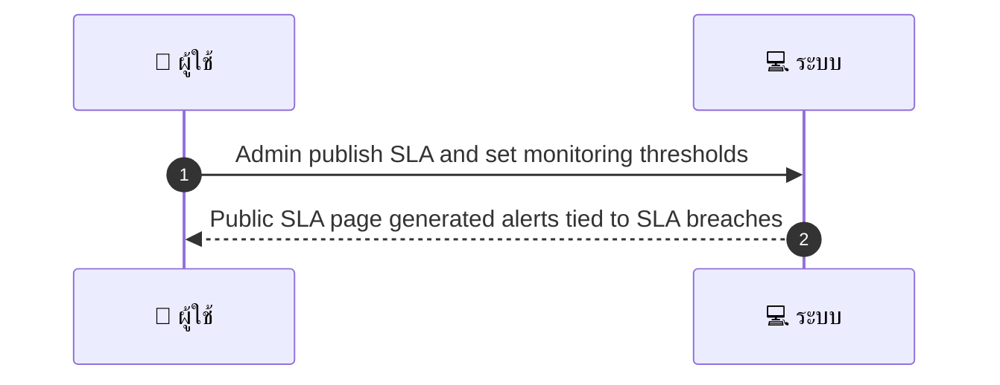
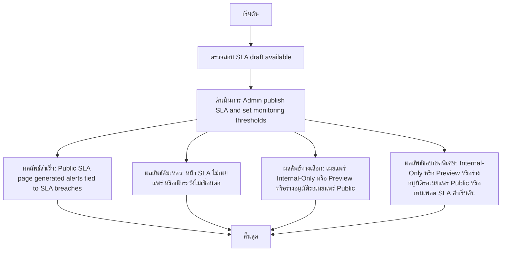

# ASYS042 - จัดการ service level agreements และ public SLA page

## 👤 บทบาท
- ผู้ดูแลระบบ

## 🎯 เป้าหมายของเคส
- ในฐานะ
- Admin/Operations
- ต้องการ
- กำหนด SLA public/internal uptime, support และแสดงหน้า SLA
- เพื่อ
- เพื่อสื่อสารความคาดหวังกับลูกค้า/ทีม

## ⚙️ เงื่อนไขก่อนเริ่ม (Precondition)
- SLA draft available

## 🧭 ผลลัพธ์และสถานการณ์
- ✅ ผลลัพธ์ที่คาดหวัง (Success Flow): Public SLA page generated alerts tied to SLA breaches  
- ❌ ผลลัพธ์ที่ Failure:  
  - ไม่สามารถสร้างหน้า Public SLA ได้เมื่อพยายามเผยแพร่ เนื่องจากระบบ rendering หรือ API สั่งทำงานล้มเหลว
  - การบันทึกค่าการเฝ้าระวัง monitoring thresholds ล้มเหลว ทำให้ไม่สามารถเชื่อมโยงกับหน้า SLA ได้
  - ข้อมูล SLA uptime ระยะเวลาการสนับสนุน ไม่ถูกต้องหรือไม่ครบถ้วน ทำให้การเผยแพร่ล้มเหลว
  - การตั้งค่าการแจ้งเตือน SLA breach ไม่ถูกผูกกับหน้า SLA หรือระบบแจ้งเตือนล้มเหลว
- 🔄 ผลลัพธ์ทางเลือก:  
  - เผยแพร่ SLA ในโหมด Internal-Only หรือ Preview ก่อนให้กลุ่มภายในเข้าถึง
  - บันทึกเป็นร่างที่อนุมัติแล้วแต่รอการอนุมัติสำหรับเผยแพร่ Public
  - เลือกใช้เทมเพลต SLA ที่มีการตั้งค่าเริ่มต้นแตกต่าง เช่น ไม่มีการแจ้งเตือน breaches ก่อนที่ปรับค่าได้
- ⚠️ ผลลัพธ์ขอบเขตพิเศษ:  
  - เผยแพร่ SLA ในโหมด Internal-Only หรือ Preview ก่อนให้กลุ่มภายในเข้าถึง
  - บันทึกเป็นร่างที่อนุมัติแล้วแต่รอการอนุมัติสำหรับเผยแพร่ Public
  - เลือกใช้เทมเพลต SLA ที่มีการตั้งค่าเริ่มต้นแตกต่าง เช่น ไม่มีการแจ้งเตือน breaches ก่อนที่ปรับค่าได้

## ✅ เกณฑ์การยอมรับ (Acceptance Criteria)
- SLA breach logging and notifications to stakeholders

## ⏱ ลำดับความสำคัญ / SLA
- Priority: P2
- SLA: publish immediate

---

## 🔁 Sequence Diagram  
> แสดงลำดับเหตุการณ์ระหว่าง "ผู้ใช้" กับ "ระบบ"

---

## 🧭 Flowchart Diagram
> แสดงขั้นตอนการทำงานของระบบอย่างเข้าใจง่าย

