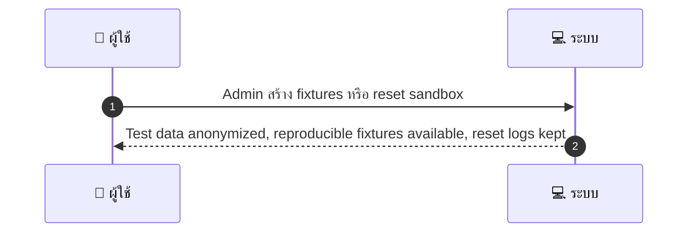
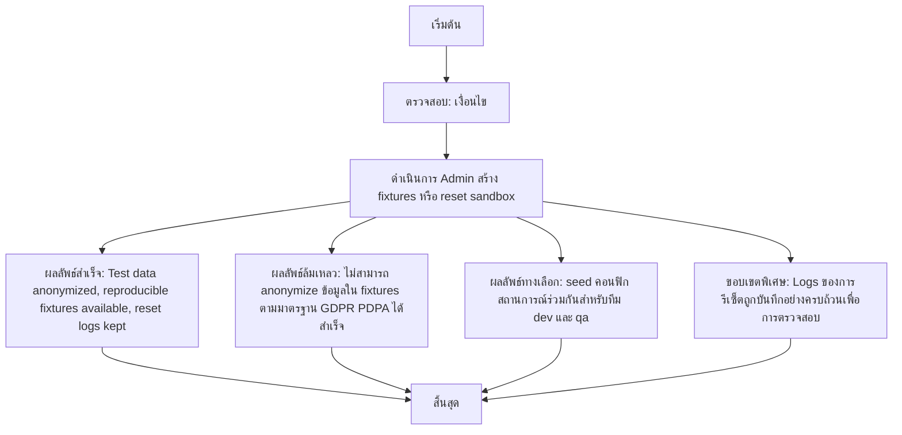

# ASYS054 - จัดการ sandbox/test accounts และ data fixtures

## 👤 บทบาท
- ผู้ดูแลระบบ

## 🎯 เป้าหมายของเคส
- ใบในฐานะ: Admin/QA
- ต้องการ: สร้าง/รีเซ็ต sandbox accounts และ fixtures สำหรับทีม dev/qa
- เพื่อ: เพื่อให้ environment ทดสอบสอดคล้องกับ production data patterns

## ⚙️ เงื่อนไขก่อนเริ่ม (Precondition)
- Test environment available

## 🧭 ผลลัพธ์และสถานการณ์
- ✅ ผลลัพธ์ที่คาดหวัง (Success Flow): Test data anonymized, reproducible fixtures available, reset logs kept
- ❌ ผลลัพธ์ที่ Failure:  
  - ไม่สามารถ anonymize ข้อมูลใน fixtures ตามมาตรฐาน GDPR/PDPA ได้สำเร็จ
  - Sandbox environment ไม่พร้อมใช้งานหรือถูกระงับในช่วงเวลาทดสอบ
  - การรีเซ็ต sandbox ล้มเหลวโดยไม่มีการบันทึก logs หรือข้อมูลไม่ครบถ้วน
  - การ seed fixtures ล้มเหลว ทำให้ชุดข้อมูลไม่สอดคล้องกับ production data patterns
  - เวลาการ deploy fixtures เกิน SLA 5 นาที
  - ข้อมูล fixture ซ้ำซ้อนหรือไม่สอดคล้องกับ environment ปัจจุบัน
- 🔄 ผลลัพธ์ทางเลือก:  
  - สามารถ seed คอนฟิก/สถานการณ์ร่วมกันสำหรับทีม dev และ qa ได้
  - สามารถ rollback ไปสู่สถานะก่อนรีเซ็ตได้อย่างรวดเร็ว
  - มี snapshot/backup ของ fixtures ให้เลือกใช้งานสำหรับกรณีทดสอบทั่วไป
  - สามารถ seed คอนฟิก/สถานการณ์ร่วมกันสำหรับทีม dev และ qa ได้
  - ขั้นตอนการ re-seed และ purge รองรับการใช้งานซ้ำโดยไม่รบกวน prod
  - Logs ของการรีเซ็ตถูกบันทึกอย่างครบถ้วนเพื่อการตรวจสอบ
- ⚠️ ผลลัพธ์ขอบเขตพิเศษ:  
  - สามารถใช้งานชุด fixturesที่สำคัญได้แม้บางส่วนของข้อมูลไม่ถูก anonymize ครบถ้วน
  - สามารถ rollback ไปสู่สถานะก่อนรีเซ็ตได้อย่างรวดเร็ว
  - มี snapshot/backup ของ fixtures ให้เลือกใช้งานสำหรับกรณีทดสอบทั่วไป
  - สามารถ seed คอนฟิก/สถานการณ์ร่วมกันสำหรับทีม dev และ qa ได้
  - ขั้นตอนการ re-seed และ purge รองรับการใช้งานซ้ำโดยไม่รบกวน prod
  - Logs ของการรีเซ็ตถูกบันทึกอย่างครบถ้วนเพื่อการตรวจสอบ

## ✅ เกณฑ์การยอมรับ (Acceptance Criteria)
- Isolation from prod
- ability to seed common scenarios
- purge after tests

## ⏱ ลำดับความสำคัญ / SLA
- Priority: P2
- SLA: fixture deploy 5m

---

## 🔁 Sequence Diagram  
> แสดงลำดับเหตุการณ์ระหว่าง "ผู้ใช้" กับ "ระบบ"

---

## 🧭 Flowchart Diagram
> แสดงขั้นตอนการทำงานของระบบอย่างเข้าใจง่าย

