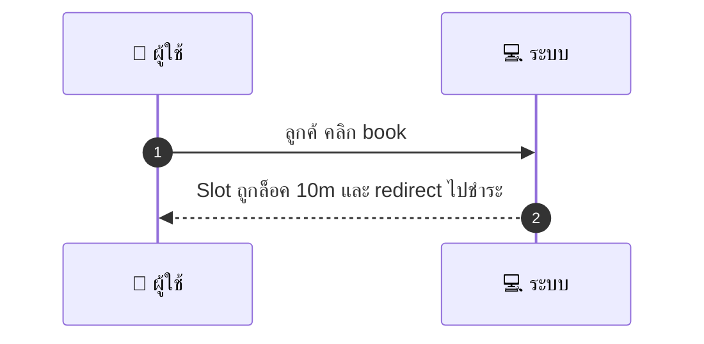
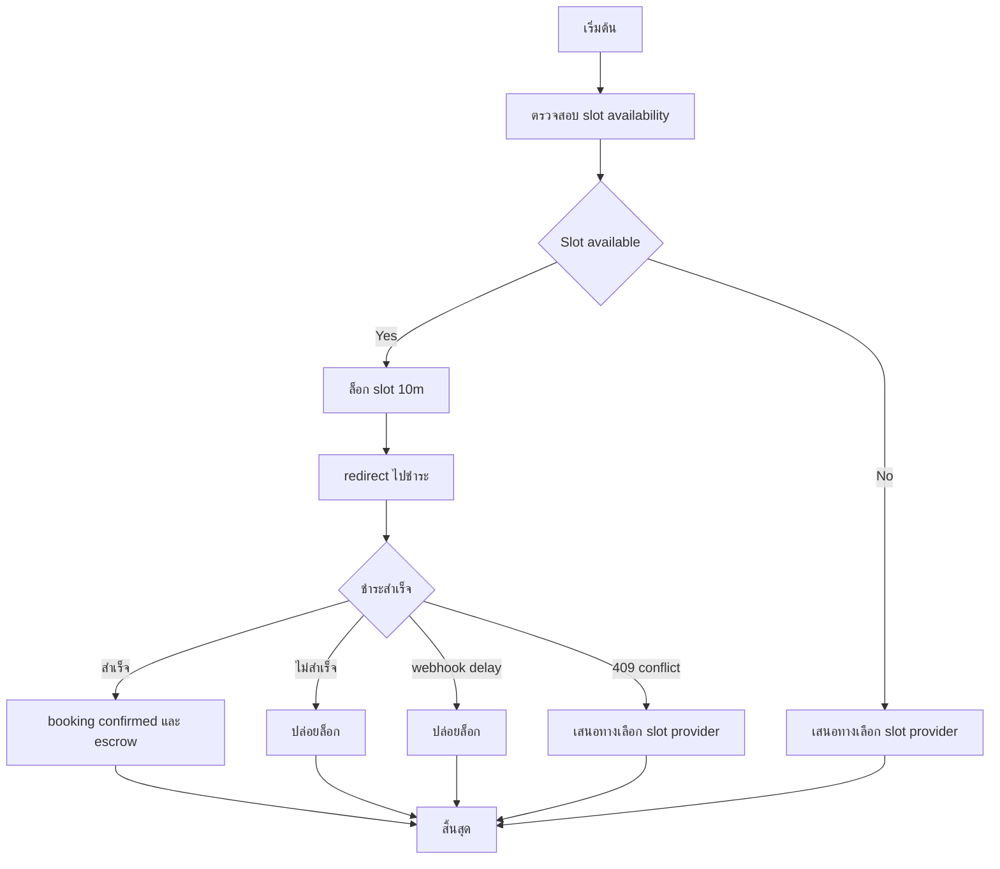

# CUS004 - Create Booking slot based

## 👤 บทบาท
- ลูกค้า

## 🎯 เป้าหมายของเคส
- ในฐานะ ลูกค้า
- ต้องการ เลือก provider เลือก slot และจ่าย 100% เพื่อนัดหมาย
- เพื่อ จองเวลาให้บริการ

## ⚙️ เงื่อนไขก่อนเริ่ม (Precondition)
- Slot แสดงว่า available

## 🧭 ผลลัพธ์และสถานการณ์
- ✅ ผลลัพธ์ที่คาดหวัง (Success Flow): ถ้าชำระสำเร็จภายในล็อค booking confirmed และสร้าง escrow ถ้าไม่สำเร็จ slot ถูกปล่อย
- ❌ ผลลัพธ์ที่ Failure:  
  - การชำระเงินล้มเหลวหรือถูกปฏิเสธระหว่างการ Redirect หลังล็อก slot ทำให้ไม่สามารถยืนยันการจองได้
  - Webhook สถานะการชำระเงินล่าช้าหรือไม่ครบ 5 วินาที ส่งผลให้ระบบไม่สามารถยืนยันการจองและต้องปล่อยล็อก
  - ล็อก TTL 10 นาทีหมดก่อนที่การชำระจะสำเร็จ ทำให้ slot ถูกปล่อยและจองล้มเหลว
  - เกิดข้อผิดพลาดของระบบระหว่างขั้นตอนล็อก/ตรวจสอบความพร้อมของ slot 500 Internal Server Error
  - มีคำขอจองทับซ้อนกันหลายรายแต่ไม่มีรายใดสำเร็จ 409 Conflict และไม่มีการจองเกิดขึ้น
- 🔄 ผลลัพธ์ทางเลือก:  
  - Slot ไม่ว่างระหว่างการล็อก แต่ระบบสามารถเสนอทางเลือกให้เลือก slot/provider เวลาที่ใกล้เคียง
  - ผู้ใช้งานยกเลิกการจองระหว่างขั้นตอนล็อกและเลือกทำรายการใหม่ในครั้งถัดไป
  - ผู้ใช้งานเลือก slot/provider อื่นแล้วเริ่มกระบวนการล็อกใหม่ทันที
  - ผู้ใช้งานเปลี่ยนวิธีชำระเงินเป็นวิธีอื่นหลังจากถูก redirected เพื่อดำเนินการจองต่อ
  - ผู้ใช้งานบันทึกไว้เป็นคิวจองและออกจากระบบ โดยระบบจะให้ผู้ใช้งานยืนยันเมื่อพร้อมชำระในภายหลัง
- ⚠️ ผลลัพธ์ขอบเขตพิเศษ:  
  - Slot ไม่ว่างระหว่างการล็อก แต่ระบบสามารถเสนอทางเลือกให้เลือก slot/provider เวลาที่ใกล้เคียง
  - ผู้ใช้งานยกเลิกการจองระหว่างขั้นตอนล็อกและเลือกทำรายการใหม่ในครั้งถัดไป
  - ผู้ใช้งานเลือก slot/provider อื่นแล้วเริ่มกระบวนการล็อกใหม่ทันที
  - ผู้ใช้งานเปลี่ยนวิธีชำระเงินเป็นวิธีอื่นหลังจากถูก redirected เพื่อดำเนินการจองต่อ
  - ผู้ใช้งานบันทึกไว้เป็นคิวจองและออกจากระบบ โดยระบบจะให้ผู้ใช้งานยืนยันเมื่อพร้อมชำระในภายหลัง

## ✅ เกณฑ์การยอมรับ (Acceptance Criteria)
- Lock + availability check atomic
- Lock TTL default 10m
- Lock op <1s
- payment webhook <5s
- concurrent attempts: only one success
- unsuccessful get 409+suggestions

## ⏱ ลำดับความสำคัญ / SLA
- Priority: P0
- SLA: Lock TTL 10m, lock op <1s, payment webhook <5s

---

## 🔁 Sequence Diagram  
> แสดงลำดับเหตุการณ์ระหว่าง "ผู้ใช้" กับ "ระบบ"

---

## 🧭 Flowchart Diagram
> แสดงขั้นตอนการทำงานของระบบอย่างเข้าใจง่าย

