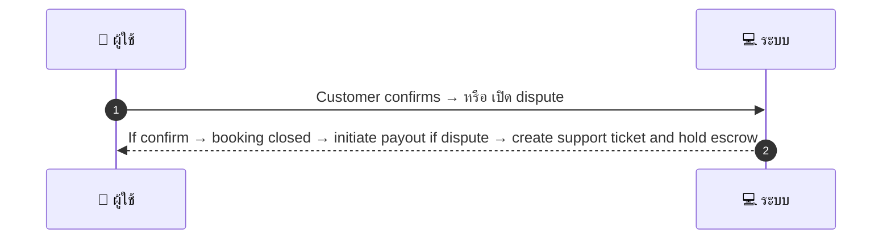

# CUS005 - Customer Confirms/Disputes after Service

## 👤 บทบาท
- ลูกค้า

## 🎯 เป้าหมายของเคส
- ในฐานะ: ลูกค้า
- ต้องการ: ยืนยันว่าบริการสำเร็จหรือเปิด dispute หากไม่เป็นไปตามข้อตกลง
- เพื่อ: เพื่อให้ระบบปล่อยเงินหรือเปิด case support

## ⚙️ เงื่อนไขก่อนเริ่ม (Precondition)
- Provider marked complete and customer notified

## 🧭 ผลลัพธ์และสถานการณ์
- ✅ ผลลัพธ์ที่คาดหวัง (Success Flow): If confirm → booking closed → initiate payout if dispute → create support ticket and hold escrow
- ❌ ผลลัพธ์ที่ Failure:
  - ข้อมูลการชำระเงินไม่ถูกต้องหรือไม่ครบถ้วนทำให้ไม่สามารถยืนยันการชำระเงินได้
  - สถานะ escrow ไม่พร้อมสำหรับการปล่อยเงินทำให้ไม่สามารถปิด Booking
  - การสร้าง ticket สนับสนุนล้มเหลวเนื่องจากระบบล้มเหลวหรือไม่สามารถติดต่อทีมสนับสนุนได้
- 🔄 ผลลัพธ์ทางเลือก:
  - ยืนยันแล้วแต่ payout ถูกเลื่อนออกเนื่องจากการตรวจสอบภายในยังไม่เสร็จสิ้น
  - Dispute ถูกประเมินแล้วพบข้อเท็จริงไม่ชัดเจนจำเป็นต้องขอข้อมูลเพิ่มเติมจากลูกค้า
  - การยืนยันเสร็จสมบูรณ์แต่มีข้อสงสัยในบริการทำให้ต้องรอการยืนยันขั้นสุดท้ายก่อนการปิด Booking
- ⚠️ ผลลัพธ์ขอบเขตพิเศษ:
  - ยืนยันแล้วแต่ payout ถูกเลื่อนออกเนื่องจากการตรวจสอบภายในยังไม่เสร็จสิ้น
  - Dispute ถูกประเมินแล้วพบข้อเท็จจริงไม่ชัดเจนจำเป็นต้องขอข้อมูลเพิ่มเติมจากลูกค้า
  - การยืนยันเสร็จสมบูรณ์แต่มีข้อสงสัยในบริการทำให้ต้องรอการยืนยันขั้นสุดท้ายก่อนการปิด Booking

## ✅ เกณฑ์การยอมรับ (Acceptance Criteria)
- Confirm action available within 3 days
- dispute creates ticket
- SLA: support initial response =24h
- dispute assessment =7d

## ⏱ ลำดับความสำคัญ / SLA
- Priority: P0
- SLA: Support response =24h, dispute assessment =7d

---

## 🔁 Sequence Diagram  
> แสดงลำดับเหตุการณ์ระหว่าง "ผู้ใช้" กับ "ระบบ"



---

## 🧭 Flowchart Diagram
> แสดงขั้นตอนการทำงานของระบบอย่างเข้าใจง่าย

```mermaid
flowchart TD
  A[เริ่มต้น] --> B[ตรวจสอบ เงื่อนไข Provider marked complete and customer notified]
  B --> C[ดำเนินการ Customer confirms → หรือ เปิด dispute]
  C --> D[ผลลัพธ์สำเร็จ If confirm booking closed and payout initiated]
  C --> E[ผลลัพธ์ล้มเหลว ข้อมูลการชำระเงินไม่ถูกต้องหรือ escrow ไม่พร้อมสำหรับการปล่อยเงิน หรือการสร้าง ticket สนับสนุนล้มเหลว]
  C --> F[ผลลัพธ์ทางเลือก ยืนยันแล้วแต่ payout ถูกเลื่อนออกเนื่องจากการตรวจสอบภายในยังไม่เสร็จสิ้น | Dispute ถูกประเมินแล้วพบข้อเท็จจริงไม่ชัดเจนจำเป็นต้องขอข้อมูลเพิ่มเติมจากลูกค้า | การยืนยันเสร็จสมบูรณ์แต่มีข้อสงสัยในบริการทำให้ต้องรอการยืนยันขั้นสุดท้ายก่อนการปิด Booking]
  C --> G[ผลลัพธ์ขอบเขตพิเศษ ยืนยันแล้วแต่ payout ถูกเลื่อนออกเนื่องจากการตรวจสอบภายในยังไม่เสร็จสิ้น | Dispute ถูกประเมินแล้วพบข้อเท็จจริงไม่ชัดเจนจำเป็นต้องขอข้อมูลเพิ่มเติมจากลูกค้า | การยืนยันเสร็จสมบูรณ์แต่มีข้อสงสัยในบริการทำให้ต้องรอการยืนยันขั้นสุดท้ายก่อนการปิด Booking]
  D --> H[สิ้นสุด]
  E --> H
  F --> H
  G --> H
```

