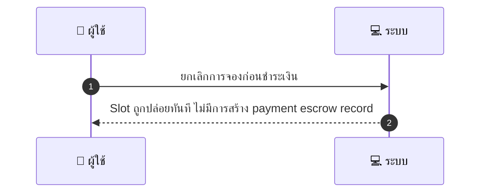
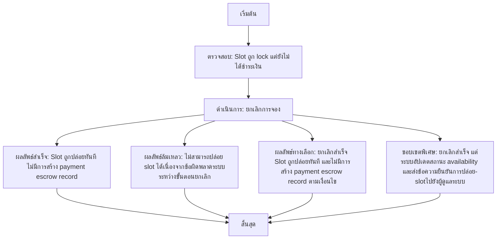

# CUS006 - Customer Cancellation before Payment Pre-lock

## 👤 บทบาท
- ลูกค้า

## 🎯 เป้าหมายของเคส
- ในฐานะ ลูกค้า
- ต้องการ ยกเลิกการจองก่อนชำระเงิน ระหว่าง lock และก่อนจ่าย
- เพื่อ เพื่อไม่ถูกคิดเงินและปล่อย slot

## ⚙️ เงื่อนไขก่อนเริ่ม (Precondition)
- Slot ถูก lock แต่ยังไม่ได้ชำระเงิน

## 🧭 ผลลัพธ์และสถานการณ์
- ✅ ผลลัพธ์ที่คาดหวัง (Success Flow): Slot ถูกปล่อยทันที ไม่มีการสร้าง payment escrow record
- ❌ ผลลัพธ์ที่ Failure:  
  - ไม่สามารถปล่อย slot ได้เนื่องจากข้อผิดพลาดระบบระหว่างขั้นตอนยกเลิก
  - สถานะจองไม่อยู่ใน Pre-lock ทำให้ไม่สามารถดำเนินการยกเลิกและปล่อย slot ได้
  - การเรียกใช้งาน API ภายนอกที่เกี่ยวข้องกับการยกเลิกล้มเหลวจึงไม่สามารถปล่อย slot ได้
- 🔄 ผลลัพธ์ทางเลือก:  
  - ยกเลิกสำเร็จ Slot ถูกปล่อยทันที ไม่มีการสร้าง payment escrow record ตามเงื่อนไข
  - ยกเลิกสำเร็จ มีการบันทึกเหตุการณ์ใน audit log และส่งการแจ้งเตือนไปยังลูกค้า
  - ยกเลิกสำเร็จ แต่ระบบอัปเดตสถานะ availability และส่งข้อความยืนยันการปล่อย-slotไปยังผู้ดูแลระบบ
- ⚠️ ผลลัพธ์ขอบเขตพิเศษ:  
  - ยกเลิกสำเร็จ Slot ถูกปล่อยทันที ไม่มีการสร้าง payment escrow record ตามเงื่อนไข
  - ยกเลิกสำเร็จ มีการบันทึกเหตุการณ์ใน audit log และส่งการแจ้งเตือนไปยังลูกค้า
  - ยกเลิกสำเร็จ แต่ระบบอัปเดตสถานะ availability และส่งข้อความยืนยันการปล่อย-slotไปยังผู้ดูแลระบบ

## ✅ เกณฑ์การยอมรับ (Acceptance Criteria)
- Immediate slot release
- availability updated
- no charges

## ⏱ ลำดับความสำคัญ / SLA
- Priority: P0
- SLA: Immediate

---

## 🔁 Sequence Diagram  
> แสดงลำดับเหตุการณ์ระหว่าง "ผู้ใช้" กับ "ระบบ"

---

## 🧭 Flowchart Diagram
> แสดงขั้นตอนการทำงานของระบบอย่างเข้าใจง่าย

