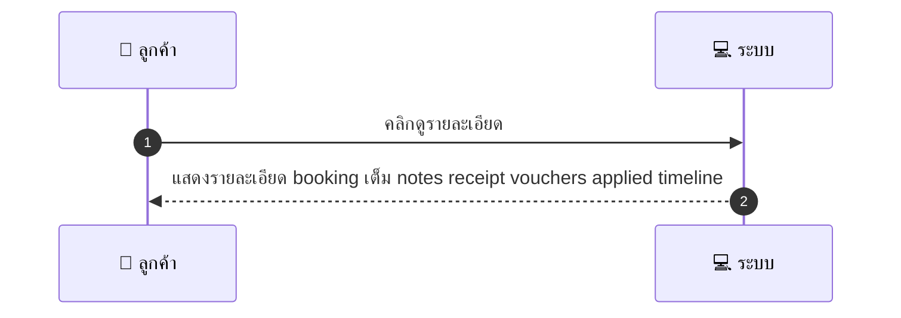
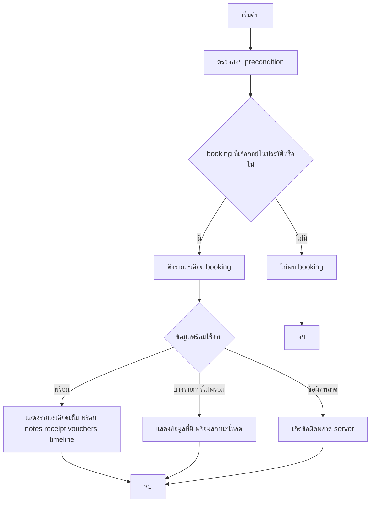

# CUS010 - ดูรายละเอียด booking เดียว Booking Detail

## 👤 บทบาท
- ลูกค้า

## 🎯 เป้าหมายของเคส
- ในฐานะ ลูกค้า
- ต้องการ ดูรายละเอียด booking ฉบับเต็ม
- เพื่อ เห็น notes receipt vouchers ที่ใช้

## ⚙️ เงื่อนไขก่อนเริ่ม (Precondition)
- ลูกค้้อยู่ในหน้าประวัติและเลือก booking หนึ่ง

## 🧭 ผลลัพธ์และสถานการณ์
- ✅ ผลลัพธ์ที่คาดหวัง (Success Flow): ระบบแสดงข้อมูลเต็ม notes receipt vouchers applied timeline
- ❌ ผลลัพธ์ที่ Failure:
  - ไม่พบ booking ที่ระบุในประวัติการจอง
  - เกิดข้อผิดพลาดทางเซิร์ฟเวอร์ขณะดึงข้อมูลรายละเอียด booking
  - สิทธิ์ไม่พอใช้งานหน้าดูรายละเอียด ต้องเข้าสู่ระบบ
- 🔄 ผลลัพธ์ทางเลือก:
  - ข้อมูลบางรายการยังไม่พร้อมใช้งาน Notes Receipt Vouchers ระบบแสดงสถานะชัดเจนและข้อมูลที่มี
  - ข้อมูลโหลดช้ากว่าปกติ ระบบแสดงสถานะกำลังโหลดและให้รีเฟรช
  - ผู้ใช้เลือกดูรายละเอียดแบบย่อ ระบบนำไปสู่หน้ารายละเอียดเต็มเมื่อพร้อม
  - ผู้ใช้กลับไปหน้าประวัติการจองโดยไม่ปิดหน้าดูรายละเอียด
- ⚠️ ผลลัพธ์ขอบเขตพิเศษ:
  - ข้อมูลบางรายการยังไม่พร้อมใช้งาน Notes Receipt Vouchers ระบบแสดงสถานะชัดเจนและข้อมูลที่มี
  - ข้อมูลโหลดช้ากว่าปกติ ระบบแสดงสถานะกำลังโหลดและให้รีเฟรช
  - ผู้ใช้เลือกดูรายละเอียดแบบย่อ ระบบนำไปสู่หน้ารายละเอียดเต็มเมื่อพร้อม
  - ผู้ใช้กลับไปหน้าประวัติการจองโดยไม่ปิดหน้าดูรายละเอียด

## ✅ เกณฑ์การยอมรับ (Acceptance Criteria)
- มีปุ่มดาวน์โหลดใบเสร็จ PDF และแสดง audit timestamps

## ⏱ ลำดับความสำคัญ / SLA
- Priority: P0
- SLA: response <2s

---

## 🔁 Sequence Diagram  
> แสดงลำดับเหตุการณ์ระหว่าง "ผู้ใช้" กับ "ระบบ"

---

## 🧭 Flowchart Diagram
> แสดงขั้นตอนการทำงานของระบบอย่างเข้าใจง่าย

