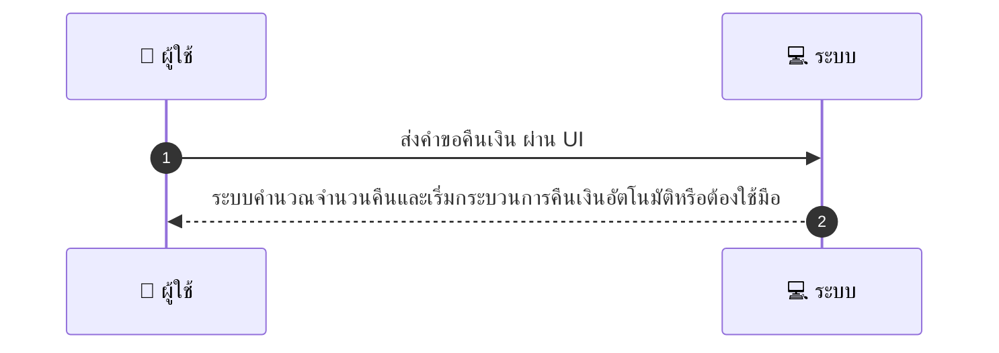
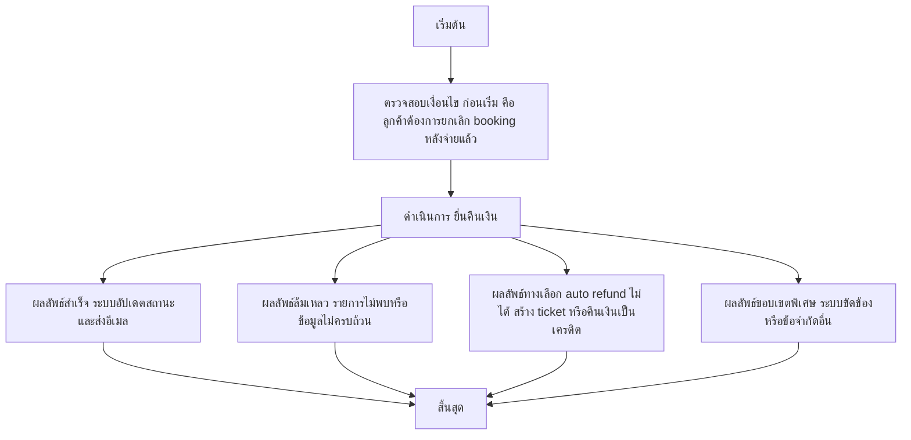

# CUS018 - ขอคืนเงิน Refund Request — Customer-initiated

## 👤 บทบาท
- ลูกค้า

## 🎯 เป้าหมายของเคส
- ในฐานะ ลูกค้า
- ต้องการ ยื่นคำขอคืนเงิน ยกเลิกหลังชำระ
- เพื่อ เพื่อรับเงินคืนตาม policy

## ⚙️ เงื่อนไขก่อนเริ่ม (Precondition)
- ลูกค้าต้องการยกเลิก booking หลังจ่ายแล้ว

## 🧭 ผลลัพธ์และสถานการณ์
- ✅ ผลลัพธ์ที่คาดหวัง (Success Flow): ระบบคำนวณ refundable amount ตาม policy และเริ่ม process auto/manual
- ❌ ผลลัพธ์ที่ Failure:  
  - ไม่พบรายการจองที่ตรงกับคำขอคืนเงิน
  - สถานะการชำระเงินไม่อยู่ในสถานะที่คืนเงินได้ ยังไม่ชำระ หรือชำระสำเร็จแต่ข้อมูลไม่ครบถ้วน
  - เกิดข้อผิดพลาดระบบระหว่างการคำนวณ refundable amount หรือระหว่างขั้นตอนคืนเงิน
  - คำขอคืนเงินถูกปฏิเสธตาม policy เนื่องจากเงื่อนไขการยกเลิกไม่ครบถ้วนหรือเกินระยะเวลาที่กำหนด
  - ไม่สามารถดำเนินการคืนเงินผ่านช่องทางชำระเงินที่ลูกค้าเลือกได้
- 🔄 ผลลัพธ์ทางเลือก:  
  - คืนเงินอัตโนมัติสำเร็จตาม policy เรียกอีเมลยืนยันและอัปเดตสถานะ
  - คืนเงินเป็นเครดิตใน Wallet บัญชีผู้ใช้งานสำหรับการซื้อครั้งถัดไป
  - สร้าง ticket ในระบบช่วยเหลือเพื่อดำเนินการคืนเงินด้วยตัวเลือก manual processing
  - คืนเงินบางส่วนตามส่วนที่เข้าเงื่อนไขของ policy partial refund โดยแสดงยอดคืนที่คาดว่าจะได้รับ
- ⚠️ ผลลัพธ์ขอบเขตพิเศษ:  
  - คืนเงินอัตโนมัติสำเร็จตาม policy เรียกอีเมลยืนยันและอัปเดตสถานะ
  - คืนเงินเป็นเครดิตใน Wallet บัญชีผู้ใช้งานสำหรับการซื้อครั้งถัดไป
  - สร้าง ticket ในระบบช่วยเหลือเพื่อดำเนินการคืนเงินด้วยตัวเลือก manual processing
  - คืนเงินบางส่วนตามส่วนที่เข้าเงื่อนไขของ policy partial refund โดยแสดงยอดคืนที่คาดว่าจะได้รับ

## ✅ เกณฑ์การยอมรับ (Acceptance Criteria)
- แสดงจำนวนคืนที่คาดว่าจะได้รับและเหตุผล
- auto-refund ถ้าเข้าเงื่อนไข
- ticket created otherwise

## ⏱ ลำดับความสำคัญ / SLA
- Priority: P0
- SLA: auto refund immediate or create ticket 1m

---

## 🔁 Sequence Diagram  
> แสดงลำดับเหตุการณ์ระหว่าง "ผู้ใช้" กับ "ระบบ"

---

## 🧭 Flowchart Diagram
> แสดงขั้นตอนการทำงานของระบบอย่างเข้าใจง่าย

