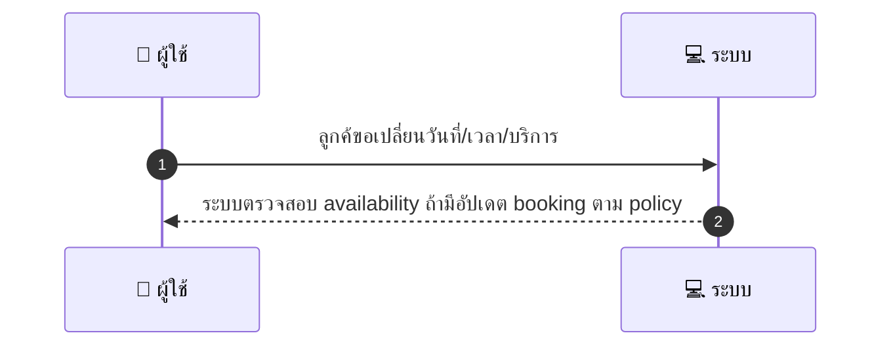
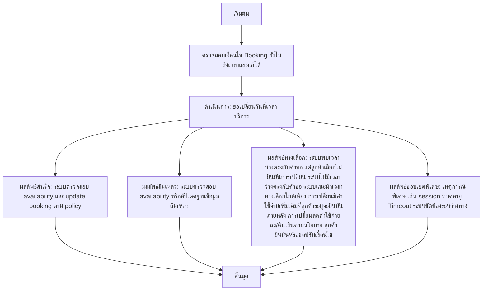

# CUS021 - เรียกคืน/ยกเลิกการจองภายในเวลาแก้ไข Modify Booking

## 👤 บทบาท
- ลูกค้า

## 🎯 เป้าหมายของเคส
- ในฐานะ
- ต้องการ
- เพื่อ
- ในฐานะ: ลูกค้า
- ต้องการ: ขอเปลี่ยนวันที่/เวลา/บริการก่อนถึงเวลา
- เพื่อ: เพื่อแก้ไขความจำเป็นหรือความสะดวก

## ⚙️ เงื่อนไขก่อนเริ่ม (Precondition)
- Booking ยังไม่ถึงเวลาและอยู่ในสถานะที่แก้ไขได้

## 🧭 ผลลัพธ์และสถานการณ์
- ✅ ผลลัพธ์ที่คาดหวัง (Success Flow): ระบบตรวจสอบ availability ถ้ามีให้ update booking และ adjust escrow/fees ตาม policy
- ❌ ผลลัพธ์ที่ Failure:
  - ระบบไม่สามารถตรวจสอบความพร้อมของ slot หรือสถานะการจองได้ภายในเวลา SLA
  - อัปเดตการจองในฐานข้อมูลล้มเหลว ทำให้สถานะการจองไม่เปลี่ยนแปลง
  - การปรับ escrow/ค่าธรรมเนียมตามนโยบายล้มเหลว หรือไม่สามารถคำนวณยอดเงินใหม่ได้
  - ไม่สามารถแจ้งยืนยันการเปลี่ยนแปลงไปยังผู้ให้บริการได้
- 🔄 ผลลัพธ์ทางเลือก:
  - ระบบพบเวลาว่างตรงกับคำขอ แต่ลูกค้าเลือกไม่ยืนยันการเปลี่ยน
  - ไม่มีเวลาว่างตรงกับคำขอ ระบบแนะนำเวลาทางเลือกใกล้เคียง
  - การเปลี่ยนมีค่าใช้จ่ายเพิ่มเติม แต่ลูกค้าระบุจะยืนยันภายหลัง
  - การเปลี่ยนลดค่าใช้จ่ายลง/คืนเงินตามนโยบาย ลูกค้ายืนยันหรือขอปรับเงื่อนไข
- ⚠️ ผลลัพธ์ขอบเขตพิเศษ:
  - ระบบพบเวลาว่างตรงกับคำขอ แต่ลูกค้าเลือกไม่ยืนยันการเปลี่ยน
  - ไม่มีเวลาว่างตรงกับคำขอ ระบบแนะนำเวลาทางเลือกใกล้เคียง
  - การเปลี่ยนมีค่าใช้จ่ายเพิ่มเติม แต่ลูกค้าระบุจะยืนยันภายหลัง
  - การเปลี่ยนลดค่าใช้จ่ายลง/คืนเงินตามนโยบาย ลูกค้ายืนยันหรือขอปรับเงื่อนไข

## ✅ เกณฑ์การยอมรับ (Acceptance Criteria)
- If slot change requires extra payment → create top-up payment
- if reduced → apply refund per policy
- notify provider

## ⏱ ลำดับความสำคัญ / SLA
- Priority: P0
- SLA: change process 5m

---

## 🔁 Sequence Diagram  
> แสดงลำดับเหตุการณ์ระหว่าง "ผู้ใช้" กับ "ระบบ"

---

## 🧭 Flowchart Diagram
> แสดงขั้นตอนการทำงานของระบบอย่างเข้าใจง่าย

