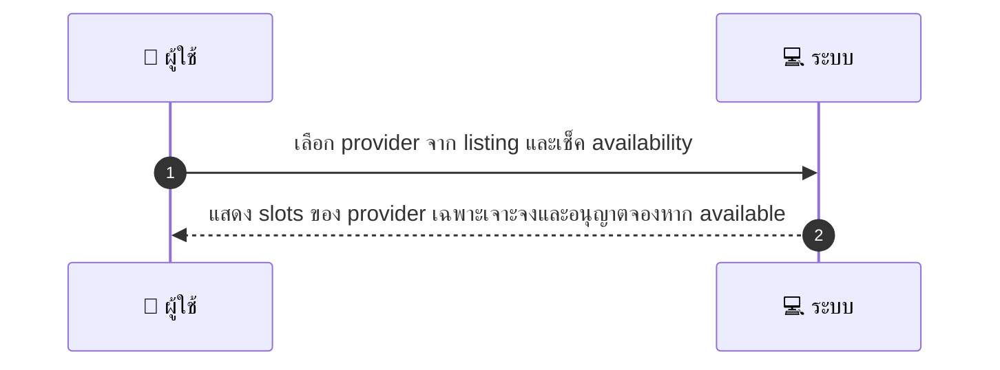
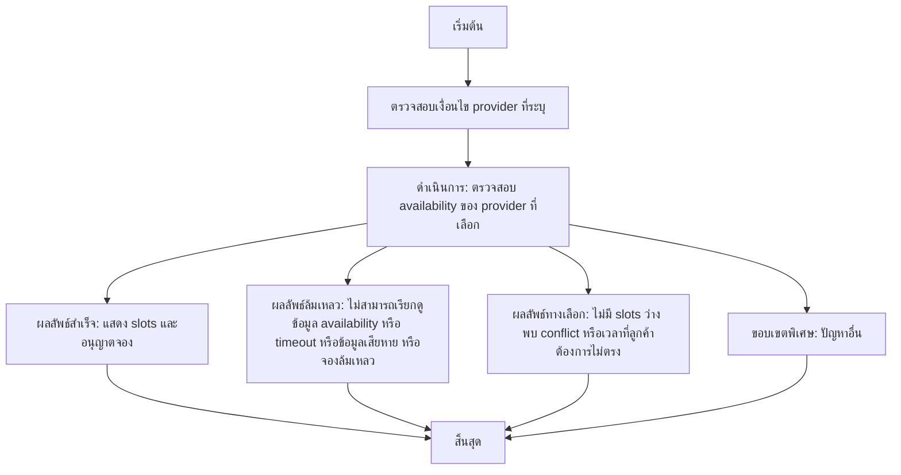

# CUS025 - เลือก provider แบบระบุชื่อ Select Specific Provider

## 👤 บทบาท
- ลูกค้า

## 🎯 เป้าหมายของเคส
- ในฐานะ ลูกค้า
- ต้องการ เลือก provider ที่เฉพาะเจาะจงเพื่อจอง
- เพื่อ ใช้บริการจากบุคคลที่ต้องการ

## ⚙️ เงื่อนไขก่อนเริ่ม (Precondition)
- ลูกค้าต้องการใช้บริการจาก provider คนใดคนหนึ่ง

## 🧭 ผลลัพธ์และสถานการณ์
- ✅ ผลลัพธ์ที่คาดหวัง (Success Flow): ระบบแสดง slots ของ provider เฉพาะเจาะจงและอนุญาตจองหาก available
- ❌ ผลลัพธ์ที่ Failure:
  - ไม่สามารถเรียกดูข้อมูล availability ของ provider ที่เลือกได้ เนื่องจากข้อผิดพลาดของ API
  - เกิด timeout ระหว่างการดึง slots ของ provider
  - ข้อมูล slots ที่ได้มีความผิดพลาดหรือเสียหาย ทำให้ไม่สามารถประมวลผลการจองได้
  - ระบบไม่สามารถดำเนินการจองได้หลังจากตรวจสอบ availability ล้มเหลว
- 🔄 ผลลัพธ์ทางเลือก:
  - ไม่มี slots ว่างสำหรับ provider ที่เลือกในวันที่ระบุ
  - พบ conflict กับ Google Calendar ของ provider ระบบแจ้งเตือนและเสนอช่วงเวลาอื่น
  - เวลาที่พบไม่ตรงกับช่วงเวลาที่ลูกค้าต้องการ แนะนำวันที่เวลาที่ต่างออกไป
  - ระบบขอให้ลูกค้าลองเลือก provider คนอื่นเมื่อไม่มีความพร้อม
- ⚠️ ผลลัพธ์ขอบเขตพิเศษ:
  - ไม่มี slots ว่างสำหรับ provider ที่เลือกในวันที่ระบุ
  - พบ conflict กับ Google Calendar ของ provider ระบบแจ้งเตือนและเสนอช่วงเวลาอื่น
  - เวลาที่พบไม่ตรงกับช่วงเวลาที่ลูกค้าต้องการ แนะนำวันที่เวลาที่ต่างออกไป
  - ระบบขอให้ลูกค้าลองเลือก provider คนอื่นเมื่อไม่มีความพร้อม

## ✅ เกณฑ์การยอมรับ (Acceptance Criteria)
- Provider-specific availability respected
- conflict with Google Calendar detected
- show buffer times

## ⏱ ลำดับความสำคัญ / SLA
- Priority: P0
- SLA: availability check under 1s

---

## 🔁 Sequence Diagram  
> แสดงลำดับเหตุการณ์ระหว่าง "ผู้ใช้" กับ "ระบบ"

---

## 🧭 Flowchart Diagram
> แสดงขั้นตอนการทำงานของระบบอย่างเข้าใจง่าย

