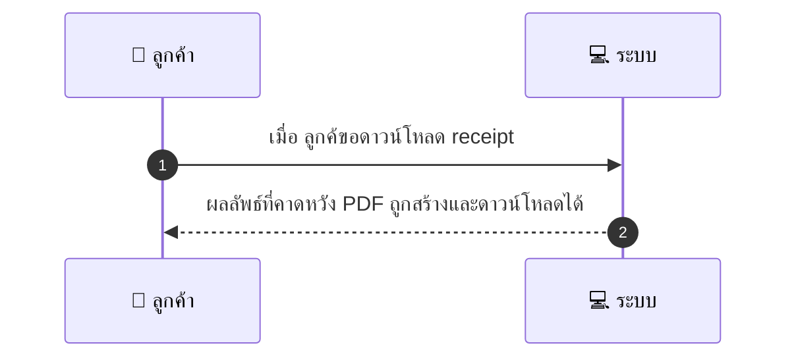
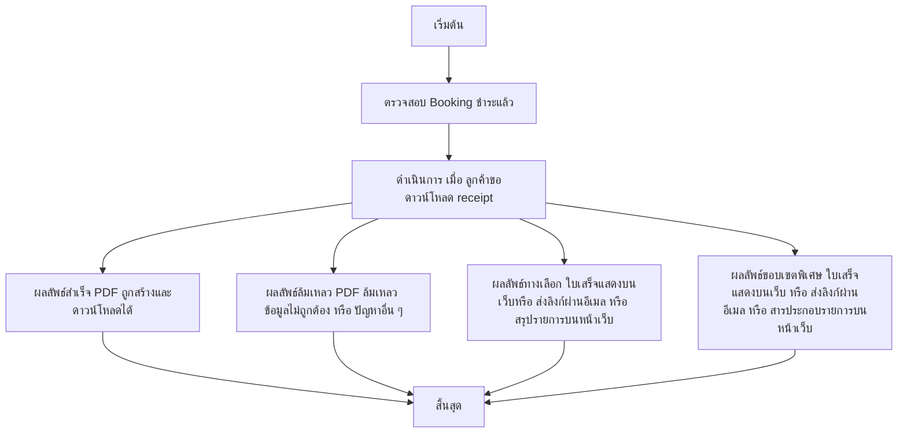

# CUS011 - ดาวน์โหลดใบเสร็จ/หลักฐานการชำระเงิน

## 👤 บทบาท
- ลูกค้า

## 🎯 เป้าหมายของเคส
- ในฐานะ ลูกค้า
- ต้องการ ดาวน์โหลด PDF ใบเสร็จ
- เพื่อ ใช้เป็นหลักฐานการชำระเงิน

## ⚙️ เงื่อนไขก่อนเริ่ม (Precondition)
- Booking ชำระแล้ว

## 🧭 ผลลัพธ์และสถานการณ์
- ✅ ผลลัพธ์ที่คาดหวัง (Success Flow): PDF ถูกสร้างและดาวน์โหลดได้
- ❌ ผลลัพธ์ที่ Failure:
  - การสร้าง PDF ล้มเหลว พบข้อผิดพอลในการประมวลผลข้อมูลใบเสร็จ
  - ไม่พบข้อมูล booking_id หรือ booking_id ไม่ถูกต้อง
  - พื้นที่จัดเก็บไฟล์บนเซิร์ฟเวอร์เต็ม ทำให้ไม่สามารถบันทึก PDF ได้
  - ข้อผิดพลาดในการดึงข้อมูลรายการชำระเงินจากฐานข้อมูล
  - ข้อผิดพลาดในการสร้างลิงก์ดาวน์โหลดหรือส่งไฟล์
- 🔄 ผลลัพธ์ทางเลือก:
  - ใบเสร็จถูกสร้างและแสดงบนหน้าเว็บให้ดูรายละเอียดก่อนดาวน์โหลด
  - ระบบส่งลิงก์ดาวน์โหลด PDF ผ่านอีเมลแทนการดาวน์โหลดทันที
  - ใบเสร็จถูกสร้างเป็นสรุปรายการบนหน้าเว็บแทนการดาวน์โหลด PDF
- ⚠️ ผลลัพธ์ขอบเขตพิเศษ:
  - ใบเสร็จถูกสร้างและแสดงบนหน้าเว็บให้ดูรายละเอียดก่อนดาวน์โหลด
  - ระบบส่งลิงก์ดาวน์โหลด PDF ผ่านอีเมลแทนการดาวน์โหลดทันที
  - ใบเสร็จถูกสร้างเป็นสรุปรายการบนหน้าเว็บแทนการดาวน์โหลด PDF

## ✅ เกณฑ์การยอมรับ (Acceptance Criteria)
- PDF ถูกสร้างและดาวน์โหลดได้
- พร้อมแสดงช่องทางติดต่อกรณีสงสัย

## ⏱ ลำดับความสำคัญ / SLA
- Priority: P1
- SLA: generate <10s

---

## 🔁 Sequence Diagram  
> แสดงลำดับเหตุการณ์ระหว่าง "ผู้ใช้" กับ "ระบบ"

---

## 🧭 Flowchart Diagram
> แสดงขั้นตอนการทำงานของระบบอย่างเข้าใจง่าย

