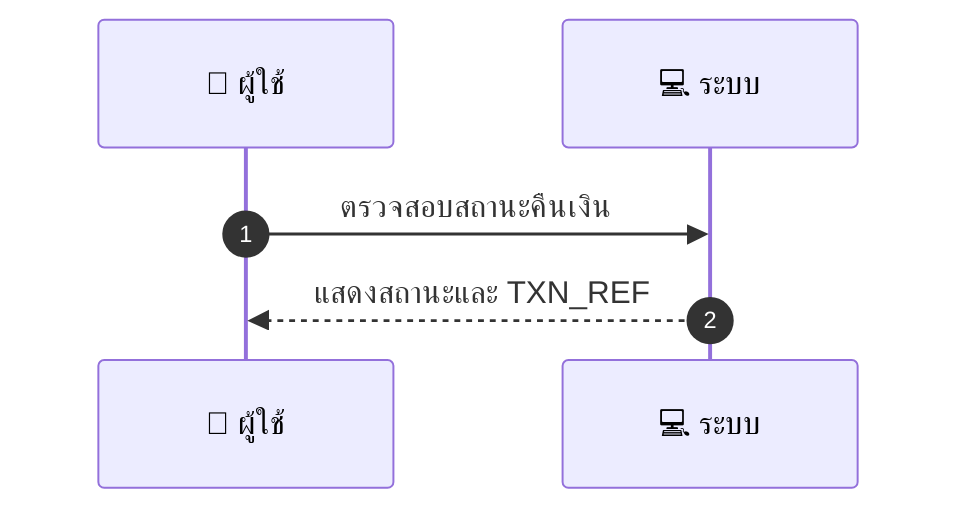
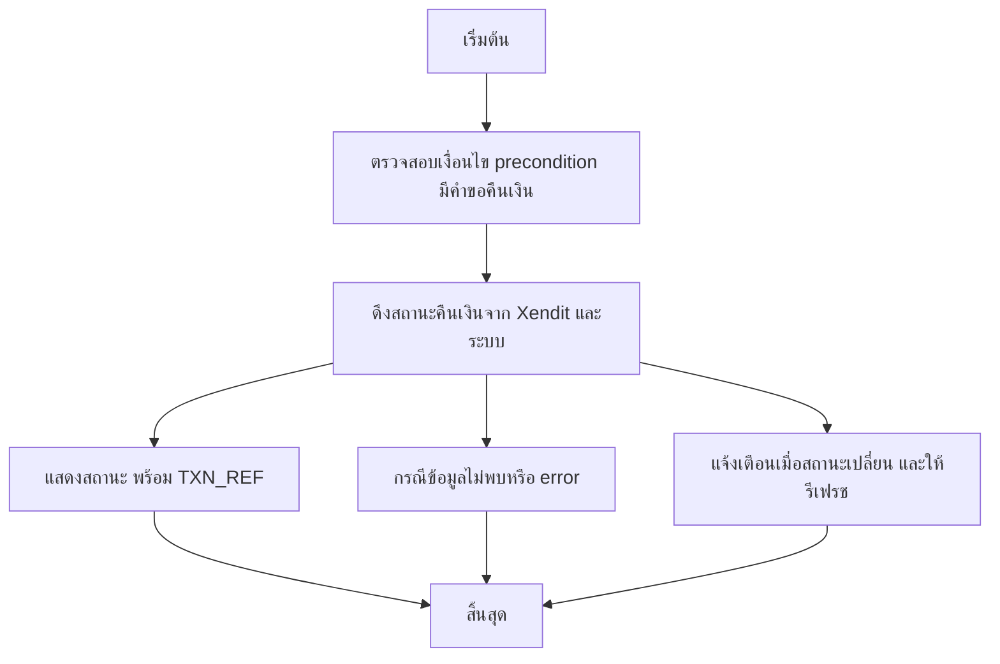

# CUS019 - ติดตามสถานะการคืนเงิน Track Refund Status

## 👤 บทบาท
- ลูกค้า

## 🎯 เป้าหมายของเคส
- ในฐานะ ลูกค้า
- ต้องการ ติดตามสถานะ refund ที่ยื่นไป
- เพื่อ รู้ว่าการคืนเงินดำเนินการถึงไหน

## ⚙️ เงื่อนไขก่อนเริ่ม (Precondition)
- ลูกค้ายื่นคำขอคืนเงินแล้ว

## 🧭 ผลลัพธ์และสถานการณ์
- ✅ ผลลัพธ์ที่คาดหวัง (Success Flow): ระบบแสดงสถานะ โดยมีค่าสถานะ คือ requested, processing, completed หรือ failed และแสดง TXN_REF
- ❌ ผลลัพธ์ที่ Failure:
  - ไม่พบคำขอคืนเงินสำหรับ TXN_REF ที่ระบุ
  - เกิดข้อผิดพลาดระหว่างเรียก API ของผู้ให้บริการคืนเงิน Xendit และระบบ
  - ข้อมูลสถานะที่แสดงไม่สอดคล้องกับข้อมูล reconciliation
  - คำขอคืนเงินถูกยกเลิกโดยผู้ใช้งาน
  - ไม่สามารถดึงสถานะคืนเงินได้สำเร็จภายใน SLA อัปเดตล่าช้า
- 🔄 ผลลัพธ์ทางเลือก:
  - สถานะปัจจุบันเป็น 'requested' พร้อม TXN_REF และยังไม่เริ่มดำเนินการ
  - สถานะปัจจุบันเป็น 'processing' พร้อม TXN_REF และ ETA ที่คาดการณ์
  - สถานะปัจจุบันเป็น 'completed' พร้อม TXN_REF และรายละเอียดการโอนคืน
  - มีการแจ้งเตือนเมื่อสถานะเปลี่ยนและตัวเลือกให้ผู้ใช้รีเฟรชสถานะ
- ⚠️ ผลลัพธ์ขอบเขตพิเศษ:
  - สถานะปัจจุบันเป็น 'requested' พร้อม TXN_REF และยังไม่เริ่มดำเนินการ
  - สถานะปัจจุบันเป็น 'processing' พร้อม TXN_REF และ ETA ที่คาดการณ์
  - สถานะปัจจุบันเป็น 'completed' พร้อม TXN_REF และรายละเอียดการโอนคืน
  - มีการแจ้งเตือนเมื่อสถานะเปลี่ยนและตัวเลือกให้ผู้ใช้รีเฟรชสถานะ

## ✅ เกณฑ์การยอมรับ (Acceptance Criteria)
- อัปเดตสถานะจาก reconciliation ของ Xendit
- แจ้งเตือนเมื่อสถานะเปลี่ยน

## ⏱ ลำดับความสำคัญ / SLA
- Priority: P1
- SLA: update within 24h of provider update

---

## 🔁 Sequence Diagram  
> แสดงลำดับเหตุการณ์ระหว่าง "ผู้ใช้" กับ "ระบบ"

---

## 🧭 Flowchart Diagram
> แสดงขั้นตอนการทำงานของระบบอย่างเข้าใจง่าย

