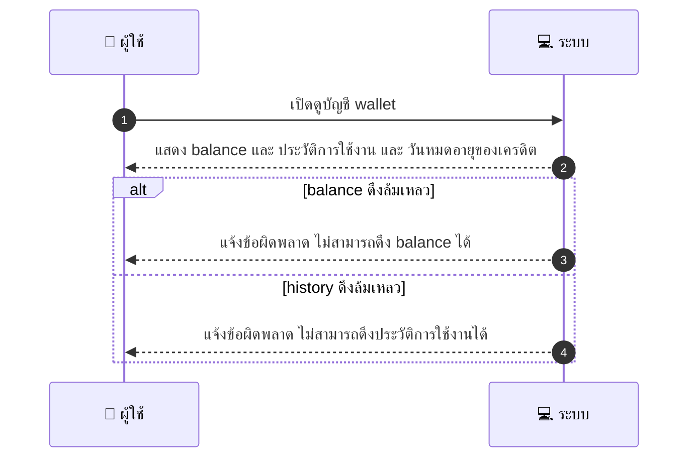
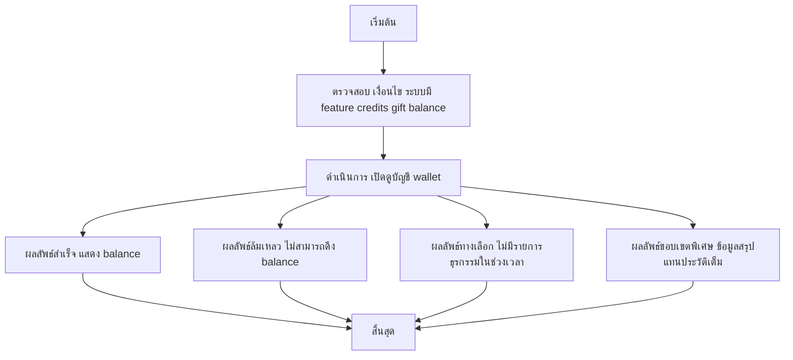

# CUS029 - ดูคะแนน/เครดิตในระบบ Wallet / Credits

## 👤 บทบาท
- ลูกค้า

## 🎯 เป้าหมายของเคส
- ในฐานะ ลูกค้า
- ต้องการ ดูยอดเครดิต/wallet balance และประวัติการใช้งาน
- เพื่อ เพื่อใช้ credits ที่มีในระบบ

## ⚙️ เงื่อนไขก่อนเริ่ม (Precondition)
- ระบบมี feature credits gift balance

## 🧭 ผลลัพธ์และสถานการณ์
- ✅ ผลลัพธ์ที่คาดหวัง (Success Flow): แสดง balance, transaction history, expiry ของ credits
- ❌ ผลลัพธ์ที่ Failure:  
  - ไม่สามารถดึงยอด balance ของ wallet ได้จากระบบกลาง
  - ไม่สามารถดึงประวัติการใช้งาน transaction history ได้
  - ไม่สามารถคำนวณวันหมดอายุของเครดิตได้
- 🔄 ผลลัพธ์ทางเลือก:  
  - ไม่มีรายการธุรกรรมในช่วงเวลาที่เลือก ระบบจะแสดง balance และวันหมดอายุพร้อมข้อความว่าไม่มีประวัติ
  - ข้อมูลประวัติการใช้งานถูกกรองตามสิทธิ์ผู้ใช้ ทำให้บางรายการไม่แสดง
  - ระบบแสดงข้อมูลแบบสรุป summary ของเครดิตแทนประวัติเต็ม เนื่องจากข้อจำกัดในการแสดงผล
- ⚠️ ผลลัพธ์ขอบเขตพิเศษ:  
  - ไม่มีรายการธุรกรรมในช่วงเวลาที่เลือก ระบบจะแสดง balance และวันหมดอายุพร้อมข้อความว่าไม่มีประวัติ
  - ข้อมูลประวัติการใช้งานถูกกรองตามสิทธิ์ผู้ใช้ ทำให้บางรายการไม่แสดง
  - ระบบแสดงข้อมูลแบบสรุป summary ของเครดิตแทนประวัติเต็ม เนื่องจากข้อจำกัดในการแสดงผล

## ✅ เกณฑ์การยอมรับ (Acceptance Criteria)
- Transactions traceable
- apply credits at checkout
- expiry reminders sent

## ⏱ ลำดับความสำคัญ / SLA
- Priority: P1
- SLA: response 2s

---

## 🔁 Sequence Diagram  
> แสดงลำดับเหตุการณ์ระหว่าง "ผู้ใช้" กับ "ระบบ"

---

## 🧭 Flowchart Diagram
> แสดงขั้นตอนการทำงานของระบบอย่างเข้าใจง่าย

