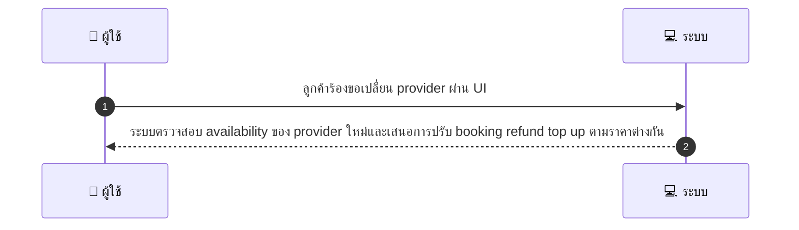
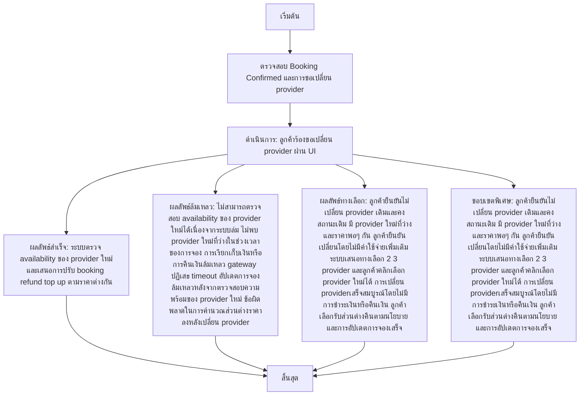

# CUS039 - ขอเปลี่ยน provider หลัง booking confirmed Swap Provider Request

## 👤 บทบาท
- ลูกค้า

## 🎯 เป้าหมายของเคส
- ในฐานะ
- ต้องการ
- เพื่อ

- ในฐานะ ลูกค้า
- ต้องการ ขอเปลี่ยน provider ที่จองไว้เป็นคนอื่น
- เพื่อ เพื่อความสะดวกหรือความพึงพอใจ

## ⚙️ เงื่อนไขก่อนเริ่ม (Precondition)
- Booking confirmed แต่ลูกค้าต้องการเปลี่ยน provider

## 🧭 ผลลัพธ์และสถานการณ์
- ✅ ผลลัพธ์ที่คาดหวัง (Success Flow): ระบบตรวจ availability ของ provider ใหม่และเสนอการปรับ booking refund top up ตามราคาต่างกัน  
- ❌ ผลลัพธ์ที่ Failure:  
  - ไม่สามารถตรวจสอบ availability ของ provider ใหม่ได้เนื่องจากระบบล่ม
  - ไม่พบ provider ใหม่ที่ว่างในช่วงเวลาของการจอง
  - การเรียกเก็บเงินหรือการคืนเงินล้มเหลว gateway ปฏิเสธ timeout
  - อัปเดตการจองล้มเหลวหลังจากตรวจสอบความพร้อมของ provider ใหม่
  - ข้อผิดพลาดในการคำนวณส่วนต่างราคาหลังเปลี่ยน provider
- 🔄 ผลลัพธ์ทางเลือก:  
  - ลูกค้ายืนยันไม่เปลี่ยน provider เดิมและคงสถานะเดิม
  - มี provider ใหม่ที่ว่างและราคาพอๆ กัน ลูกค้ายืนยันเปลี่ยนโดยไม่มีค่าใช้จ่ายเพิ่มเติม
  - ระบบเสนอทางเลือก 2 3 provider และลูกค้าคลิกเลือก provider ใหม่ได้
  - การเปลี่ยน providerเสร็จสมบูรณ์โดยไม่มีการชำระเงินหรือคืนเงิน
  - ลูกค้าเลือกรับส่วนต่างคืนตามนโยบาย และการอัปเดตการจองเสร็จ
- ⚠️ ผลลัพธ์ขอบเขตพิเศษ:  
  - ลูกค้ายืนยันไม่เปลี่ยน provider เดิมและคงสถานะเดิม
  - มี provider ใหม่ที่ว่างและราคาพอๆ กัน ลูกค้ายืนยันเปลี่ยนโดยไม่มีค่าใช้จ่ายเพิ่มเติม
  - ระบบเสนอทางเลือก 2 3 provider และลูกค้าคลิกเลือก provider ใหม่ได้
  - การเปลี่ยน providerเสร็จสมบูรณ์โดยไม่มีการชำระเงินหรือคืนเงิน
  - ลูกค้าเลือกรับส่วนต่างคืนตามนโยบาย และการอัปเดตการจองเสร็จ

## ✅ เกณฑ์การยอมรับ (Acceptance Criteria)
- If provider change needs extra payment create payment link
- if cheaper refund per policy
- notify both providers

## ⏱ ลำดับความสำคัญ / SLA
- Priority: P1
- SLA: change attempt 5m

---

## 🔁 Sequence Diagram  
> แสดงลำดับเหตุการณ์ระหว่าง "ผู้ใช้" กับ "ระบบ"

---

## 🧭 Flowchart Diagram
> แสดงขั้นตอนการทำงานของระบบอย่างเข้าใจง่าย

