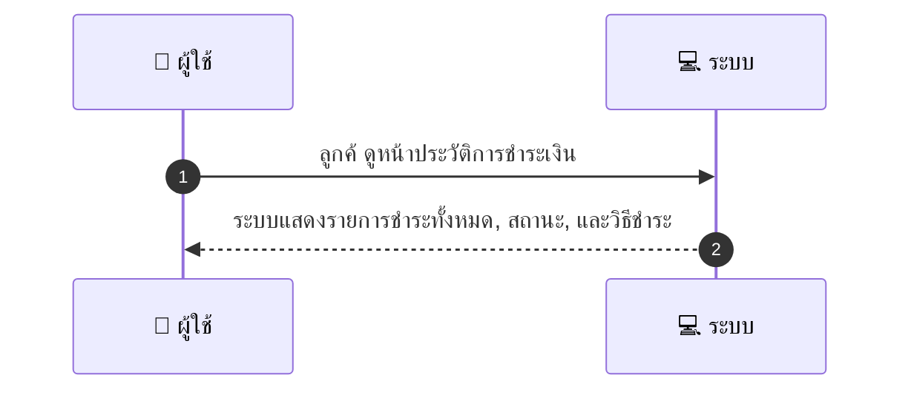
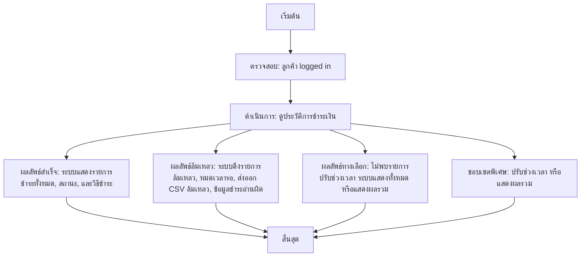

# CUS046 - ดูประวัติการชำระเงินทั้งหมด Payment History

## 👤 บทบาท
- ลูกค้า

## 🎯 เป้าหมายของเคส
- ในฐานะ ลูกค้า
- ต้องการ ดูรายการชำระเงินทั้งหมดในบัญชี
- เพื่อ ตรวจสอบรายการชำระและวิธีชำระ

## ⚙️ เงื่อนไขก่อนเริ่ม (Precondition)
- ลูกค้า logged in

## 🧭 ผลลัพธ์และสถานการณ์
- ✅ ผลลัพธ์ที่คาดหวัง (Success Flow): ระบบแสดงรายการชำระทั้งหมด, สถานะ, และวิธีชำระ
- ❌ ผลลัพธ์ที่ Failure:
  - ระบบดึงรายการชำระเงินได้ไม่สำเร็จ เนื่องจากข้อผิดพลาดภายในเซิร์ฟเวอร์
  - หมดเวลาการตอบสนองของเซิร์ฟเวอร์ขณะที่ดึงข้อมูล
  - เกิดข้อผิดพลาดในการส่งออกไฟล์ CSV
  - ข้อมูลการชำระเงินถูกอ่านผิดพลาดหรือไม่สมบูรณ์ ทำให้ไม่สามารถแสดงรายการได้
- 🔄 ผลลัพธ์ทางเลือก:
  - ไม่พบรายการชำระเงินตามเงื่อนไขที่กรอก ระบบแจ้งให้ปรับช่วงเวลา/เงื่อนไขใหม่
  - ระบบแสดงรายการทั้งหมดแทนเฉพาะรายการที่ตรงเงื่อนไขเมื่อไม่มีรายการตรงเงื่อนไข
  - ระบบแสดงผลรวมการชำระเงิน (จำนวนรายการ, ยอดรวม) แทนการแสดงรายการทีละรายการ
- ⚠️ ผลลัพธ์ขอบเขตพิเศษ:
  - ไม่พบรายการชำระเงินตามเงื่อนไขที่กรอก ระบบแจ้งให้ปรับช่วงเวลา/เงื่อนไขใหม่
  - ระบบแสดงรายการทั้งหมดแทนเฉพาะรายการที่ตรงเงื่อนไขเมื่อไม่มีรายการตรงเงื่อนไข
  - ระบบแสดงผลรวมการชำระเงิน (จำนวนรายการ, ยอดรวม) แทนการแสดงรายการทีละรายการ

## ✅ เกณฑ์การยอมรับ (Acceptance Criteria)
- Filter by date/range/method
- export CSV option

## ⏱ ลำดับความสำคัญ / SLA
- Priority: P1
- SLA: - response 2s

---

## 🔁 Sequence Diagram  
> แสดงลำดับเหตุการณ์ระหว่าง "ผู้ใช้" กับ "ระบบ"

---

## 🧭 Flowchart Diagram
> แสดงขั้นตอนการทำงานของระบบอย่างเข้าใจง่าย

