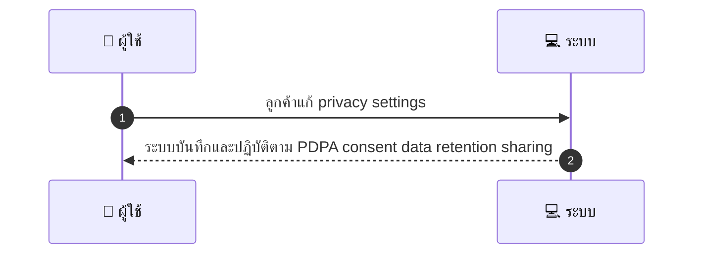
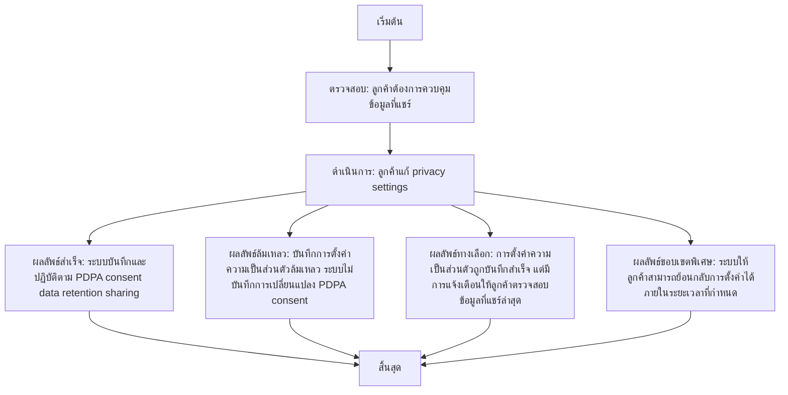

# CUS048 - ตั้งค่าความเป็นส่วนตัว Privacy Controls

## 👤 บทบาท
- ลูกค้า

## 🎯 เป้าหมายของเคส
- ในฐานะ
- ต้องการ
- เพื่อ

## ⚙️ เงื่อนไขก่อนเริ่ม (Precondition)
- ลูกค้าต้องการควบคุมข้อมูลที่แชร์

## 🧭 ผลลัพธ์และสถานการณ์
- ✅ ผลลัพธ์ที่คาดหวัง (Success Flow): ระบบบันทึกและปฏิบัติตาม PDPA consent data retention sharing
- ❌ ผลลัพธ์ที่ Failure:  
  - บันทึกการตั้งค่าความเป็นส่วนตัวล้มเหลว ระบบไม่บันทึกการเปลี่ยนแปลง PDPA consent
  - ข้อมูลการยินยอมไม่ถูกต้องหรือหายไป ทำให้การแชร์ข้อมูลผิดเงื่อนไข PDPA
  - ไม่สามารถเรียกดูประวัติการยินยอม Consent logs ทำให้การตรวจสอบความถูกต้องล่าช้า
- 🔄 ผลลัพธ์ทางเลือก:  
  - การตั้งค่าความเป็นส่วนตัวถูกบันทึกสำเร็จ แต่มีการแจ้งเตือนให้ลูกค้าตรวจสอบข้อมูลที่แชร์ล่าสุด
  - ระบบให้ลูกค้าสามารถย้อนกลับการตั้งค่าได้ภายในระยะเวลาที่กำหนด
  - ข้อมูลที่ยินยอมถูกนำไปใช้ตามนโยบายที่ลูกค้าเลือกโดยอัตโนมัติ
- ⚠️ ผลลัพธ์ขอบเขตพิเศษ:  
  - การตั้งค่าความเป็นส่วนตัวถูกบันทึกสำเร็จ แต่มีการแจ้งเตือนให้ลูกค้าตรวจสอบข้อมูลที่แชร์ล่าสุด
  -.System ให้ลูกค้าสามารถย้อนกลับการตั้งค่าได้ภายในระยะเวลาที่กำหนด
  - ข้อมูลที่ยินยอมถูกนำไปใช้ตามนโยบายที่ลูกค้าเลือกโดยอัตโนมัติ

## ✅ เกณฑ์การยอมรับ (Acceptance Criteria)
- Consent logs stored
- ability to request data export/delete per PDPA

## ⏱ ลำดับความสำคัญ / SLA
- Priority: P1
- SLA: change immediate

---

## 🔁 Sequence Diagram  
> แสดงลำดับเหตุการณ์ระหว่าง "ผู้ใช้" กับ "ระบบ"

---

## 🧭 Flowchart Diagram
> แสดงขั้นตอนการทำงานของระบบอย่างเข้าใจง่าย

