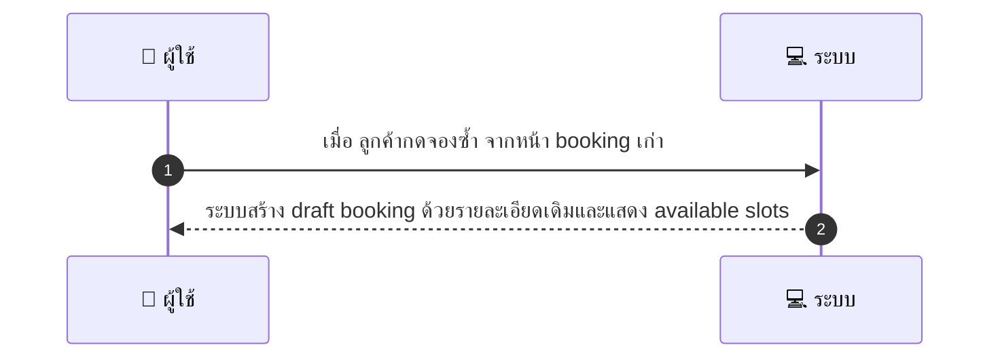
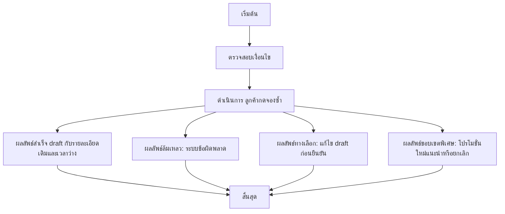

# CUS053 - บันทึกคำสั่งซื้อซ้ำ Reorder / Repeat Booking

## 👤 บทบาท
- ลูกค้า

## 🎯 เป้าหมายของเคส
- ในฐานะ: ลูกค้า
- ต้องการ: จองซ้ำรายการเดิมจาก booking เก่า
- เพื่อ: เพื่อความสะดวกในการจองอีกครั้ง

## ⚙️ เงื่อนไขก่อนเริ่ม (Precondition)
- ลูกค้ามี booking เก่าที่ต้องการทำซ้ำ

## 🧭 ผลลัพธ์และสถานการณ์
- ✅ ผลลัพธ์ที่คาดหวัง (Success Flow): ระบบสร้าง draft booking ด้วยรายละเอียดเดิมและแสดง available slots
- ❌ ผลลัพธ์ที่ Failure:  
  - ไม่สามารถสร้าง draft booking ได้เนื่องจากข้อผิดพลาดภายในระบบ Internal Server Error ระบบแสดงข้อความและให้ผู้ใช้งันทดลองใหม่
  - ไม่พบ booking เก่าที่ต้องการทำซ้ำหรือรหัส booking ที่ระบุผิด
  - ไม่มีช่วงเวลาว่างที่ตรงกับรายละเอียดใน booking เก่า ระบบแสดงตัวเลือกเวลาที่ใกล้เคียงให้เลือก
  - คูปองที่ใช้งานใน booking เก่าหมดอายุหรือไม่สามารถใช้งานได้กับการจองซ้ำนี้
  - ข้อมูลใน booking เก่าไม่ครบถ้วน เช่น จำนวนผู้เข้าพักหรือรายละเอียดผู้เดินทางทำให้สร้าง draft ไม่สำเร็จ
- 🔄 ผลลัพธ์ทางเลือก:  
  - ผู้ใช้งานสามารถแก้ไขรายละเอียดใน draft ก่อนยืนยัน เช่น เปลี่ยนวันที่, เวลา หรือจำนวนผู้เข้าพัก
  - ระบบนำเสนอช่วงเวลาว่างที่ใกล้เคียงกับเดิมให้เลือกและลูกค้าสามารถยืนยันการจองใหม่ได้
  - หากมีโปรโมชั่นใหม่ที่สอดคล้อยกับเงื่อนไขปัจจุบัน ระบบแนะนำให้ใช้โปรโมชั่นใหม่นั้นใน draft
  - ผู้ใช้งานเลือกยกเลิกการจองซ้ำหากไม่ต้องการจองในขณะนั้น
- ⚠️ ผลลัพธ์ขอบเขตพิเศษ:  
  - ผู้ใช้งานสามารถแก้ไขรายละเอียดใน draft ก่อนยืนยัน เช่น เปลี่ยนวันที่, เวลา หรือจำนวนผู้เข้าพัก
  - ระบบนำเสนอช่วงเวลาว่างที่ใกล้เคียงกับเดิมให้เลือกและลูกค้าสามารถยืนยันการจองใหม่ได้
  - หากมีโปรโมชั่นใหม่ที่สอดคล้อยกับเงื่อนไขปัจจุบัน ระบบแนะนำให้ใช้โปรโมชั่นใหม่นั้นใน draft
  - ผู้ใช้งานเลือกยกเลิกการจองซ้ำหากไม่ต้องการจองในขณะนั้น

## ✅ เกณฑ์การยอมรับ (Acceptance Criteria)
- Allow edit before confirm
- preserve applied coupons if still valid

## ⏱ ลำดับความสำคัญ / SLA
- Priority: P1
- SLA: draft creation 2s

---

## 🔁 Sequence Diagram  
> แสดงลำดับเหตุการณ์ระหว่าง "ผู้ใช้" กับ "ระบบ"

---

## 🧭 Flowchart Diagram
> แสดงขั้นตอนการทำงานของระบบอย่างเข้าใจง่าย

