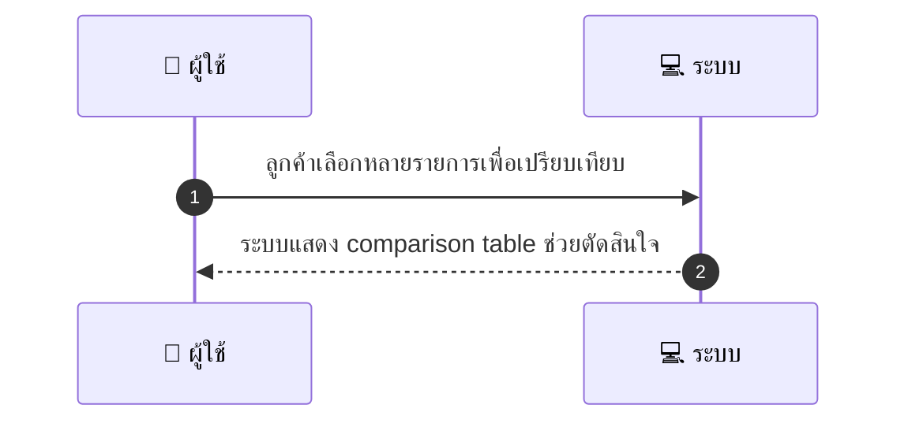
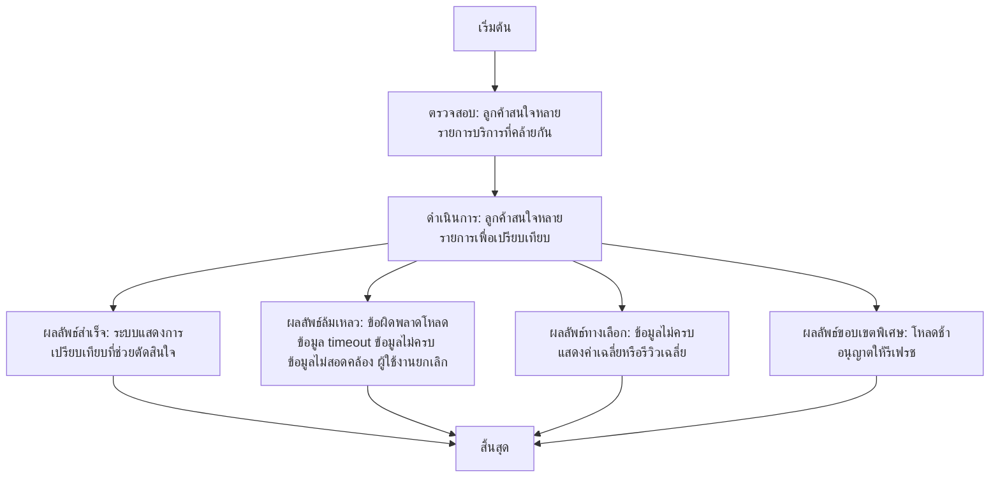

# CUS026 - เปรียบเทียบบริการ

## 👤 บทบาท
- ลูกค้า

## 🎯 เป้าหมายของเคส
- ในฐานะ ลูกค้า
- ต้องการ เปรียบเทียบบริการหลายรายการ price duration reviews
- เพื่อ ช่วยตัดสินใจเลือกบริการ

## ⚙️ เงื่อนไขก่อนเริ่ม (Precondition)
- ลูกค้าสนใจหลายรายการบริการที่คล้ายกัน

## 🧭 ผลลัพธ์และสถานการณ์
- ✅ ผลลัพธ์ที่คาดหวัง (Success Flow): ระบบแสดง comparison table ช่วยตัดสินใจ
- ❌ ผลลัพธ์ที่ Failure:
  - ไม่สามารถโหลดข้อมูลบริการที่เลือกเพื่อเปรียบเทียบได้ เนื่องจากข้อผิดพลาดของเซิร์ฟเวอร์
  - ข้อมูลราคาหรือระยะเวลาของบางรายการว่างเปล่าหรือไม่สมบูรณ์ ทำให้ไม่สามารถคำนวณเปรียบเทียบได้
  - การตอบสนองล้มเหลวหรือตอบสนองช้ากว่าที่กำหนด (timeout) ทำให้ไม่สามารถสร้างตารางเปรียบเทียบได้
  - ข้อมูลราคาหรือเวลาที่ขัดแย้งกันระหว่างบริการ ทำให้การเปรียบเทียบไม่ถูกต้อง
  - ผู้ใช้งานยกเลิกกระบวนการเปรียบเทียบระหว่างดึงข้อมูล
- 🔄 ผลลัพธ์ทางเลือก:
  - ถ้ามีข้อมูลไม่ครบในบางรายการ ระบบจะแสดงค่าเฉลี่ยที่มีอยู่และสัญลักษณ์เตือนข้อมูลไม่ครบ
  - หากจำนวนบริการที่เลือกน้อยเกินไป ระบบจะแนะนำให้เลือกบริการเพิ่มเติมเพื่อให้การเปรียบเทียบมีความหมาย
  - หากข้อมูลรีวิวไม่ครบทุกบริการ ระบบจะแสดงรีวิวเฉลี่ยจากข้อมูลที่มี หรือระบุว่าไม่มีข้อมูลรีวิว
  - ถ้าการโหลดข้อมูลล่าช้าบางส่วน ระบบจะแสดงสถานะกำลังโหลดและอนุญาตให้ผู้ใช้รีเฟรช
  - ถ้าบันทึกการเปรียบเทียบไม่สำเร็จ ระบบแจ้งข้อผิดพลาดและเสนอให้ลองใหม่ภายหลัง
- ⚠️ ผลลัพธ์ขอบเขตพิเศษ:
  - ถ้ามีข้อมูลไม่ครบในบางรายการ ระบบจะแสดงค่าเฉลี่ยที่มีอยู่และสัญลักษณ์เตือนข้อมูลไม่ครบ
  - หากจำนวนบริการที่เลือกน้อยเกินไป ระบบจะแนะนำให้เลือกบริการเพิ่มเติมเพื่อให้การเปรียบเทียบมีความหมาย
  - หากข้อมูลรีวิวไม่ครบทุกบริการ ระบบจะแสดงรีวิวเฉลี่ยจากข้อมูลที่มี หรือระบุว่าไม่มีข้อมูลรีวิว
  - ถ้าการโหลดข้อมูลล่าช้าบางส่วน ระบบจะแสดงสถานะกำลังโหลดและอนุญาตให้ผู้ใช้รีเฟรช
  - ถ้าบันทึกการเปรียบเทียบไม่สำเร็จ ระบบแจ้งข้อผิดพลาดและเสนอให้ลองใหม่ภายหลัง
- เกณฑ์การยอมรับ:
  - Table shows price, duration, avg rating, next available slot
  - responsive UI
- SLA: 
  - response 2s

## ✅ เกณฑ์การยอมรับ (Acceptance Criteria)
- Table shows price, duration, avg rating, next available slot
- responsive UI

## ⏱ ลำดับความสำคัญ / SLA
- Priority: P2
- SLA: response 2s

---

## 🔁 Sequence Diagram  
> แสดงลำดับเหตุการณ์ระหว่าง "ผู้ใช้" กับ "ระบบ"

---

## 🧭 Flowchart Diagram
> แสดงขั้นตอนการทำงานของระบบอย่างเข้าใจง่าย

