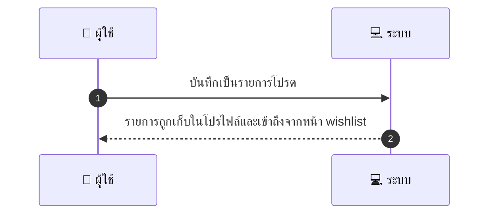
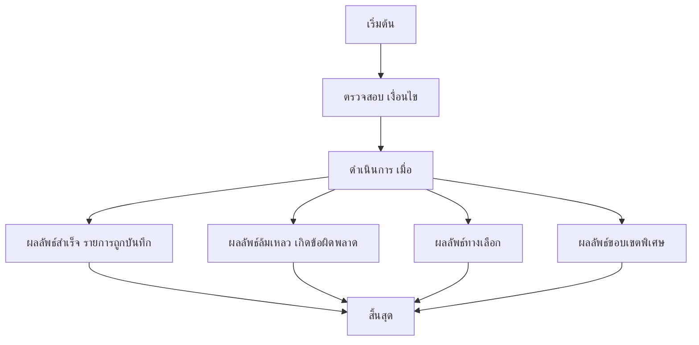

# CUS027 - บันทึกรายการโปรด Favorite / Wishlist

## 👤 บทบาท
- ลูกค้า

## 🎯 เป้าหมายของเคส
- ในฐานะ ลูกค้า
- ต้องการ บันทึกรายการบริการที่สนใจไว้ดูทีหลัง
- เพื่อ เพื่อกลับมาจองง่ายขึ้น

## ⚙️ เงื่อนไขก่อนเริ่ม (Precondition)
- ลูกค้าพบบริการที่ต้องการเก็บไว้

## 🧭 ผลลัพธ์และสถานการณ์
- ✅ ผลลัพธ์ที่คาดหวัง (Success Flow): รายการถูกเก็บในโปรไฟล์และสามารถเข้าถึงจากหน้า wishlist
- ❌ ผลลัพธ์ที่ Failure:
  - เกิดข้อผิดพลาดของระบบทำให้บันทึกรายการโปรดไม่สำเร็จ
  - ไม่สามารถเข้าถึงข้อมูลโปรไฟล์ session หมดอายุไม่ลงชื่อเข้าใช้ ทำให้บันทึกไม่สมบูรณ์
  - รายการที่ต้องบันทึกไม่มีอยู่ในระบบหรือถูกลบออก
  - ฐานข้อมูลขัดข้องระหว่างบันทึกข้อมูลลง Wishlist
  - จำนวนรายการโปรดต่อผู้ใช้ถึงขีดจำกัดสูงสุดแล้ว จึงไม่สามารถบันทึกเพิ่มเติม
  - เครือข่ายล้มเหลวระหว่างการสื่อสารกับเซิร์เวอร์
- 🔄 ผลลัพธ์ทางเลือก:
  - รายการนี้มีอยู่แล้วใน Wishlist ของผู้ใช้ ไม่ทำการบันทึกซ้ำ และแสดงข้อความยืนยัน
  - บันทึกสำเร็จแต่ระบบขอให้ผู้ใช้เปิดใช้งานการแจ้งเตือนโปรโมชั่นสำหรับรายการนี้เอง (เลือกเปิด/ปิดได้)
  - รายการบันทึกสำเร็จและสามารถเข้าถึงได้จากหน้า Wishlist ได้ทันที
- ⚠️ ผลลัพธ์ขอบเขตพิเศษ:
  - รายการนี้มีอยู่แล้วใน Wishlist ของผู้ใช้ ไม่ทำการบันทึกซ้ำ และแสดงข้อความยืนยัน
  - บันทึกสำเร็จแต่ระบบขอให้ผู้ใช้เปิดใช้งานการแจ้งเตือนโปรโมชั่นสำหรับรายการนี้เอง (เลือกเปิด/ปิดได้)
  - รายการบันทึกสำเร็จและสามารถเข้าถึงได้จากหน้า Wishlist ได้ทันที

## ✅ เกณฑ์การยอมรับ (Acceptance Criteria)
- สามารถเพิ่ม ลบ ได้
- แจ้งเตือนโปรโมชั่นที่เกี่ยวกับรายการโปรด (เลือกได้)

## ⏱ ลำดับความสำคัญ / SLA
- Priority: P2
- SLA: action immediate

---

## 🔁 Sequence Diagram  
> แสดงลำดับเหตุการณ์ระหว่าง ผู้ใช้ กับ ระบบ

---

## 🧭 Flowchart Diagram
> แสดงขั้นตอนการทำงานของระบบอย่างเข้าใจง่าย

