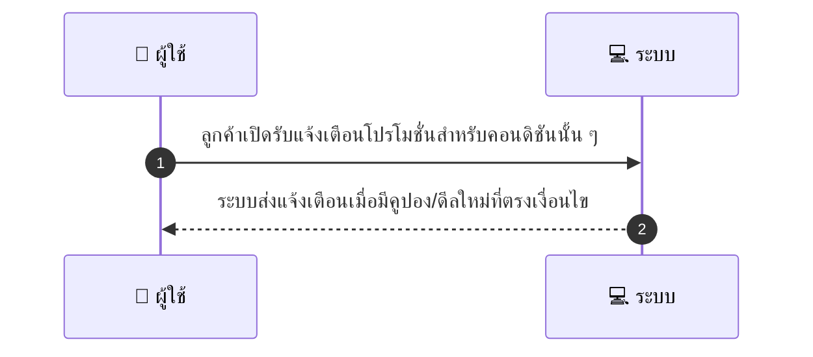
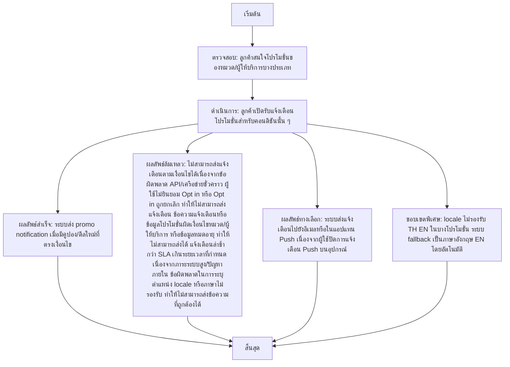

# CUS028 - ตั้งการแจ้งเตือนโปรโมชั่น Promo Alerts

## 👤 บทบาท
- ลูกค้า

## 🎯 เป้าหมายของเคส
- ในฐานะ: ลูกค้า
- ต้องการ: รับแจ้งเตือนเมื่อมีโปรโมชั่นที่สนใจ
- เพื่อ: เพื่อไม่พลาดดีลที่สนใจ

## ⚙️ เงื่อนไขก่อนเริ่ม (Precondition)
- ลูกค้าสนใจโปรโมชั่นของหมวด/ผู้ให้บริการบางประเภท

## 🧭 ผลลัพธ์และสถานการณ์
- ✅ ผลลัพธ์ที่คาดหวัง (Success Flow): ระบบส่ง promo notification เมื่อมีคูปอง/ดีลใหม่ที่ตรงเงื่อนไข
- ❌ ผลลัพธ์ที่ Failure:
  - ไม่สามารถส่ง promo notification ตามเงื่อนไขได้เนื่องจากข้อผิดพลาด API/เครือข่ายชั่วคราว
  - ผู้ใช้ไม่ยินยอม Opt in หรือ Opt in ถูกยกเลิก ทำให้ไม่สามารถส่งแจ้งเตือน
  - ข้อความแจ้งเตือนหรือข้อมูลโปรโมชั่นผิดเงื่อนไขหมวด/ผู้ให้บริการ หรือข้อมูลหมดอายุ ทำให้ไม่สามารถส่งได้
  - แจ้งเตือนล่าช้ากว่า SLA เกินระยะเวลาที่กำหนด เนื่องจากภาระระบบสูง/ปัญหาภายใน
  - ข้อผิดพลาดในการระบุตำแหน่ง locale หรือภาษาไม่รองรับ ทำให้ไม่สามารถส่งข้อความที่ถูกต้องได้
- 🔄 ผลลัพธ์ทางเลือก:
  - ระบบส่งแจ้งเตือนไปยังอีเมลหรือในแอปแทน Push เนื่องจากผู้ใช้ปิดการแจ้งเตือน Push บนอุปกรณ์
  - ผู้ใช้เลือกยกเลิกติดตามหมวด/ผู้ให้บริการ ก่อนการส่งแจ้งเตือน หรือปรับแต่งการตั้งค่าให้ไม่รับแจ้งเตือน
  - โปรโมชั่นที่ตรงเงื่อนไขถูกยกเลิกหรือหมดอายุระหว่างรอส่ง ทำให้ระบบแจ้งเตือนสำเร็จทางการปรับไปยังโปรโมชั่นที่ใกล้เคียงแทน
  - locale ไม่รองรับ TH/EN ในบางโปรโมชั่น ระบบ fallback เป็นภาษาอังกฤษ EN โดยอัตโนมัติ
- ⚠️ ผลลัพธ์ขอบเขตพิเศษ:
  - ระบบส่งแจ้งเตือนไปยังอีเมลหรือในแอปแทน Push เนื่องจากผู้ใช้ปิดการแจ้งเตือน Push บนอุปกรณ์
  - ผู้ใช้เลือกยกเลิกติดตามหมวด/ผู้ให้บริการ ก่อนการส่งแจ้งเตือน หรือปรับแต่งการตั้งค่าให้ไม่รับแจ้งเตือน
  - โปรโมชั่นที่ตรงเงื่อนไขถูกยกเลิกหรือหมดอายุระหว่างรอส่ง ทำให้ระบบแจ้งเตือนสำเร็จทางการปรับไปยังโปรโมชั่นที่ใกล้เคียงแทน
  - locale ไม่รองรับ TH/EN ในบางโปรโมชั่น ระบบ fallback เป็นภาษาอังกฤษ EN โดยอัตโนมัติ

## ✅ เกณฑ์การยอมรับ (Acceptance Criteria)
- Opt-in consent
- frequency cap
- localized content TH/EN

## ⏱ ลำดับความสำคัญ / SLA
- Priority: P2
- SLA: notification within minutes

---

## 🔁 Sequence Diagram  
> แสดงลำดับเหตุการณ์ระหว่าง "ผู้ใช้" กับ "ระบบ"

---

## 🧭 Flowchart Diagram
> แสดงขั้นตอนการทำงานของระบบอย่างเข้าใจง่าย

