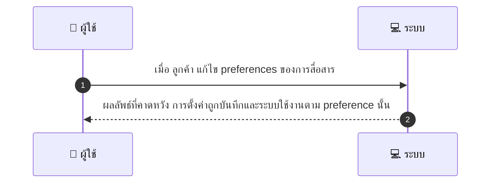
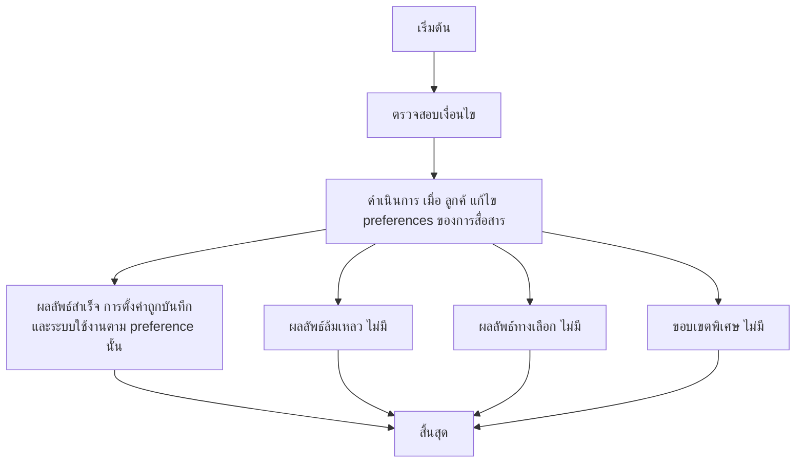

# CUS030 - จัดการการสมัครรับจดหมายข่าว Manage Subscriptions / Preferences

## 👤 บทบาท
- ลูกค้า

## 🎯 เป้าหมายของเคส
- ในฐานะ ลูกค้า
- ต้องการ แก้ไข preferences ของการสื่อสาร email SMS push
- เพื่อ เพื่อควบคุมการรับข้อความจากแพลตฟอร์ม

## ⚙️ เงื่อนไขก่อนเริ่ม (Precondition)
- ลูกค้าได้รับอีเมลสื่อสารจากแพลตฟอร์ม

## 🧭 ผลลัพธ์และสถานการณ์
- ✅ ผลลัพธ์ที่คาดหวัง (Success Flow): การตั้งค่าถูกบันทึกและระบบใช้งานตาม preference นั้น  
- ❌ ผลลัพธ์ที่ Failure:  
  - ไม่มี  
- 🔄 ผลลัพธ์ทางเลือก:  
  - ไม่มี  
- ⚠️ ผลลัพธ์ขอบเขตพิเศษ:  
  - ไม่มี

## ✅ เกณฑ์การยอมรับ (Acceptance Criteria)
- Opt-in/out เก็บ consent
- immediate effect for future sends
- DNT respected

## ⏱ ลำดับความสำคัญ / SLA
- Priority: P2
- SLA: preference change immediate

---

## 🔁 Sequence Diagram  
> แสดงลำดับเหตุการณ์ระหว่าง "ผู้ใช้" กับ "ระบบ"

---

## 🧭 Flowchart Diagram
> แสดงขั้นตอนการทำงานของระบบอย่างเข้าใจง่าย

