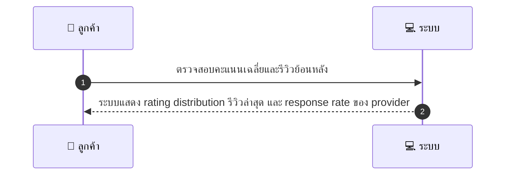
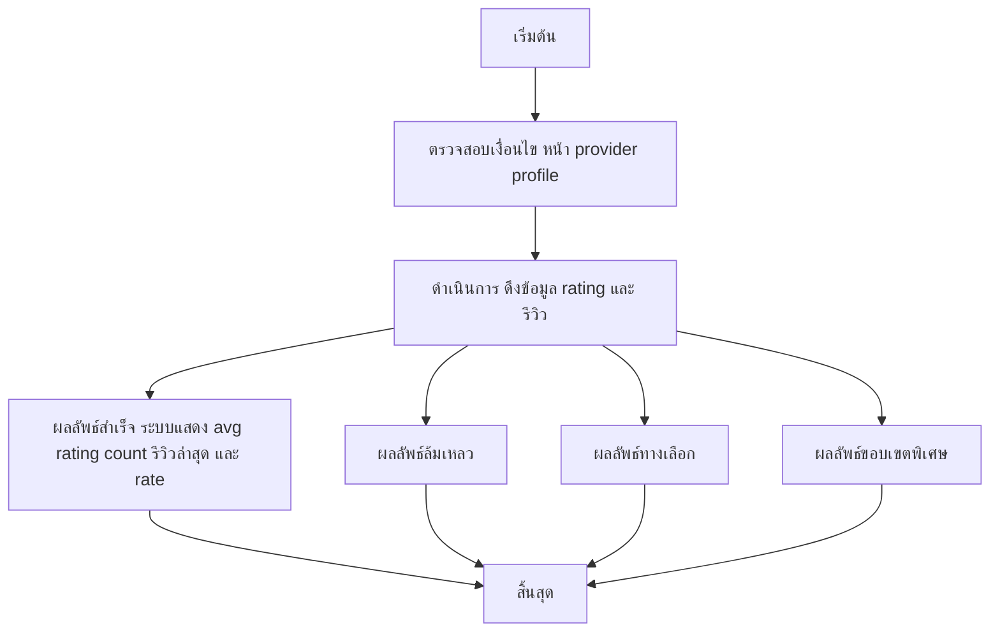

# CUS034 - ดู ratings/score เฉลี่ยของ provider (View Provider Reputation)

## 👤 บทบาท
- ลูกค้า

## 🎯 เป้าหมายของเคส
- ในฐานะ: ลูกค้า
- ต้องการ: ดูคะแนนเฉลี่ยและรีวิวย้อนหลังของ provider
- เพื่อ: เพื่อประเมินคุณภาพบริการ

## ⚙️ เงื่อนไขก่อนเริ่ม (Precondition)
- ลูกค้าดูหน้า provider profile

## 🧭 ผลลัพธ์และสถานการณ์
- ✅ ผลลัพธ์ที่คาดหวัง (Success Flow): ระบบแสดง rating distribution รีวิวล่าสุด และ response rate ของ provider
- ❌ ผลลัพธ์ที่ Failure:  
  - ไม่สามารถดึงข้อมูลโปรไฟล์ provider ได้ชั่วคราว เนื่องจากข้อผิดพลาดเครือข่ายหรือเซิร์ฟเวอร์
  - ข้อมูล rating/รีวิวไม่สมบูรณ์หรือเสียหาย ทำให้ไม่สามารถคำนวณค่าเฉลี่ยหรือ distribution ได้
  - การโหลดหน้าเกิน SLA 2 วินาที ทำให้ไม่สามารถแสดง rating distribution และรีวิว
  - ผู้ใช้งานไม่มีสิทธิ์เข้าถึงข้อมูลรีวิว (เช่นสถานะผู้ใช้ไม่ยืนยันตัวตนหรือ role ไม่ถูกต้อง)
- 🔄 ผลลัพธ์ทางเลือก:  
  - หากไม่มีรีวิวล่าสุด ระบบสามารถแสดงข้อความ 'ยังไม่มีรีวิว' พร้อมค่าเฉลี่ยและจำนวนรีวิวที่มีอยู่
  - ข้อมูล rating ถูกคำนวณจากช่วงเวลาอื่น (เช่น 90 วันที่ผ่านมา) หรือจากแหล่ง cache เพื่อให้ผู้ใช้งานเห็นข้อมูลที่อัปเดต
  - แสดงรีวิวล่าสุด 3 รายการพร้อมคะแนนและเวลาที่โพสต์
  - หากบางรายการไม่พร้อม แสดงเฉลี่ยและจำนวนรีวิวที่มีพร้อมข้อความเตือนว่าข้อมูลบางส่วนอาจขาดหาย
- ⚠️ ผลลัพธ์ขอบเขตพิเศษ:  
  - หากไม่มีรีวิวล่าสุด ระบบสามารถแสดงข้อความ 'ยังไม่มีรีวิว' พร้อมค่าเฉลี่ยและจำนวนรีวิวที่มีอยู่
  - ข้อมูล rating ถูกคำนวณจากช่วงเวลาอื่น (เช่น 90 วันที่ผ่านมา) หรือจากแหล่ง cache เพื่อให้ผู้ใช้งานเห็นข้อมูลที่อัปเดต
  - แสดงรีวิวล่าสุด 3 รายการพร้อมคะแนนและเวลาที่โพสต์
  - หากบางรายการไม่พร้อม แสดงเฉลี่ยและจำนวนรีวิวที่มีพร้อมข้อความเตือนว่าข้อมูลบางส่วนอาจขาดหาย

## ✅ เกณฑ์การยอมรับ (Acceptance Criteria)
- Show avg rating, count, recent reviews
- response rate metric calculated from provider actions

## ⏱ ลำดับความสำคัญ / SLA
- Priority: P2
- SLA: page load 2s

---

## 🔁 Sequence Diagram  
> แสดงลำดับเหตุการณ์ระหว่าง "ผู้ใช้" กับ "ระบบ"

---

## 🧭 Flowchart Diagram
> แสดงขั้นตอนการทำงานของระบบอย่างเข้าใจง่าย

