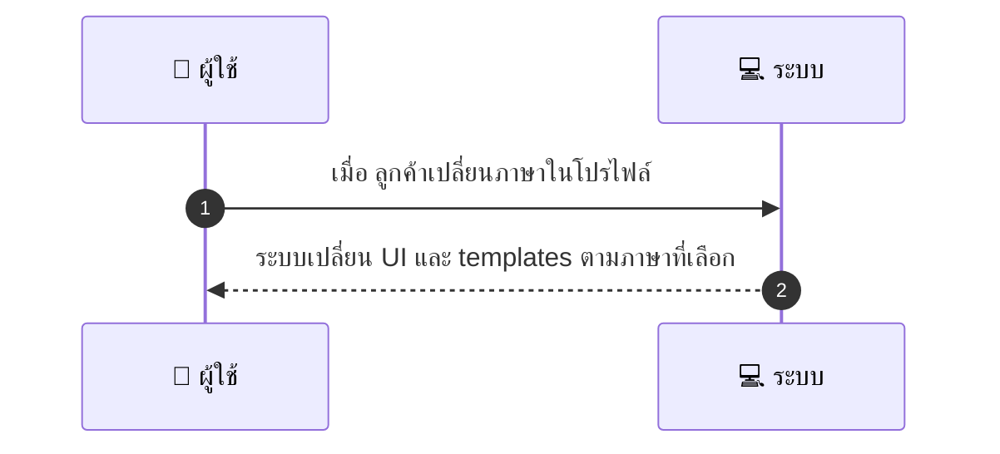
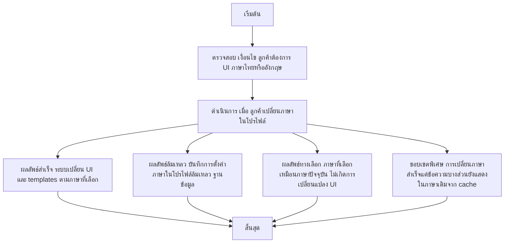

# CUS036 - ตั้งค่า preferred language localization TH/EN

## 👤 บทบาท
- ลูกค้า

## 🎯 เป้าหมายของเคส
- ในฐานะ ลูกค้า
- ต้องการ เปลี่ยนภาษาของ UI เป็นไทยหรืออังกฤษ
- เพื่อ ใช้งานสะดวกตามความถนัด

## ⚙️ เงื่อนไขก่อนเริ่ม
- ลูกค้าต้องการ UI ภาษาไทยหรืออังกฤษ

## 🧭 ผลลัพธ์และสถานการณ์
- ✅ ผลลัพธ์ที่คาดหวัง (Success Flow): ระบบเปลี่ยน UI และ templates เป็นภาษาที่เลือก i18n
- ❌ ผลลัพธ์ที่ Failure:
  - บันทึกการตั้งค่าภาษาในโปรไฟล์ล้มเหลว เนื่องจากข้อผิดพลาดฐานข้อมูล
  - โหลดทรัพยากร i18n สำหรับภาษาที่เลือกล้มเหลว ทำให้ UI ไม่เปลี่ยนตามภาษา
  - เครือข่าย/API ล้มเหลวระหว่างเรียกเปลี่ยนภาษา ทำให้การอัปเดตภาษาล้มเหลว
  - ภาษาที่เลือกไม่รองรับในระบบ
  - ข้อผิดพลาดภายในระหว่างประมวลผลคำสั่งเปลี่ยนภาษา
- 🔄 ผลลัพธ์ทางเลือก:
  - ภาษาที่เลือกเหมือนภาษาปัจจุบัน ไม่เกิดการเปลี่ยนแปลง UI
  - การเปลี่ยนภาษสำเร็จแต่ข้อความบางส่วนยังแสดงในภาษาเดิมชั่วคราวจากแคช
  - ผู้ใช้ยกเลิกการเปลี่ยนภาษาในโปรไฟล์
- ⚠️ ผลลัพธ์ขอบเขตพิเศษ:
  - ภาษาที่เลือกเหมือนภาษาปัจจุบัน ไม่เกิดการเปลี่ยนแปลง UI
  - การเปลี่ยนภาษสำเร็จแต่ข้อความบางส่วนยังแสดงในภาษาเดิมชั่วคราวจากแคช
  - ผู้ใช้ยกเลิกการเปลี่ยนภาษาในโปรไฟล์

## ✅ เกณฑ์การยอมรับ (Acceptance Criteria)
- All core flows localized
- fallbacks handled gracefully

## ⏱ ลำดับความสำคัญ / SLA
- Priority: P2
- SLA: immediate

---

## 🔁 Sequence Diagram  
> แสดงลำดับเหตุการณ์ระหว่าง "ผู้ใช้" กับ "ระบบ"

---

## 🧭 Flowchart Diagram
> แสดงขั้นตอนการทำงานของระบบอย่างเข้าใจง่าย

