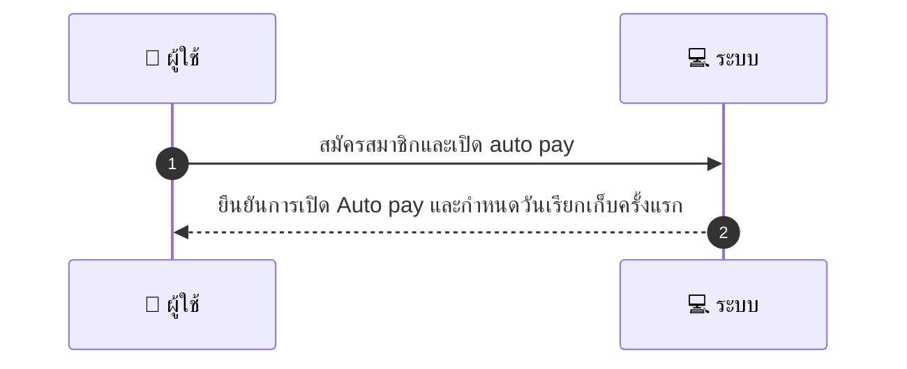
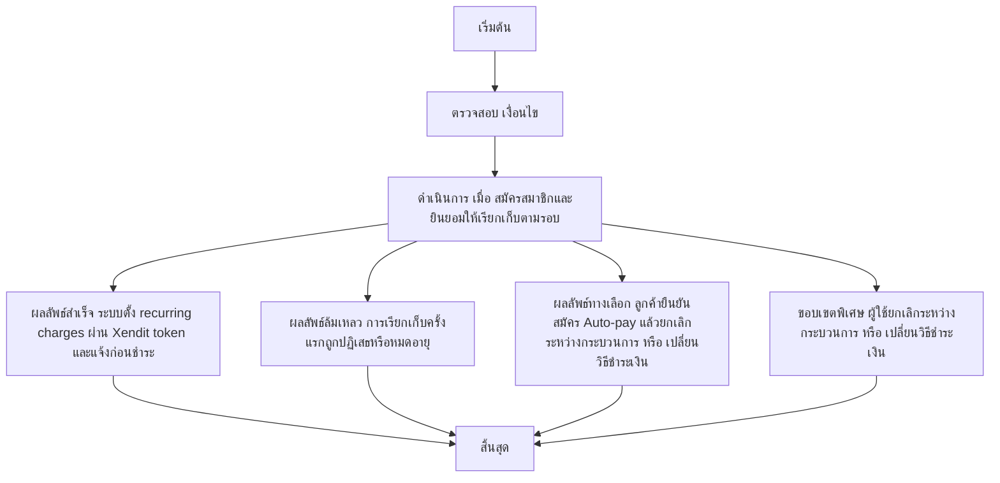

# CUS043 - ตั้งค่าการชำระเงินอัตโนมัติสำหรับแผน/สมัครสมาชิก Auto pay Subscription

## 👤 บทบาท
- ลูกค้า

## 🎯 เป้าหมายของเคส
- ในฐานะ ลูกค้า
- ต้องการ สมัครบริการแบบ subscription และเปิด auto pay
- เพื่อ ให้ถูกเรียกเก็บตามรอบโดยอัตโนมัติ

## ⚙️ เงื่อนไขก่อนเริ่ม (Precondition)
- บริการมี subscription model

## 🧭 ผลลัพธ์และสถานการณ์
- ✅ ผลลัพธ์ที่คาดหวัง (Success Flow): ระบบตั้ง recurring charges ผ่าน Xendit token และแจ้งก่อนชำระ
- ❌ ผลลัพธ์ที่ Failure:
  - การเรียกเก็บครั้งแรกล้มเหลว เนื่องจากบัตรถูกปฏิเสธหรือหมดอายุ ทำให้ไม่สามารถเปิด Auto pay ได้
  - การเรียกเก็บรอบถัดไปล้มเหลวหลายครั้ง ส่งผลให้สถานะ subscription ถูกระงับชั่วคราว
  - Token ของ Xendit หมดอายุหรือถูกยกเลิก ทำให้ไม่สามารถสร้าง recurring charge ได้
  - ข้อมูลการยินยอมไม่ครบถ้วนหรือไม่ถูกต้อง ทำให้ระบบไม่สามารถเปิดใช้งาน Auto pay
- 🔄 ผลลัพธ์ทางเลือก:
  - ลูกค้ายืนยันสมัคร Auto pay แล้วยกเลิก Auto pay ระหว่างกระบวนการ ทำให้ subscription อยู่ในสถานะ manual
  - ลูกค้าตัดสินใจเปลี่ยนวิธีชำระเงินข้อมูลบัตรระหว่างกระบวนการ และระบบอัปเดตข้อมูลเพื่อเรียกเก็บด้วยวิธีใหม่
  - การเรียกเก็บสำเร็จในรอบแรกแต่ลูกค้าขอหักเงินในรอบถัดไปด้วยเงื่อนไขการชำระที่ต่างออกไป
- ⚠️ ผลลัพธ์ขอบเขตพิเศษ:
  - ลูกค้ายืนยันสมัคร Auto pay แล้วยกเลิก Auto pay ระหว่างกระบวนการ ทำให้ subscription อยู่ในสถานะ manual
  - ลูกค้าตัดสินใจเปลี่ยนวิธีชำระเงินข้อมูลบัตรระหว่างกระบวนการ และระบบอัปเดตข้อมูลเพื่อเรียกเก็บด้วยวิธีใหม่
  - การเรียกเก็บสำเร็จในรอบแรกแต่ลูกค้าขอหักเงินในรอบถัดไปด้วยเงื่อนไขการชำระที่ต่างออกไป

## ✅ เกณฑ์การยอมรับ (Acceptance Criteria)
- ยินยอมอย่างชัดเจน
- ความสามารถในการยกเลิกการสมัครสมาชิก
- ใบเสร็จสำหรับการเรียกเก็บแต่ละครั้ง

## ⏱ ลำดับความสำคัญ / SLA
- Priority: P2
- SLA: first charge immediate; subsequent per schedule

---

## 🔁 Sequence Diagram  
> แสดงลำดับเหตุการณ์ระหว่าง "ผู้ใช้" กับ "ระบบ"

---

## 🧭 Flowchart Diagram
> แสดงขั้นตอนการทำงานของระบบอย่างเข้าใจง่าย

