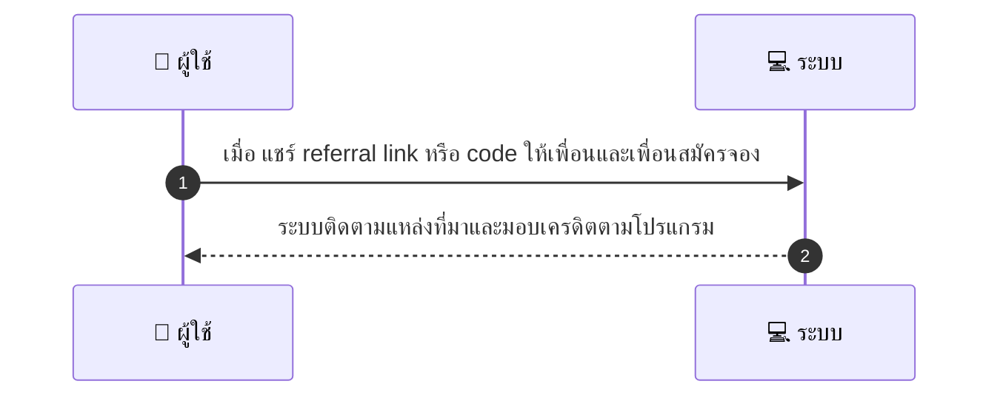
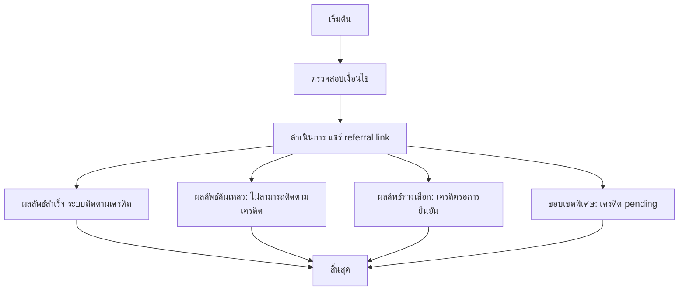

# CUS044 - เชิญเพื่อนRefer a friend Referral

## 👤 บทบาท
- ลูกค้า

## 🎯 เป้าหมายของเคส
- ในฐานะ ลูกค้า
- ต้องการ แชร์ referral link code เพื่อรับเครดิต
- เพื่อ รับสิทธิพิเศษจากการแนะนำเพื่อน

## ⚙️ เงื่อนไขก่อนเริ่ม (Precondition)
- ลูกค้ามี referral codelink

## 🧭 ผลลัพธ์และสถานการณ์
- ✅ ผลลัพธ์ที่คาดหวัง (Success Flow): ระบบติดตาม conversion และมอบเครดิตตามโปรแกรม referral
- ❌ ผลลัพธ์ที่ Failure:  
  - ไม่สามารถติดตามแหล่งที่มาของการลงทะเบียน/จองได้ ทำให้เครดิต referral ไม่ถูกมอบ
  - รหัส referral/link หมดอายุ หรือไม่ถูกต้อง
  - ผู้ถูกแนะนำลงทะเบียนแต่ไม่มีการจอง/ซื้อภายในเงื่อนไขที่กำหนด
  - พบการทุจริตหรือการใช้ referral ซ้ำจากหลายบัญชี ระบบระงับเครดิต
- 🔄 ผลลัพธ์ทางเลือก:  
  - เครดิตอยู่ในสถานะรอการยืนยัน pending จนกว่าการลงทะเบียน/จองจะเสร็จสมบูรณ์
  - หากเพื่อนลงทะเบียนแต่ไม่จอง ระบบจะมอบเครดิตเมื่อเพื่อนทำการจองครั้งถัดไป
  - เครดิตถูกแบ่งจ่ายตามเงื่อนไขของโปรแกรม เช่น 50% เมื่อสมัคร และ 50% เมื่อจองสำเร็จ
  - หากไม่ได้ระบุแหล่งที่มาอย่างชัดเจน ระบบจะมอบเครดิตจากแหล่งที่มาที่ระบบตรวจสอบได้
- ⚠️ ผลลัพธ์ขอบเขตพิเศษ:  
  - เครดิตอยู่ในสถานะรอการยืนยัน pending จนกว่าการลงทะเบียน/จองจะเสร็จสมบูรณ์
  - หากเพื่อนลงทะเบียนแต่ไม่จอง ระบบจะมอบเครดิตเมื่อเพื่อนทำการจองครั้งถัดไป
  - เครดิตถูกแบ่งจ่ายตามเงื่อนไขของโปรแกรม เช่น 50% เมื่อสมัคร และ 50% เมื่อจองสำเร็จ
  - หากไม่ได้ระบุแหล่งที่มาอย่างชัดเจน ระบบจะมอบเครดิตจากแหล่งที่มาที่ระบบตรวจสอบได้

## ✅ เกณฑ์การยอมรับ (Acceptance Criteria)
- Track referral source, prevent abuse, credits apply per rules

## ⏱ ลำดับความสำคัญ / SLA
- Priority: P2
- SLA: attribution immediate upon qualifying action

---

## 🔁 Sequence Diagram  
> แสดงลำดับเหตุการณ์ระหว่าง "ผู้ใช้" กับ "ระบบ"

---

## 🧭 Flowchart Diagram
> แสดงขั้นตอนการทำงานของระบบอย่างเข้าใจง่าย

