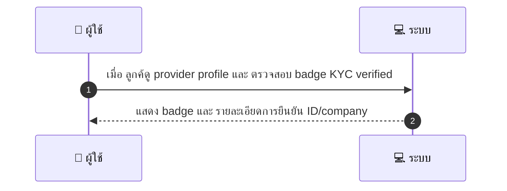
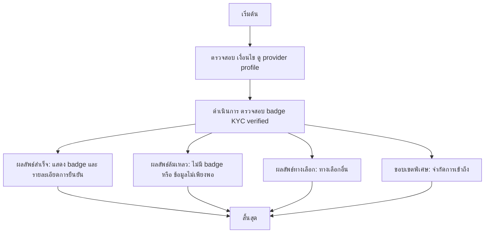

# CUS051 - ดูสถานะ KYC ของ provider Provider Verification Badge

## 👤 บทบาท
- ลูกค้า

## 🎯 เป้าหมายของเคส
- ในฐานะ
- ต้องการ
- เพื่อ

## ⚙️ เงื่อนไขก่อนเริ่ม (Precondition)
- ลูกค้าดู provider profile

## 🧭 ผลลัพธ์และสถานการณ์
- ✅ ผลลัพธ์ที่คาดหวัง (Success Flow): ระบบแสดง badge และรายละเอียดระดับการยืนยัน ID/company
- ❌ ผลลัพธ์ที่ Failure: ไม่มีกรณีล้มเหลวระบุ
- 🔄 ผลลัพธ์ทางเลือก: ไม่มีกรณีทางเลือกระบุ
- ⚠️ ผลลัพธ์ขอบเขตพิเศษ: ไม่มี

## ✅ เกณฑ์การยอมรับ (Acceptance Criteria)
- Badge reflects admin-verified status
- click-through to view non-sensitive verified info

## ⏱ ลำดับความสำคัญ / SLA
- Priority: P2
- SLA: profile load 2s

---

## 🔁 Sequence Diagram  
> แสดงลำดับเหตุการณ์ระหว่าง "ผู้ใช้" กับ "ระบบ"

---

## 🧭 Flowchart Diagram
> แสดงขั้นตอนการทำงานของระบบอย่างเข้าใจง่าย

