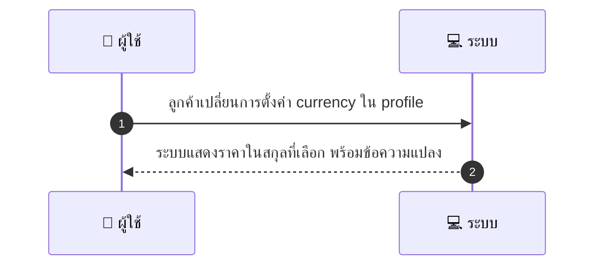
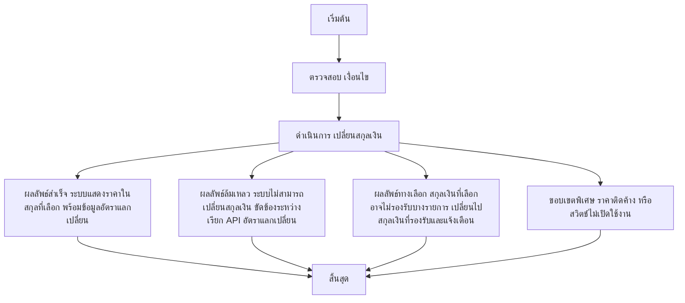

# CUS057 - ตั้งค่า preferred currency / display THB default

## 👤 บทบาท
- ลูกค้า

## 🎯 เป้าหมายของเคส
- ในฐานะ ลูกค้า
- ต้องการ เปลี่ยนสกุลเงินที่แสดงราคาใน UI
- เพื่อ ดูราคาในสกุลที่คุ้นเคย

## ⚙️ เงื่อนไขก่อนเริ่ม (Precondition)
- ลูกค้าอาจต้องการเห็นราคาในสกุลอื่น

## 🧭 ผลลัพธ์และสถานการณ์
- ✅ ผลลัพธ์ที่คาดหวัง (Success Flow): ระบบแสดงราคาในสกุลที่เลือก พร้อมข้อความแปลง
- ❌ ผลลัพธ์ที่ Failure:  
  - ระบบไม่สามารถเปลี่ยนสกุลเงินได้ในระหว่างเรียก API อัตราแลกเปลี่ยน
  - ไม่พบสกุลเงินที่ผู้ใช้เลือกในรายการสกุลเงินที่รองรับ
  - ข้อผิดพลาดในการคำนวณอัตราแลกเปลี่ยน
  - ไม่สามารถบันทึกการตั้งค่าผู้ใช้ในโปรไฟล์
  - การตอบสนองของเซิร์ฟเวอร์ขัดข้องระหว่างขั้นตอนปรับค่า currency
- 🔄 ผลลัพธ์ทางเลือก:  
  - การเปลี่ยนสกุลเงินสำเร็จ แต่ระบบยังใช้งาน checkout ใน THB เพราะยังไม่เปิดใช้งาน multi-currency
  - สกุลเงินที่เลือกไม่รองรับสำหรับสินค้าบางรายการ ระบบจะสลับไปยังสกุลเงินที่รองรับพร้อมข้อความแจ้ง
  - ผู้ใช้ยกเลิกการเปลี่ยนสกุลเงินในระหว่างขั้นตอน และเก็บการตั้งค่าไว้ในโปรไฟล์เดิม
  - ราคายังแสดงในสกุลเงินเดิมบนบางหน้า UI หลังจากเปลี่ยนค่า
- ⚠️ ผลลัพธ์ขอบเขตพิเศษ:  
  - การเปลี่ยนสกุลเงินสำเร็จ แต่ระบบยังใช้งาน checkout ใน THB เพราะยังไม่เปิดใช้งาน multi-currency
  - สกุลเงินที่เลือกไม่รองรับสำหรับสินค้าบางรายการ ระบบจะสลับไปยังสกุลเงินที่รองรับพร้อมข้อความแจ้ง
  - ผู้ใช้ยกเลิกการเปลี่ยนสกุลเงินในระหว่างขั้นตอน และเก็บการตั้งค่าไว้ในโปรไฟล์เดิม
  - ราคายังแสดงในสกุลเงินเดิมบนบางหน้า UI หลังจากเปลี่ยนค่า

## ✅ เกณฑ์การยอมรับ (Acceptance Criteria)
- Conversion shown with rate and timestamp
- checkout in platform base currency THB unless multi-currency supported

## ⏱ ลำดับความสำคัญ / SLA
- Priority: P2
- SLA: เปลี่ยนทันที

---

## 🔁 Sequence Diagram  
> แสดงลำดับเหตุการณ์ระหว่าง "ผู้ใช้" กับ "ระบบ"

---

## 🧭 Flowchart Diagram
> แสดงขั้นตอนการทำงานของระบบอย่างเข้าใจง่าย

