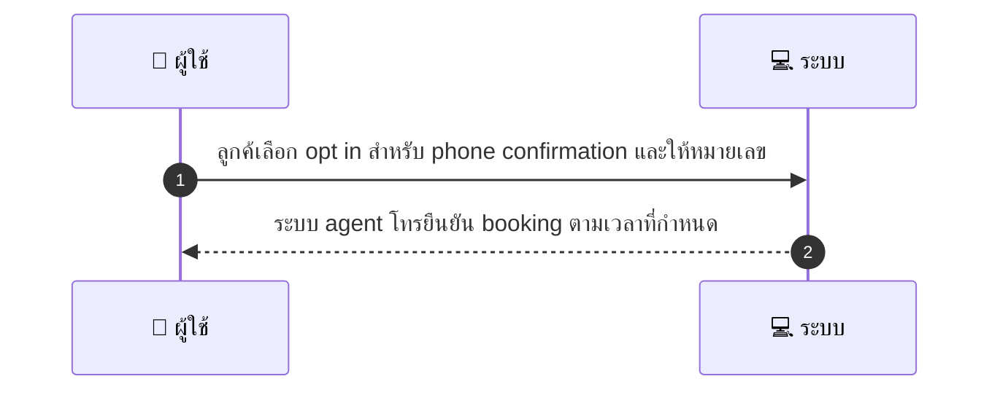
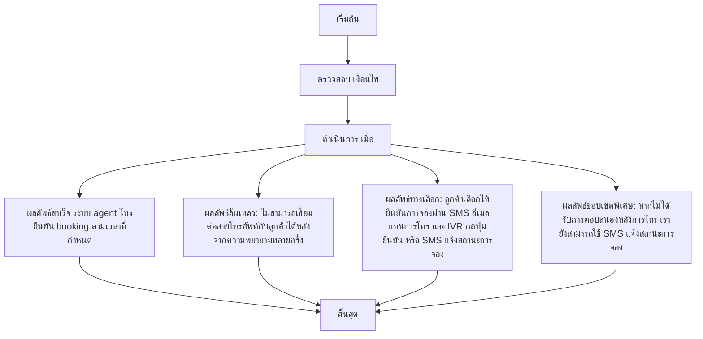

# CUS058 - ขอรับการยืนยันทางโทรศัพท์/voice call Phone Confirmation

## 👤 บทบาท
- ลูกค้า

## 🎯 เป้าหมายของเคส
- ในฐานะ
- ต้องการ
- เพื่อ

- ในฐานะ: ลูกค้า
- ต้องการ: ขอการยืนยัน booking ทางโทรศัพท์โดยเจ้าหน้าที่/automated call
- เพื่อ: เพื่อความมั่นใจใน booking ที่สำคัญ

## ⚙️ เงื่อนไขก่อนเริ่ม (Precondition)
- ลูกค้าต้องการการยืนยันผ่านโทรศัพท์

## 🧭 ผลลัพธ์และสถานการณ์
- ✅ ผลลัพธ์ที่คาดหวัง (Success Flow): ระบบ/agent โทรยืนยัน booking ตามเวลาที่กำหนด
- ❌ ผลลัพธ์ที่ Failure:
  - ไม่สามารถเชื่อมต่อสายโทรศัพท์กับลูกค้าได้หลังจากความพยายามหลายครั้ง
  - ลูกค้าไม่ยินยอมให้บันทึกความยินยอมตามนโยบายข้อมูลส่วนบุคคล
  - หมายเลขโทรศัพท์ไม่ถูกต้อง/ไม่สามารถใช้งานได้
  - ไม่สามารถบันทึกการยืนยันทางโทรศัพท์ consent ในระบบ
  - การโทรล้มเหลวด้วยข้อผิดพลาดของระบบขณะเรียก
- 🔄 ผลลัพธ์ทางเลือก:
  - ลูกค้าเลือกให้ยืนยันการจองผ่าน SMS/อีเมลแทนการโทร
  - ลูกค้าอนุญาตให้โทรภายหลังหรือตามเวลาทำการที่กำหนดใหม่
  - การยืนยันผ่านระบบ IVR โดยลูกค้ากดปุ่มเพื่อยืนยัน
  - หากไม่ได้รับการตอบสนองหลังการโทร เรายังสามารถใช้ SMS แจ้งสถานะการจอง
- ⚠️ ผลลัพธ์ขอบเขตพิเศษ:
  - ลูกค้าเลือกให้ยืนยันการจองผ่าน SMS/อีเมลแทนการโทร
  - ลูกค้าอนุญาตให้โทรภายหลังหรือตามเวลาทำการที่กำหนดใหม่
  - การยืนยันผ่านระบบ IVR โดยลูกค้ากดปุ่มเพื่อยืนยัน
  - หากไม่ได้รับการตอบสนองหลังการโทร เรายังสามารถใช้ SMS แจ้งสถานะการจอง

## ✅ เกณฑ์การยอมรับ (Acceptance Criteria)
- Consent logged
- call attempts recorded
- fallback to SMS/email if fail

## ⏱ ลำดับความสำคัญ / SLA
- Priority: P2
- SLA: initial call attempt within business hours configurable

---

## 🔁 Sequence Diagram  
> แสดงลำดับเหตุการณ์ระหว่าง "ผู้ใช้" กับ "ระบบ"

---

## 🧭 Flowchart Diagram
> แสดงขั้นตอนการทำงานของระบบอย่างเข้าใจง่าย

