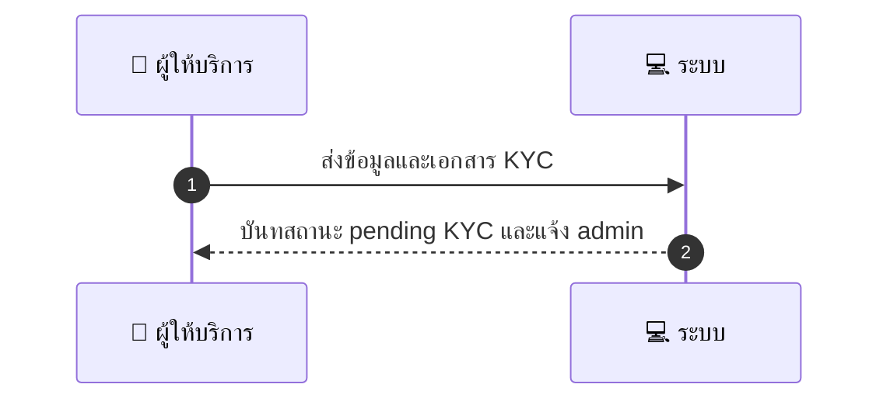
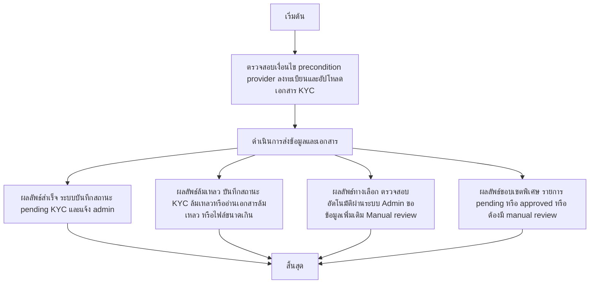

# MCC001 - Provider Onboarding & KYC

## 👤 บทบาท
- ผู้ให้บริการ

## 🎯 เป้าหมายของเคส
- ในฐานะ
- ต้องการ อัปโหลดเอกสาร KYC ID/หนังสือจดทะเบียนสำหรับ SME
- เพื่อ เพื่อรับการยืนยันบัญชีและเปิดรับ booking

## ⚙️ เงื่อนไขก่อนเริ่ม (Precondition)
- Provider ลงทะเบียนและอัปโหลดเอกสาร KYC

## 🧭 ผลลัพธ์และสถานการณ์
- ✅ ผลลัพธ์ที่คาดหวัง (Success Flow): ระบบบันทึกสถานะ pending KYC และแจ้ง admin
- ❌ ผลลัพธ์ที่ Failure:
  - บันทึกสถานะ KYC เป็น 'pending KYC' ล้มเหลว เนื่องจากข้อผิดพลาดฐานข้อมูลหรือ timeout
  - ไฟล์แนบ ID/ทะเบียน SME ไม่สามารถอ่านได้หรือเสียหาย
  - ไฟล์แนบเกินขนาด 10MB หรือมีชนิดไฟล์ที่ไม่รองรับ (นอก jpg/png/pdf)
  - ข้อมูล KYC ที่ส่งมาครบถ้วนไม่ตรงกับเอกสารที่แนบ
  - การแจ้งเตือน Admin ล้มเหลว (notification service ล้มเหลว)
- 🔄 ผลลัพธ์ทางเลือก:
  - ตรวจสอบอัตโนมัติผ่านระบบสำเร็จ: สถานะเปลี่ยนเป็น 'approved' และผู้ให้บริการสามารถเริ่ม payout ได้ทันที
  - Admin ขอข้อมูลเพิ่มเติมจาก provider ก่อนดำเนินการตรวจสอบต่อ และสถานะยังคง 'pending KYC'
  - Admin ทำการตรวจสอบด้วย manual review และหากผ่านจะเปลี่ยนสถานะเป็น 'approved'
- ⚠️ ผลลัพธ์ขอบเขตพิเศษ:
  - ตรวจสอบอัตโนมัติผ่านระบบสำเร็จ: สถานะเปลี่ยนเป็น 'approved' และผู้ให้บริการสามารถเริ่ม payout ได้ทันที
  - Admin ขอข้อมูลเพิ่มเติมจาก provider ก่อนดำเนินการตรวจสอบต่อ และสถานะยังคง 'pending KYC'
  - Admin ทำการตรวจสอบด้วย manual review และหากผ่านจะเปลี่ยนสถานะเป็น 'approved'

## ✅ เกณฑ์การยอมรับ (Acceptance Criteria)
- รองรับไฟล์ jpg png pdf =10MB
- Admin ได้รับ notification
- KYC status: pending/approved/rejected
- จนกว่าอนุมัติ provider ไม่ได้รับ payout

## ⏱ ลำดับความสำคัญ / SLA
- Priority: P0
- SLA: Admin initial review =48h

---

## 🔁 Sequence Diagram  
> แสดงลำดับเหตุการณ์ระหว่าง "ผู้ให้บริการ" กับ "ระบบ"

---

## 🧭 Flowchart Diagram
> แสดงขั้นตอนการทำงานของระบบอย่างเข้าใจง่าย

